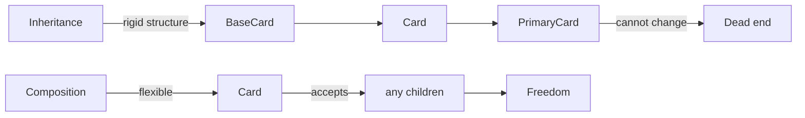
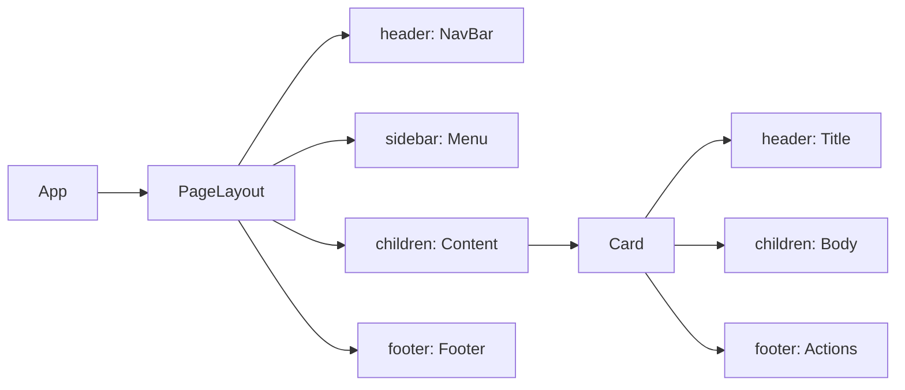

# Level 1: Composition — children and slots (detailed)

## The problem: monolithic components

Imagine building a house. You could build one huge monolith where the bedroom, kitchen, and bathroom are permanently attached to each other. Or you could build a house from separate rooms that are easy to rearrange, expand, or replace.

A monolithic component looks like this:

```tsx
// Bad: everything is hardcoded inside
function UserCard({ name, avatar, bio, buttonText, onButtonClick, showBadge, badgeText }) {
  return (
    <div className="card">
      
      <h2>{name}</h2>
      {showBadge && <span className="badge">{badgeText}</span>}
      <p>{bio}</p>
      <button onClick={onButtonClick}>{buttonText}</button>
    </div>
  )
}
```

What happens when the product manager says: "Can we put a form instead of a button? And make the bio a clickable link?" — the component needs to be rewritten, props added, the list of conditions grows.

The root of the problem: the component **knows too much** about what it renders.

## Solution: children as content insertion

In HTML we're used to nesting tags inside each other:

```html
<div class="card">
  <h2>Title</h2>
  <p>Any text</p>
</div>
```

React allows the same with your components. Everything between the opening and closing tags goes into the `children` prop:

```tsx
interface CardProps {
  children: React.ReactNode
}

function Card({ children }: CardProps) {
  return <div className="card">{children}</div>
}

// Usage — exactly like HTML
<Card>
  <h2>Any title</h2>
  <p>Any text</p>
  <button>Any button</button>
</Card>
```

💡 **Analogy:** `children` is like an envelope. The Card component is the envelope, and it doesn't care at all what's inside: a letter, a postcard, or a check. It just delivers the contents and wraps it on the outside.

## The React.ReactNode type

`React.ReactNode` is the widest type for content. It accepts:

- JSX elements: `<h2>Title</h2>`
- Strings: `"Just text"`
- Numbers: `42`
- Arrays of elements
- `null`, `undefined`, `false` (render as nothing)
- Other components

```tsx
// All these variants are valid:
<Card>String</Card>
<Card>{42}</Card>
<Card><MyComponent /></Card>
<Card>{isLoading ? <Spinner /> : <Content />}</Card>
```

## Slots: multiple content zones

One `children` is often not enough. A card might have a header, body, and footer — three independent zones. This is where **slots** come in.

A slot is a regular prop with type `React.ReactNode`, given a semantic name:

```tsx
interface CardProps {
  header?: React.ReactNode   // slot for header
  children: React.ReactNode  // main content
  footer?: React.ReactNode   // slot for footer
}

function Card({ header, children, footer }: CardProps) {
  return (
    <div style={{ border: '1px solid #e0e0e0', borderRadius: 8 }}>
      {header && (
        <div style={{ padding: '12px 16px', borderBottom: '1px solid #e0e0e0' }}>
          {header}
        </div>
      )}
      <div style={{ padding: 16 }}>
        {children}
      </div>
      {footer && (
        <div style={{ padding: '12px 16px', borderTop: '1px solid #e0e0e0' }}>
          {footer}
        </div>
      )}
    </div>
  )
}
```

Usage:

```tsx
// Card without header
<Card footer={<button>Save</button>}>
  <p>Content</p>
</Card>

// Card with full set
<Card
  header={<h2>Title</h2>}
  footer={
    <div>
      <button>Cancel</button>
      <button>OK</button>
    </div>
  }
>
  <form>...</form>
</Card>
```

💡 **Construction analogy:** Card is the house frame. Slots `header`, `children`, `footer` are the floors. What exactly stands on each floor is up to whoever uses the component.

## Why composition is better than inheritance

In languages like Java, UI components often inherit from each other: `PrimaryCard extends Card extends BaseCard`. In React, this approach doesn't work for several reasons.

**Problem 1: inflexibility**

Inheritance rigidly fixes the structure. If `BaseCard` renders `<div>`, and you need `<article>` — you have to rewrite the whole chain.

**Problem 2: impossible to predict content**

Component authors don't know what users will want to put inside. Composition hands that power to the user.

**Problem 3: testing**

Inheritance creates hidden dependencies. A component with `children` is tested in isolation — it knows nothing about its descendants.



## Practical pattern: PageLayout with slots

One of the most common uses of slots is page layouts:

```tsx
interface PageLayoutProps {
  header: React.ReactNode
  sidebar?: React.ReactNode
  children: React.ReactNode
  footer?: React.ReactNode
}

function PageLayout({ header, sidebar, children, footer }: PageLayoutProps) {
  return (
    <div style={{ display: 'flex', flexDirection: 'column', minHeight: '100vh' }}>
      <header style={{ background: '#1a1a2e', color: 'white', padding: '0 24px' }}>
        {header}
      </header>
      <div style={{ display: 'flex', flex: 1 }}>
        {sidebar && (
          <aside style={{ width: 240, background: '#f5f5f5', padding: 16 }}>
            {sidebar}
          </aside>
        )}
        <main style={{ flex: 1, padding: 24 }}>
          {children}
        </main>
      </div>
      {footer && (
        <footer style={{ background: '#f0f0f0', padding: '16px 24px' }}>
          {footer}
        </footer>
      )}
    </div>
  )
}
```

Now one component serves dozens of pages with different structures:

```tsx
// Page with sidebar
<PageLayout header={<NavBar />} sidebar={<Navigation />} footer={<Footer />}>
  <Dashboard />
</PageLayout>

// Page without sidebar
<PageLayout header={<NavBar />}>
  <FullWidthContent />
</PageLayout>
```

## Accordion via composition

A classic antipattern — Accordion via config array:

```tsx
// Bad: data and rendering are mixed
<Accordion items={[
  { title: 'Question 1', content: 'Answer 1' },
  { title: 'Question 2', content: <p>Complex <strong>answer</strong></p> },
]} />
```

The problem: what if one item should be disabled? Or have an icon? Or a nested accordion? You'd have to keep adding new fields to the config.

Solution via composition:

```tsx
// Good: structure is defined by the calling code
<Accordion>
  <AccordionItem title="Question 1">
    Answer 1
  </AccordionItem>
  <AccordionItem title={<span>Question 2 <Badge>New</Badge></span>}>
    <p>Complex <strong>answer</strong></p>
  </AccordionItem>
</Accordion>
```

Each `AccordionItem` manages its open/closed state independently.

## Flow of children through the component tree



Each level receives only what it's responsible for. App doesn't know about Card internals. Card doesn't know about Page structure.

## Conditional rendering of slots

Always check slots for existence before rendering:

```tsx
// Rule: slot renders only if passed
{header && <div className="header">{header}</div>}
```

Why this matters: if `footer` is not passed, rendering `<div className="footer">{footer}</div>` creates an empty `div` that breaks styles (border, padding, etc.).

## ⚠️ Common beginner mistakes

**Mistake 1: Using string instead of ReactNode**

```tsx
// ❌ Bad — lose the ability to pass JSX
interface CardProps {
  title: string  // only string
  content: string
}

// ✅ Good — accept anything
interface CardProps {
  title: React.ReactNode
  children: React.ReactNode
}
```

**Mistake 2: Rendering an empty container**

```tsx
// ❌ Bad — renders empty <div> if footer not passed
function Card({ footer }: CardProps) {
  return (
    <div>
      <div className="footer">{footer}</div>
    </div>
  )
}

// ✅ Good — div doesn't appear at all
function Card({ footer }: CardProps) {
  return (
    <div>
      {footer && <div className="footer">{footer}</div>}
    </div>
  )
}
```

**Mistake 3: Duplicating components instead of parameterizing**

```tsx
// ❌ Bad — three nearly identical components
function InfoCard({ children }) { ... }
function WarningCard({ children }) { ... }
function ErrorCard({ children }) { ... }

// ✅ Good — one component with variant
function Card({ variant = 'info', children }: CardProps) {
  const colors = { info: '#e3f2fd', warning: '#fff3e0', error: '#ffebee' }
  return (
    <div style={{ background: colors[variant] }}>
      {children}
    </div>
  )
}
```

**Mistake 4: Deep nesting instead of slots**

```tsx
// ❌ Bad — parent dictates structure to child
<Card>
  <CardHeader>
    <CardTitle>Title</CardTitle>
  </CardHeader>
</Card>

// ✅ Good — slot accepts any markup
<Card header={<h2>Title</h2>}>
  Content
</Card>
```

## 📌 Best practices

1. **Make slots optional** — add `?` and check with `&&` before rendering
2. **Prefer `children` for main content** — this is a convention in the React ecosystem
3. **Name slots by semantics** — `header`, `footer`, `sidebar`, not `slot1`, `topContent`
4. **Don't overuse slots** — if there are more than 4-5, you may need to rethink the architecture
5. **Use `React.ReactNode` for all slots** — this is the most flexible type
