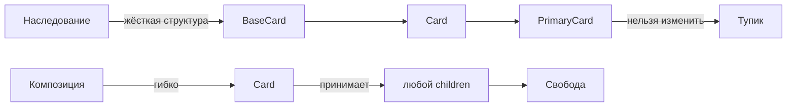
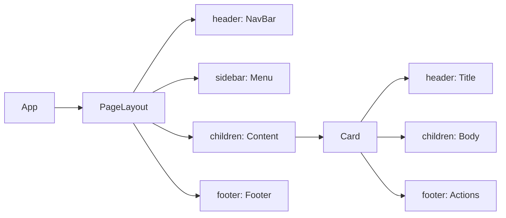

# Level 1: Композиция — children и слоты (подробно)

## Проблема: монолитные компоненты

Представьте, что вы строите дом. Можно построить один огромный монолит, где спальня, кухня и ванная намертво прибиты друг к другу. А можно построить дом из отдельных комнат, которые легко переставить, расширить или заменить.

Монолитный компонент выглядит вот так:

```tsx
// Плохо: всё зашито внутри
function UserCard({ name, avatar, bio, buttonText, onButtonClick, showBadge, badgeText }) {
  return (
    <div className="card">
      
      <h2>{name}</h2>
      {showBadge && <span className="badge">{badgeText}</span>}
      <p>{bio}</p>
      <button onClick={onButtonClick}>{buttonText}</button>
    </div>
  )
}
```

Что происходит, когда продукт-менеджер говорит: "А можем вместо кнопки поставить форму? А биографию сделать кликабельной ссылкой?" — компонент нужно переписывать, добавлять пропсы, разрастается список условий.

Корень проблемы: компонент **знает слишком много** о том, что он отображает.

## Решение: children как вставка контента

В HTML мы привыкли вкладывать теги друг в друга:

```html
<div class="card">
  <h2>Заголовок</h2>
  <p>Любой текст</p>
</div>
```

React позволяет делать то же самое с вашими компонентами. Всё, что находится между открывающим и закрывающим тегом, попадает в проп `children`:

```tsx
interface CardProps {
  children: React.ReactNode
}

function Card({ children }: CardProps) {
  return <div className="card">{children}</div>
}

// Использование — точь-в-точь как HTML
<Card>
  <h2>Любой заголовок</h2>
  <p>Любой текст</p>
  <button>Любая кнопка</button>
</Card>
```

💡 **Аналогия:** `children` — это как конверт. Card-компонент — это конверт, и ему совершенно всё равно, что лежит внутри: письмо, открытка или чек. Он просто доставляет содержимое и оформляет его снаружи.

## Тип React.ReactNode

`React.ReactNode` — самый широкий тип для содержимого. Он принимает:

- JSX-элементы: `<h2>Заголовок</h2>`
- Строки: `"Просто текст"`
- Числа: `42`
- Массивы элементов
- `null`, `undefined`, `false` (рендерятся как ничего)
- Другие компоненты

```tsx
// Все эти варианты валидны:
<Card>Строка</Card>
<Card>{42}</Card>
<Card><MyComponent /></Card>
<Card>{isLoading ? <Spinner /> : <Content />}</Card>
```

## Слоты: несколько зон для контента

Одного `children` часто недостаточно. У карточки может быть шапка, тело и подвал — три независимые зоны. Для этого используются **слоты**.

Слот — это обычный проп с типом `React.ReactNode`, которому дано смысловое имя:

```tsx
interface CardProps {
  header?: React.ReactNode   // слот для шапки
  children: React.ReactNode  // основной контент
  footer?: React.ReactNode   // слот для подвала
}

function Card({ header, children, footer }: CardProps) {
  return (
    <div style={{ border: '1px solid #e0e0e0', borderRadius: 8 }}>
      {header && (
        <div style={{ padding: '12px 16px', borderBottom: '1px solid #e0e0e0' }}>
          {header}
        </div>
      )}
      <div style={{ padding: 16 }}>
        {children}
      </div>
      {footer && (
        <div style={{ padding: '12px 16px', borderTop: '1px solid #e0e0e0' }}>
          {footer}
        </div>
      )}
    </div>
  )
}
```

Использование:

```tsx
// Карточка без шапки
<Card footer={<button>Сохранить</button>}>
  <p>Контент</p>
</Card>

// Карточка с полным набором
<Card
  header={<h2>Заголовок</h2>}
  footer={
    <div>
      <button>Отмена</button>
      <button>ОК</button>
    </div>
  }
>
  <form>...</form>
</Card>
```

💡 **Аналогия со строительством:** Card — это каркас дома. Слоты `header`, `children`, `footer` — это этажи. Что именно стоит на каждом этаже — дело того, кто использует компонент.

## Почему композиция лучше наследования

В языках вроде Java компоненты UI часто наследуют друг от друга: `PrimaryCard extends Card extends BaseCard`. В React этот подход не работает по нескольким причинам.

**Проблема 1: негибкость**

Наследование жёстко фиксирует структуру. Если `BaseCard` рендерит `<div>`, а вам нужен `<article>` — придётся переписывать всю цепочку.

**Проблема 2: невозможно предсказать контент**

Авторы компонента не знают, что пользователь захочет положить внутрь. Композиция передаёт эту власть пользователю.

**Проблема 3: тестирование**

Наследование создаёт скрытые зависимости. Компонент с `children` тестируется изолированно — он не знает ничего о своих потомках.



## Практический паттерн: PageLayout со слотами

Один из самых частых применений слотов — компоновка страниц:

```tsx
interface PageLayoutProps {
  header: React.ReactNode
  sidebar?: React.ReactNode
  children: React.ReactNode
  footer?: React.ReactNode
}

function PageLayout({ header, sidebar, children, footer }: PageLayoutProps) {
  return (
    <div style={{ display: 'flex', flexDirection: 'column', minHeight: '100vh' }}>
      <header style={{ background: '#1a1a2e', color: 'white', padding: '0 24px' }}>
        {header}
      </header>
      <div style={{ display: 'flex', flex: 1 }}>
        {sidebar && (
          <aside style={{ width: 240, background: '#f5f5f5', padding: 16 }}>
            {sidebar}
          </aside>
        )}
        <main style={{ flex: 1, padding: 24 }}>
          {children}
        </main>
      </div>
      {footer && (
        <footer style={{ background: '#f0f0f0', padding: '16px 24px' }}>
          {footer}
        </footer>
      )}
    </div>
  )
}
```

Теперь один компонент обслуживает десятки страниц с разной структурой:

```tsx
// Страница с боковой панелью
<PageLayout header={<NavBar />} sidebar={<Navigation />} footer={<Footer />}>
  <Dashboard />
</PageLayout>

// Страница без боковой панели
<PageLayout header={<NavBar />}>
  <FullWidthContent />
</PageLayout>
```

## Accordion через композицию

Классический антипаттерн — Accordion через массив конфигов:

```tsx
// Плохо: данные и рендеринг смешаны
<Accordion items={[
  { title: 'Вопрос 1', content: 'Ответ 1' },
  { title: 'Вопрос 2', content: <p>Сложный <strong>ответ</strong></p> },
]} />
```

Проблема: что если один элемент должен быть отключён? Или иметь иконку? Или вложенный аккордеон? Придётся добавлять всё новые поля в конфиг.

Решение через композицию:

```tsx
// Хорошо: структура определяется вызывающим кодом
<Accordion>
  <AccordionItem title="Вопрос 1">
    Ответ 1
  </AccordionItem>
  <AccordionItem title={<span>Вопрос 2 <Badge>Новое</Badge></span>}>
    <p>Сложный <strong>ответ</strong></p>
  </AccordionItem>
</Accordion>
```

Каждый `AccordionItem` управляет своим открытым/закрытым состоянием независимо.

## Поток children через дерево компонентов



Каждый уровень получает только то, за что отвечает. App не знает про внутренности Card. Card не знает про структуру Page.

## Условный рендеринг слотов

Всегда проверяйте слоты на существование перед рендерингом:

```tsx
// Правило: слот рендерится только если передан
{header && <div className="header">{header}</div>}
```

Почему это важно: если `footer` не передан, рендер `<div className="footer">{footer}</div>` создаст пустой `div`, который нарушит стили (border, padding и т.д.).

## ⚠️ Типичные ошибки начинающих

**Ошибка 1: Использование string вместо ReactNode**

```tsx
// ❌ Плохо — теряем возможность передать JSX
interface CardProps {
  title: string  // только строка
  content: string
}

// ✅ Хорошо — принимаем что угодно
interface CardProps {
  title: React.ReactNode
  children: React.ReactNode
}
```

**Ошибка 2: Рендеринг пустого контейнера**

```tsx
// ❌ Плохо — рендерится пустой <div> если footer не передан
function Card({ footer }: CardProps) {
  return (
    <div>
      <div className="footer">{footer}</div>
    </div>
  )
}

// ✅ Хорошо — div не появляется вообще
function Card({ footer }: CardProps) {
  return (
    <div>
      {footer && <div className="footer">{footer}</div>}
    </div>
  )
}
```

**Ошибка 3: Дублирование компонентов вместо параметризации**

```tsx
// ❌ Плохо — три почти одинаковых компонента
function InfoCard({ children }) { ... }
function WarningCard({ children }) { ... }
function ErrorCard({ children }) { ... }

// ✅ Хорошо — один компонент с вариантом
function Card({ variant = 'info', children }: CardProps) {
  const colors = { info: '#e3f2fd', warning: '#fff3e0', error: '#ffebee' }
  return (
    <div style={{ background: colors[variant] }}>
      {children}
    </div>
  )
}
```

**Ошибка 4: Глубокая вложенность вместо слотов**

```tsx
// ❌ Плохо — родитель диктует структуру дочернему
<Card>
  <CardHeader>
    <CardTitle>Заголовок</CardTitle>
  </CardHeader>
</Card>

// ✅ Хорошо — слот принимает любую разметку
<Card header={<h2>Заголовок</h2>}>
  Контент
</Card>
```

## 📌 Лучшие практики

1. **Делайте слоты опциональными** — добавляйте `?` и проверяйте на `&&` перед рендерингом
2. **Предпочитайте `children` главному контенту** — это соглашение в экосистеме React
3. **Называйте слоты по семантике** — `header`, `footer`, `sidebar`, а не `slot1`, `topContent`
4. **Не злоупотребляйте слотами** — если их больше 4-5, возможно стоит пересмотреть архитектуру
5. **Используйте `React.ReactNode` для всех слотов** — это самый гибкий тип
