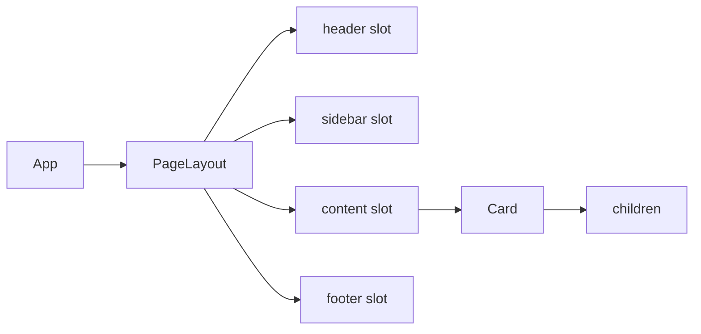

# Level 1: Composition — children and slots

## What is composition?

Composition is building complex components from simple ones, like LEGO bricks. Instead of creating one huge component, we create small ones that can be nested inside each other.

```jsx
// Without composition — monolith
<Card title="Title" content="Text" footer="Buttons" />

// With composition — flexible
<Card>
  <Card.Header>Title</Card.Header>
  <p>Any complexity text</p>
  <Card.Footer><Button>Action</Button></Card.Footer>
</Card>
```

## children — the main tool

The `children` prop is everything you put between the opening and closing tags of a component. React passes this content automatically.

```tsx
interface CardProps {
  children: React.ReactNode
}

function Card({ children }: CardProps) {
  return <div className="card">{children}</div>
}

// Usage
<Card>
  <h2>Any content</h2>
  <p>Text, components, anything you want</p>
</Card>
```

## Slots — named children

When you need several independent content zones, use **slots** — regular props with type `React.ReactNode`:

```tsx
interface CardProps {
  header?: React.ReactNode
  children: React.ReactNode
  footer?: React.ReactNode
}

function Card({ header, children, footer }: CardProps) {
  return (
    <div className="card">
      {header && <div className="card-header">{header}</div>}
      <div className="card-body">{children}</div>
      {footer && <div className="card-footer">{footer}</div>}
    </div>
  )
}
```

## Data flow through the tree



## Why not inheritance?

There's no point in inheriting components via `extends` in React. You can't predict in advance what content component users will need. Composition solves this elegantly — the wrapper component knows nothing about its contents, and that's a good thing.

## Common mistakes

❌ **Passing strings where ReactNode is needed**

```tsx
// Bad — we lose flexibility
<Card header="Title" />

// Good — can pass anything
<Card header={<h2>Title with <span>accent</span></h2>} />
```

❌ **Rendering a slot without checking for undefined**

```tsx
// Bad — renders empty div
<div className="footer">{footer}</div>

// Good — renders nothing if slot is empty
{footer && <div className="footer">{footer}</div>}
```
