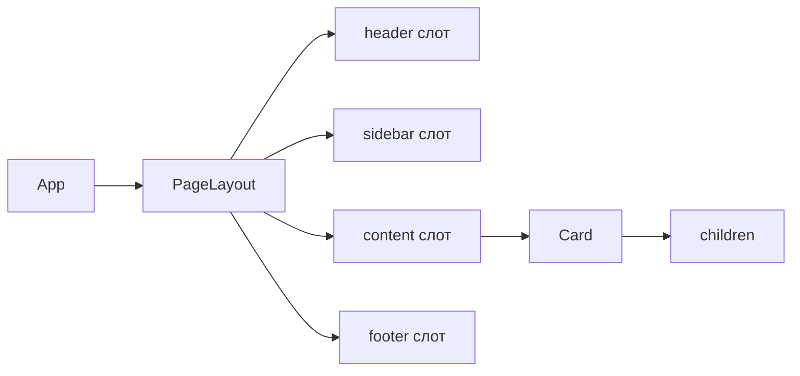

# Level 1: Композиция — children и слоты

## Что такое композиция?

Композиция — это сборка сложных компонентов из простых, как конструктор LEGO. Вместо того чтобы создавать один огромный компонент, мы создаём маленькие, которые можно вкладывать друг в друга.

```jsx
// Без композиции — монолит
<Card title="Заголовок" content="Текст" footer="Кнопки" />

// С композицией — гибко
<Card>
  <Card.Header>Заголовок</Card.Header>
  <p>Текст любой сложности</p>
  <Card.Footer><Button>Действие</Button></Card.Footer>
</Card>
```

## children — главный инструмент

Проп `children` — это всё, что вы помещаете между открывающим и закрывающим тегом компонента. React передаёт это содержимое автоматически.

```tsx
interface CardProps {
  children: React.ReactNode
}

function Card({ children }: CardProps) {
  return <div className="card">{children}</div>
}

// Использование
<Card>
  <h2>Любой контент</h2>
  <p>Текст, компоненты, всё что угодно</p>
</Card>
```

## Слоты — именованные children

Когда нужно несколько независимых зон для контента, используем **слоты** — обычные пропсы с типом `React.ReactNode`:

```tsx
interface CardProps {
  header?: React.ReactNode
  children: React.ReactNode
  footer?: React.ReactNode
}

function Card({ header, children, footer }: CardProps) {
  return (
    <div className="card">
      {header && <div className="card-header">{header}</div>}
      <div className="card-body">{children}</div>
      {footer && <div className="card-footer">{footer}</div>}
    </div>
  )
}
```

## Поток данных через дерево



## Почему не наследование?

В React нет смысла наследовать компоненты через `extends`. Нельзя заранее предсказать, какой контент понадобится пользователям компонента. Композиция решает это элегантно — компонент-обёртка не знает ничего о своём содержимом, и это правильно.

## Типичные ошибки

❌ **Передавать строки туда, где нужен ReactNode**

```tsx
// Плохо — теряем гибкость
<Card header="Заголовок" />

// Хорошо — можно передать что угодно
<Card header={<h2>Заголовок с <span>акцентом</span></h2>} />
```

❌ **Рендерить слот без проверки на undefined**

```tsx
// Плохо — рендерит пустой div
<div className="footer">{footer}</div>

// Хорошо — не рендерит ничего, если слот пуст
{footer && <div className="footer">{footer}</div>}
```
