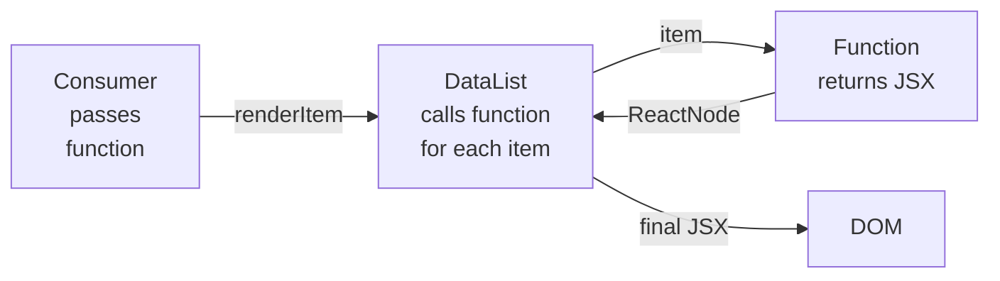

# Level 2: Render Props — Detailed Theory

## Where the pattern came from

Before hooks (React 16.8), developers had two problems: how to reuse **logic** between components and how to give the consumer control over **what exactly to render**. HOCs solved the first task but created "wrapper hell" and prop name conflicts. Render Props solved both tasks through one mechanism — a function as data.

Today hooks have replaced render props for most logic reuse cases. But render props remain the best tool where a component needs to **hand over rendering control** to the consumer.

---

## Inversion of Control

The key idea — **Inversion of Control (IoC)**. Compare two approaches:

**Without IoC: component decides what to draw**
```tsx
// Component is tightly coupled to UserCard
function UserList({ users }: { users: User[] }) {
  return (
    <ul>
      {users.map(user => (
        <UserCard key={user.id} user={user} /> // cannot change from outside
      ))}
    </ul>
  )
}
```

**With IoC via render prop: consumer decides**
```tsx
function DataList<T>({
  data,
  renderItem,
}: {
  data: T[]
  renderItem: (item: T, index: number) => ReactNode
}) {
  return (
    <ul>
      {data.map((item, i) => (
        <li key={i}>{renderItem(item, i)}</li>
      ))}
    </ul>
  )
}

// Usage: full control over rendering of each element
<DataList data={users} renderItem={(user) => <UserCard user={user} />} />
<DataList data={products} renderItem={(p) => <ProductRow product={p} />} />
```

Analogy: imagine a picture frame. The frame (`DataList`) contains the list display logic — padding, scrolling, empty state. The picture (`renderItem`) is entirely up to the frame owner.

---

## Anatomy of a render prop component



A component with render prop does three things:
1. Manages **state** or **data** (mouse coordinates, open state, list)
2. **Calls** the passed function with this data
3. Embeds the **result** of the call into its render

```tsx
// Minimal MouseTracker implementation
interface MousePosition {
  x: number
  y: number
}

interface MouseTrackerProps {
  render: (pos: MousePosition) => ReactNode
}

function MouseTracker({ render }: MouseTrackerProps) {
  const [pos, setPos] = useState<MousePosition>({ x: 0, y: 0 })

  return (
    <div
      style={{ width: '100%', height: '300px', position: 'relative' }}
      onMouseMove={(e) => setPos({ x: e.clientX, y: e.clientY })}
    >
      {render(pos)} {/* component calls the function itself */}
    </div>
  )
}

// Consumer decides what to do with coordinates
<MouseTracker render={({ x, y }) => (
  <div style={{ position: 'absolute', left: x, top: y }}>
    Cursor is here!
  </div>
)} />
```

---

## Function as Children

A variation of the pattern: instead of a named prop, `children` is used as a function.

```tsx
interface MouseTrackerProps {
  children: (pos: MousePosition) => ReactNode
}

function MouseTracker({ children }: MouseTrackerProps) {
  const [pos, setPos] = useState({ x: 0, y: 0 })
  return (
    <div onMouseMove={(e) => setPos({ x: e.clientX, y: e.clientY })}>
      {children(pos)} {/* calling children as a function */}
    </div>
  )
}

// Usage
<MouseTracker>
  {({ x, y }) => <p>x={x}, y={y}</p>}
</MouseTracker>
```

**Comparing the two forms:**

| Aspect | `render` prop | `children` as function |
|--------|---------------|----------------------|
| Readability | Explicit purpose | May not be obvious |
| Multiple functions | Easy to add | Only one `children` |
| TypeScript | Simple typing | Need to redefine `children` type |
| Popularity | React Router, Apollo | Downshift, old React Motion |

---

## Generic DataList: proper typing

Generic components in render props are a classic scenario:

```tsx
interface DataListProps<T> {
  data: T[]
  renderItem: (item: T, index: number) => ReactNode
  renderEmpty?: () => ReactNode
  keyExtractor?: (item: T, index: number) => string | number
}

function DataList<T>({
  data,
  renderItem,
  renderEmpty,
  keyExtractor,
}: DataListProps<T>) {
  if (data.length === 0) {
    return <>{renderEmpty ? renderEmpty() : <p>No data</p>}</>
  }

  return (
    <ul>
      {data.map((item, index) => (
        <li key={keyExtractor ? keyExtractor(item, index) : index}>
          {renderItem(item, index)}
        </li>
      ))}
    </ul>
  )
}

// TypeScript correctly infers item type from data:
<DataList
  data={[{ id: 1, name: 'Alice' }]}
  renderItem={(user) => <span>{user.name}</span>} // user: { id: number; name: string }
/>
```

---

## Toggle: managing boolean state

`Toggle` is a classic render prop example for managing boolean state:

```tsx
interface ToggleRenderProps {
  isOpen: boolean
  toggle: () => void
  open: () => void
  close: () => void
}

interface ToggleProps {
  defaultOpen?: boolean
  render: (props: ToggleRenderProps) => ReactNode
}

function Toggle({ defaultOpen = false, render }: ToggleProps) {
  const [isOpen, setIsOpen] = useState(defaultOpen)

  const actions = {
    isOpen,
    toggle: () => setIsOpen(v => !v),
    open: () => setIsOpen(true),
    close: () => setIsOpen(false),
  }

  return <>{render(actions)}</>
}
```

One `Toggle` component — three different use cases:

```tsx
// Dropdown
<Toggle render={({ isOpen, toggle }) => (
  <div>
    <button onClick={toggle}>Menu {isOpen ? '▲' : '▼'}</button>
    {isOpen && <ul><li>Item 1</li><li>Item 2</li></ul>}
  </div>
)} />

// Modal trigger
<Toggle render={({ isOpen, open, close }) => (
  <>
    <button onClick={open}>Open modal</button>
    {isOpen && (
      <div className="modal">
        <button onClick={close}>×</button>
        <p>Modal content</p>
      </div>
    )}
  </>
)} />

// Expandable section
<Toggle render={({ isOpen, toggle }) => (
  <section>
    <h3 onClick={toggle}>FAQ: How does the course work? {isOpen ? '−' : '+'}</h3>
    {isOpen && <p>Detailed answer to the question...</p>}
  </section>
)} />
```

---

## When render props, when hooks

Render props **are not outdated**. They solve a different task than hooks:

```tsx
// Hook: reuse logic without UI
function useMousePosition() {
  const [pos, setPos] = useState({ x: 0, y: 0 })
  useEffect(() => {
    const handler = (e: MouseEvent) => setPos({ x: e.clientX, y: e.clientY })
    window.addEventListener('mousemove', handler)
    return () => window.removeEventListener('mousemove', handler)
  }, [])
  return pos
}

// ✅ Good: logic without DOM element binding
function MyComponent() {
  const { x, y } = useMousePosition()
  return <p>{x}, {y}</p>
}
```

```tsx
// Render prop: component owns the tracking area (limited zone)
<MouseTracker>
  {({ x, y }) => <Crosshair x={x} y={y} />}
</MouseTracker>
```

**Use render props when:**
- Component manages a limited **DOM area** (tracking zone, dropzone)
- You need multiple **independent render** functions (renderItem + renderEmpty + renderHeader)
- Component should work as a **headless UI primitive** library (Headless UI, Radix UI, Downshift)

---

## Edge Cases and practical details

### Optimization: don't create functions in render

```tsx
// ❌ Each parent render creates a new function
function Parent() {
  return (
    <DataList
      data={items}
      renderItem={(item) => <Card item={item} />} // new function every time
    />
  )
}

// ✅ Stable reference via useCallback
function Parent() {
  const renderItem = useCallback(
    (item: Item) => <Card item={item} />,
    [] // dependencies
  )
  return <DataList data={items} renderItem={renderItem} />
}
```

### Typing renderItem with keys

```tsx
// React requires key when rendering in lists
// But key cannot be passed through renderItem — it's a special React attribute

// ❌ key inside renderItem is ignored
renderItem={(item) => <Card key={item.id} item={item} />}

// ✅ Correct: DataList sets key on the wrapper element itself
// renderItem returns content, DataList wraps in <li key={...}>
```

### Call order

```tsx
// render prop is called inside the component's render function,
// so hooks CANNOT be used inside render prop:

// ❌ Violation of hook rules
<DataList renderItem={(item) => {
  const [count, setCount] = useState(0) // error! hooks can't be in callback
  return <button onClick={() => setCount(c => c + 1)}>{count}</button>
}} />

// ✅ Extract into a separate component
function ItemWithCounter({ item }: { item: Item }) {
  const [count, setCount] = useState(0)
  return <button onClick={() => setCount(c => c + 1)}>{count}</button>
}

<DataList renderItem={(item) => <ItemWithCounter item={item} />} />
```

---

## ⚠️ Common beginner mistakes

**❌ Calling render prop as a component instead of a function**
```tsx
// Wrong: render is a function, not a component
function DataList({ renderItem, data }) {
  return data.map(item => <renderItem item={item} />) // error!
}
```
✅ Render prop is called as a function: `renderItem(item)`, not as a tag `<renderItem />`.

---

**❌ Forgetting about empty state**
```tsx
function DataList({ data, renderItem }) {
  return <ul>{data.map(renderItem)}</ul> // with empty array — empty <ul>
}
```
✅ Always handle empty state, preferably via `renderEmpty` prop:
```tsx
if (data.length === 0) return renderEmpty?.() ?? <p>No data</p>
```

---

**❌ Hooks inside render prop callback**
```tsx
<DataList renderItem={(item) => {
  const theme = useTheme() // violation of hook rules!
  return <Card theme={theme} />
}} />
```
✅ Extract logic with hooks into a separate component:
```tsx
function ItemCard({ item }: { item: Item }) {
  const theme = useTheme() // hooks are fine here
  return <Card theme={theme} item={item} />
}
<DataList renderItem={(item) => <ItemCard item={item} />} />
```

---

**❌ Ignoring types in generic components**
```tsx
// any instead of generic — lose type safety
function DataList({ renderItem }: { renderItem: (item: any) => ReactNode }) { }
```
✅ Use generic `<T>` — TypeScript will infer the type from `data`:
```tsx
function DataList<T>({ data, renderItem }: {
  data: T[]
  renderItem: (item: T) => ReactNode
}) { }
```
