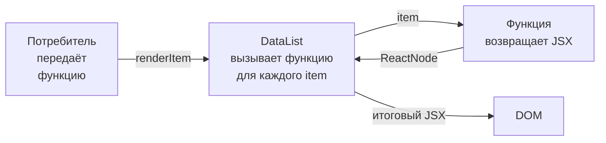

# Level 2: Render Props — Подробная теория

## Откуда появился паттерн

До хуков (React 16.8) у разработчиков было две проблемы: как переиспользовать **логику** между компонентами и как дать потребителю контроль над тем, **что именно рендерить**. HOC решал первую задачу, но создавал «обёрточный ад» и проблемы с именами пропсов. Render Props решили обе задачи через один механизм — функцию как данные.

Сегодня хуки заменили render props для большинства случаев переиспользования логики. Но render props остаются лучшим инструментом там, где компонент должен **отдавать контроль над своим рендером** потребителю.

---

## Инверсия управления

Ключевая идея — **инверсия управления** (Inversion of Control, IoC). Сравните два подхода:

**Без IoC: компонент сам решает, что рисовать**
```tsx
// Компонент жёстко привязан к UserCard
function UserList({ users }: { users: User[] }) {
  return (
    <ul>
      {users.map(user => (
        <UserCard key={user.id} user={user} /> // нельзя изменить снаружи
      ))}
    </ul>
  )
}
```

**С IoC через render prop: потребитель решает**
```tsx
function DataList<T>({
  data,
  renderItem,
}: {
  data: T[]
  renderItem: (item: T, index: number) => ReactNode
}) {
  return (
    <ul>
      {data.map((item, i) => (
        <li key={i}>{renderItem(item, i)}</li>
      ))}
    </ul>
  )
}

// Использование: полный контроль над рендером каждого элемента
<DataList data={users} renderItem={(user) => <UserCard user={user} />} />
<DataList data={products} renderItem={(p) => <ProductRow product={p} />} />
```

Аналогия: представьте рамку для картины. Рамка (`DataList`) содержит логику отображения списка — отступы, скроллинг, пустое состояние. Картина (`renderItem`) — полностью на усмотрение владельца рамки.

---

## Анатомия компонента с render prop



Компонент с render prop делает три вещи:
1. Управляет **состоянием** или **данными** (координаты мыши, состояние открытия, список)
2. **Вызывает** переданную функцию с этими данными
3. Встраивает **результат** вызова в свой рендер

```tsx
// Минимальная реализация MouseTracker
interface MousePosition {
  x: number
  y: number
}

interface MouseTrackerProps {
  render: (pos: MousePosition) => ReactNode
}

function MouseTracker({ render }: MouseTrackerProps) {
  const [pos, setPos] = useState<MousePosition>({ x: 0, y: 0 })

  return (
    <div
      style={{ width: '100%', height: '300px', position: 'relative' }}
      onMouseMove={(e) => setPos({ x: e.clientX, y: e.clientY })}
    >
      {render(pos)} {/* компонент вызывает функцию сам */}
    </div>
  )
}

// Потребитель решает, что делать с координатами
<MouseTracker render={({ x, y }) => (
  <div style={{ position: 'absolute', left: x, top: y }}>
    Курсор здесь!
  </div>
)} />
```

---

## Function as Children

Вариация паттерна: вместо именованного пропса используется `children` как функция.

```tsx
interface MouseTrackerProps {
  children: (pos: MousePosition) => ReactNode
}

function MouseTracker({ children }: MouseTrackerProps) {
  const [pos, setPos] = useState({ x: 0, y: 0 })
  return (
    <div onMouseMove={(e) => setPos({ x: e.clientX, y: e.clientY })}>
      {children(pos)} {/* вызываем children как функцию */}
    </div>
  )
}

// Использование
<MouseTracker>
  {({ x, y }) => <p>x={x}, y={y}</p>}
</MouseTracker>
```

**Сравнение двух форм:**

| Аспект | `render` пропс | `children` как функция |
|--------|---------------|----------------------|
| Читаемость | Явное назначение | Может быть неочевидно |
| Несколько функций | Легко добавить | Только одна `children` |
| TypeScript | Простая типизация | Нужно переопределить тип `children` |
| Популярность | React Router, Apollo | Downshift, старый React Motion |

---

## Generic DataList: правильная типизация

Дженерик-компоненты в render prop — классический сценарий:

```tsx
interface DataListProps<T> {
  data: T[]
  renderItem: (item: T, index: number) => ReactNode
  renderEmpty?: () => ReactNode
  keyExtractor?: (item: T, index: number) => string | number
}

function DataList<T>({
  data,
  renderItem,
  renderEmpty,
  keyExtractor,
}: DataListProps<T>) {
  if (data.length === 0) {
    return <>{renderEmpty ? renderEmpty() : <p>Нет данных</p>}</>
  }

  return (
    <ul>
      {data.map((item, index) => (
        <li key={keyExtractor ? keyExtractor(item, index) : index}>
          {renderItem(item, index)}
        </li>
      ))}
    </ul>
  )
}

// TypeScript правильно выводит тип item из data:
<DataList
  data={[{ id: 1, name: 'Alice' }]}
  renderItem={(user) => <span>{user.name}</span>} // user: { id: number; name: string }
/>
```

---

## Toggle: управление булевым состоянием

`Toggle` — классический пример render prop для управления булевым состоянием:

```tsx
interface ToggleRenderProps {
  isOpen: boolean
  toggle: () => void
  open: () => void
  close: () => void
}

interface ToggleProps {
  defaultOpen?: boolean
  render: (props: ToggleRenderProps) => ReactNode
}

function Toggle({ defaultOpen = false, render }: ToggleProps) {
  const [isOpen, setIsOpen] = useState(defaultOpen)

  const actions = {
    isOpen,
    toggle: () => setIsOpen(v => !v),
    open: () => setIsOpen(true),
    close: () => setIsOpen(false),
  }

  return <>{render(actions)}</>
}
```

Один компонент `Toggle` — три разных сценария использования:

```tsx
// Dropdown
<Toggle render={({ isOpen, toggle }) => (
  <div>
    <button onClick={toggle}>Меню {isOpen ? '▲' : '▼'}</button>
    {isOpen && <ul><li>Пункт 1</li><li>Пункт 2</li></ul>}
  </div>
)} />

// Modal trigger
<Toggle render={({ isOpen, open, close }) => (
  <>
    <button onClick={open}>Открыть модалку</button>
    {isOpen && (
      <div className="modal">
        <button onClick={close}>×</button>
        <p>Содержимое модалки</p>
      </div>
    )}
  </>
)} />

// Expandable section
<Toggle render={({ isOpen, toggle }) => (
  <section>
    <h3 onClick={toggle}>FAQ: Как работает курс? {isOpen ? '−' : '+'}</h3>
    {isOpen && <p>Подробный ответ на вопрос...</p>}
  </section>
)} />
```

---

## Когда render props, когда хуки

Render props **не устарели**. Они решают другую задачу, чем хуки:

```tsx
// Хук: переиспользуем логику без UI
function useMousePosition() {
  const [pos, setPos] = useState({ x: 0, y: 0 })
  useEffect(() => {
    const handler = (e: MouseEvent) => setPos({ x: e.clientX, y: e.clientY })
    window.addEventListener('mousemove', handler)
    return () => window.removeEventListener('mousemove', handler)
  }, [])
  return pos
}

// ✅ Хорошо: логика без привязки к DOM-элементу
function MyComponent() {
  const { x, y } = useMousePosition()
  return <p>{x}, {y}</p>
}
```

```tsx
// Render prop: компонент сам владеет областью трекинга (ограниченная зона)
<MouseTracker>
  {({ x, y }) => <Crosshair x={x} y={y} />}
</MouseTracker>
```

**Используйте render props когда:**
- Компонент управляет ограниченной **областью DOM** (зона трекинга, дропзона)
- Нужно несколько **независимых render** функций (renderItem + renderEmpty + renderHeader)
- Компонент должен работать как **библиотека UI-примитивов** (Headless UI, Radix UI, Downshift)

---

## Edge Cases и практические детали

### Оптимизация: не создавайте функции в render

```tsx
// ❌ Каждый рендер родителя создаёт новую функцию
function Parent() {
  return (
    <DataList
      data={items}
      renderItem={(item) => <Card item={item} />} // новая функция каждый раз
    />
  )
}

// ✅ Стабильная ссылка через useCallback
function Parent() {
  const renderItem = useCallback(
    (item: Item) => <Card item={item} />,
    [] // зависимости
  )
  return <DataList data={items} renderItem={renderItem} />
}
```

### Типизация renderItem с ключами

```tsx
// React требует key при рендере в списках
// Но key нельзя передать через renderItem — это специальный атрибут React

// ❌ key внутри renderItem игнорируется
renderItem={(item) => <Card key={item.id} item={item} />}

// ✅ Правильно: DataList сам устанавливает key на wrapper-элемент
// renderItem возвращает содержимое, DataList оборачивает в <li key={...}>
```

### Порядок вызовов

```tsx
// render prop вызывается внутри функции render компонента,
// поэтому хуки внутри render prop использовать НЕЛЬЗЯ:

// ❌ Нарушение правил хуков
<DataList renderItem={(item) => {
  const [count, setCount] = useState(0) // ошибка! хуки нельзя в callback
  return <button onClick={() => setCount(c => c + 1)}>{count}</button>
}} />

// ✅ Вынесите в отдельный компонент
function ItemWithCounter({ item }: { item: Item }) {
  const [count, setCount] = useState(0)
  return <button onClick={() => setCount(c => c + 1)}>{count}</button>
}

<DataList renderItem={(item) => <ItemWithCounter item={item} />} />
```

---

## ⚠️ Типичные ошибки новичков

**❌ Вызов render prop не как функцию**
```tsx
// Неправильно: render — это функция, а не компонент
function DataList({ renderItem, data }) {
  return data.map(item => <renderItem item={item} />) // ошибка!
}
```
✅ Render prop вызывается как функция: `renderItem(item)`, а не как тег `<renderItem />`.

---

**❌ Забывают про пустое состояние**
```tsx
function DataList({ data, renderItem }) {
  return <ul>{data.map(renderItem)}</ul> // при пустом массиве — пустой <ul>
}
```
✅ Всегда обрабатывайте пустое состояние, желательно через `renderEmpty` prop:
```tsx
if (data.length === 0) return renderEmpty?.() ?? <p>Нет данных</p>
```

---

**❌ Хуки внутри render prop callback**
```tsx
<DataList renderItem={(item) => {
  const theme = useTheme() // нарушение правил хуков!
  return <Card theme={theme} />
}} />
```
✅ Вынесите логику с хуками в отдельный компонент:
```tsx
function ItemCard({ item }: { item: Item }) {
  const theme = useTheme() // хуки здесь — нормально
  return <Card theme={theme} item={item} />
}
<DataList renderItem={(item) => <ItemCard item={item} />} />
```

---

**❌ Игнорирование типов в дженерик-компоненте**
```tsx
// any вместо generic — теряем типобезопасность
function DataList({ renderItem }: { renderItem: (item: any) => ReactNode }) { }
```
✅ Используйте дженерик `<T>` — TypeScript сам выведет тип из `data`:
```tsx
function DataList<T>({ data, renderItem }: {
  data: T[]
  renderItem: (item: T) => ReactNode
}) { }
```
