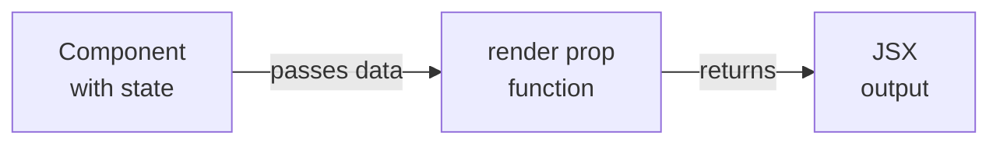

# Level 2: Render Props

## What are Render Props

Render Props is a pattern where a component accepts a function via a prop and calls it to produce its output. The component owns the **behavior**, while the calling code owns the **appearance**.



---

## Forms of render props

**Function as children** — function is passed through `children`:

```tsx
<MouseTracker>
  {({ x, y }) => <Tooltip x={x} y={y} />}
</MouseTracker>
```

**Named render prop** — function is passed through an explicit prop:

```tsx
<DataList
  data={users}
  renderItem={(user) => <UserCard key={user.id} user={user} />}
  renderEmpty={() => <p>List is empty</p>}
/>
```

📌 Named props are preferred: their purpose is clear without reading the component implementation.

---

## Render Props vs Hooks

| Criterion | Render Props | Hooks |
|----------|-------------|------|
| Access to JSX context | ✅ directly | ✅ via component |
| Nesting | Grows with multiple | Flat |
| Logic reuse | ✅ | ✅ (preferred) |
| Scope isolation | ✅ isolates | ✅ isolates |
| Hook rules in render | Not applicable | Required |

💡 Selection rule: if you need to reuse **logic without UI** — use a hook. If you need to give the consumer control over **rendering part of the UI** — render prop.

---

## ⚠️ Common beginner mistakes

**❌ Creating a function directly in JSX without useCallback**
```tsx
// Each render creates a new function — child component
// re-renders even if data hasn't changed
<DataList renderItem={(item) => <Card item={item} />} />
```
✅ If performance is critical — extract the function or wrap it in `useCallback`.

**❌ Render prop doesn't return a single root element**
```tsx
// TypeScript (and React) expects ReactNode — this is fine,
// but fragments can break positioning logic
renderItem={() => <A /><B />} // syntax error
```
✅ Use fragments: `() => <><A /><B /></>`.

**❌ Type confusion in generic components**
```tsx
// Error: item has type unknown
function DataList({ renderItem }) {
  return renderItem(data[0])
}
```
✅ Parameterize via generic: `DataList<T>` with `renderItem: (item: T) => ReactNode`.
