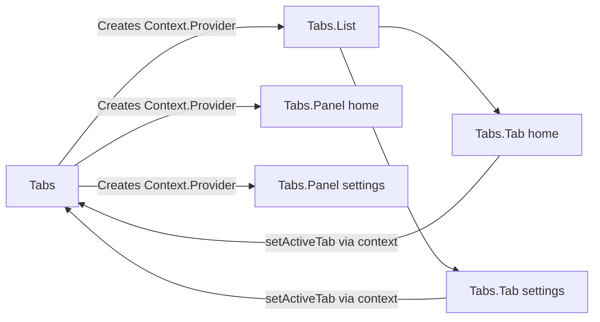

# Level 3: Compound Components — Detailed Theory

## Where it comes from: the prop explosion problem

Let's start with the pain. You create a `<Tabs>` component. At first it's simple:

```tsx
<Tabs tabs={tabs} activeTab={active} onTabChange={setActive} />
```

Then requirements come in: "add icons to tabs", "add badges with notification counts", "disable individual tabs", "need custom tab rendering". And you add props:

```tsx
// ❌ Prop explosion — component knows too much
<Tabs
  tabs={tabs}
  activeTab={active}
  onTabChange={setActive}
  renderTab={(tab) => <span>{tab.icon} {tab.label}</span>}
  renderPanel={(tab) => tab.content}
  tabClassName="custom-tab"
  panelClassName="custom-panel"
  disabledTabs={['settings']}
  tabBadges={{ notifications: 5 }}
  tabPosition="top"
  onChange={handleChange}
  onMount={handleMount}
/>
```

This is called **prop explosion** — the component gets covered in props trying to cover all use cases. Problems:

1. API is hard to remember and document
2. Each new case requires a new prop
3. Component knows about all possible variations in advance

## HTML analogy: `<select>` and `<option>`

Browsers solved this elegantly back in the 1990s:

```html
<select name="country">
  <option value="ru">Russia</option>
  <option value="us" disabled>USA (unavailable)</option>
  <optgroup label="Europe">
    <option value="de">Germany</option>
    <option value="fr">France</option>
  </optgroup>
</select>
```

Look at what's happening here:
- `<option>` **knows** about its `<select>` — when you click an option, the select updates its value
- `<option>` **doesn't receive** any callbacks through attributes
- You can nest `<optgroup>` — and it works
- The structure is declarative and readable

React Compound Components — the same pattern, but in the world of components.

## Mechanism: how children "see" parent state

In HTML the browser manages communication between `<select>` and `<option>`. In React we use **Context** as the communication channel.

Here's the full architecture:

```
Tabs (stores activeTab, provides Context)
├── Tabs.List (just a wrapper, doesn't know about state)
│   ├── Tabs.Tab id="home" (reads activeTab from Context, calls setActiveTab)
│   └── Tabs.Tab id="settings" (same)
├── Tabs.Panel id="home" (reads activeTab, shows/hides content)
└── Tabs.Panel id="settings" (same)
```

Key point: **no intermediate component passes props down**. Context works directly.



## Step-by-step implementation

### Step 1: Define types and create context

```tsx
interface TabsContextValue {
  activeTab: string
  setActiveTab: (id: string) => void
}

const TabsContext = createContext<TabsContextValue | null>(null)

// Hook for safe context usage
function useTabsContext() {
  const ctx = useContext(TabsContext)
  if (!ctx) {
    throw new Error('useTabsContext must be used within <Tabs>')
  }
  return ctx
}
```

Why throw an error? Because `<Tabs.Tab>` outside `<Tabs>` is a programming error. Better to get a clear message than a cryptic `TypeError: Cannot read property 'activeTab' of null`.

### Step 2: Root component stores state

```tsx
interface TabsProps {
  children: ReactNode
  defaultTab: string
}

function TabsRoot({ children, defaultTab }: TabsProps) {
  const [activeTab, setActiveTab] = useState(defaultTab)

  return (
    <TabsContext.Provider value={{ activeTab, setActiveTab }}>
      <div className="tabs">
        {children}
      </div>
    </TabsContext.Provider>
  )
}
```

💡 **Tip:** Name the internal function `TabsRoot`, not `Tabs`. Give the name `Tabs` to the final object — this simplifies debugging in DevTools.

### Step 3: Sub-components read context

```tsx
interface TabProps {
  id: string
  children: ReactNode
  disabled?: boolean
}

function Tab({ id, children, disabled = false }: TabProps) {
  const { activeTab, setActiveTab } = useTabsContext()
  const isActive = activeTab === id

  return (
    <button
      role="tab"
      aria-selected={isActive}
      aria-disabled={disabled}
      disabled={disabled}
      className={`tab ${isActive ? 'tab--active' : ''}`}
      onClick={() => !disabled && setActiveTab(id)}
    >
      {children}
    </button>
  )
}

interface PanelProps {
  id: string
  children: ReactNode
}

function Panel({ id, children }: PanelProps) {
  const { activeTab } = useTabsContext()

  if (activeTab !== id) return null

  return (
    <div role="tabpanel" className="tab-panel">
      {children}
    </div>
  )
}
```

### Step 4: Assemble everything via Object.assign

```tsx
export const Tabs = Object.assign(TabsRoot, {
  List: TabsList,
  Tab,
  Panel,
})
```

Now you can write `<Tabs.Tab>` — TypeScript knows the types, autocomplete works.

**Alternative — static properties:**

```tsx
TabsRoot.List = TabsList
TabsRoot.Tab = Tab
TabsRoot.Panel = Panel

export { TabsRoot as Tabs }
```

Both approaches are equivalent. `Object.assign` is slightly more compact.

## Old approach: cloneElement (deprecated, but still found)

Before React Context (before version 16.3), `React.Children.map` + `cloneElement` was used:

```tsx
// ❌ Outdated approach — don't do this
function TabsOld({ children, activeTab, onTabChange }) {
  return (
    <div>
      {React.Children.map(children, (child) =>
        React.cloneElement(child, { activeTab, onTabChange })
      )}
    </div>
  )
}
```

**Why this is bad:**
- Only works for **direct** children — if `<Tab>` is wrapped in `<div>`, it won't receive props
- TypeScript can't check types of cloned elements
- Violates the principle of explicit dependencies

## Keyboard Navigation: making Select accessible

A real compound component should work with keyboard. For `<Select>` this means:

```
Enter / Space  → open/close list
ArrowDown      → next option
ArrowUp        → previous option
Home           → first option
End            → last option
Enter          → select current option
Escape         → close list
```

```tsx
function SelectRoot({ children, onChange }: SelectProps) {
  const [isOpen, setIsOpen] = useState(false)
  const [selected, setSelected] = useState<string | null>(null)
  const [focusedIndex, setFocusedIndex] = useState(0)

  const handleKeyDown = (e: KeyboardEvent) => {
    switch (e.key) {
      case 'ArrowDown':
        e.preventDefault()
        setFocusedIndex(i => Math.min(i + 1, optionsCount - 1))
        break
      case 'ArrowUp':
        e.preventDefault()
        setFocusedIndex(i => Math.max(i - 1, 0))
        break
      case 'Enter':
        if (isOpen) selectFocused()
        else setIsOpen(true)
        break
      case 'Escape':
        setIsOpen(false)
        break
    }
  }

  // ...
}
```

## Wizard pattern: Stepper

`<Stepper>` is a compound component for multi-step forms. Its feature: steps are linear and ordered.

```tsx
<Stepper initialStep={0} onComplete={handleComplete}>
  <Stepper.Step title="Personal details">
    <PersonalForm />
  </Stepper.Step>
  <Stepper.Step title="Shipping address">
    <AddressForm />
  </Stepper.Step>
  <Stepper.Step title="Confirmation">
    <ConfirmationView />
  </Stepper.Step>
  <Stepper.Controls />
</Stepper>
```

Stepper stores `currentStep: number`, not a string id — because steps have order and can be iterated.

## "Safe context" pattern

Always create a wrapper hook over `useContext`:

```tsx
// ✅ Always do this
function useTabsContext(): TabsContextValue {
  const ctx = useContext(TabsContext)
  if (!ctx) {
    throw new Error(
      'Tabs.Tab and Tabs.Panel components must be used inside <Tabs>'
    )
  }
  return ctx
}

// ❌ Never do this — null can sneak in unnoticed
function Tab({ id }: TabProps) {
  const ctx = useContext(TabsContext) // can be null!
  return <button onClick={() => ctx!.setActiveTab(id)}>...</button>
}
```

## Displayname for DevTools

```tsx
TabsRoot.displayName = 'Tabs'
Tab.displayName = 'Tabs.Tab'
Panel.displayName = 'Tabs.Panel'
```

Without this you'll see unnamed components in React DevTools. With it — a readable tree.

## Controlled vs uncontrolled mode

A good compound component supports both modes:

```tsx
// Uncontrolled — state inside
<Tabs defaultTab="home">

// Controlled — state from outside
<Tabs activeTab={active} onTabChange={setActive}>
```

```tsx
function TabsRoot({ defaultTab, activeTab, onTabChange, children }: TabsProps) {
  // Uncontrolled: use internal state
  const [internalTab, setInternalTab] = useState(defaultTab ?? '')

  // Controlled mode takes priority
  const currentTab = activeTab ?? internalTab
  const setTab = onTabChange ?? setInternalTab

  return (
    <TabsContext.Provider value={{ activeTab: currentTab, setActiveTab: setTab }}>
      {children}
    </TabsContext.Provider>
  )
}
```

## Common mistakes

### ❌ No null check for context

```tsx
// ❌ Bad — app will crash with a cryptic error
function Tab({ id }: TabProps) {
  const { activeTab } = useContext(TabsContext)! // forced non-null
  // ...
}
```

```tsx
// ✅ Good — clear error for the developer
function useTabsContext() {
  const ctx = useContext(TabsContext)
  if (!ctx) throw new Error('<Tabs.Tab> must be inside <Tabs>')
  return ctx
}
```

### ❌ Passing index instead of id

```tsx
// ❌ Bad — fragile when tab order changes
<Tabs.Tab index={0}>Home</Tabs.Tab>

// ✅ Good — id is a stable identifier
<Tabs.Tab id="home">Home</Tabs.Tab>
```

### ❌ Unnecessary re-renders through context

```tsx
// ❌ Bad — new object on every render
<TabsContext.Provider value={{ activeTab, setActiveTab }}>

// ✅ Good — memoize the value
const value = useMemo(() => ({ activeTab, setActiveTab }), [activeTab])
<TabsContext.Provider value={value}>
```

### ❌ Everything in one context

If a component has many independent pieces of state, split into multiple contexts. Otherwise any change will re-render all sub-components.

## Summary: when to use Compound Components

| Use | Don't use |
|---|---|
| Component has 2+ interdependent parts | Simple component with 1-2 props |
| Need flexibility in part positioning | Fixed structure is fine |
| API should be declarative | User doesn't change structure |
| Component is part of a design system | Quick one-off component |
