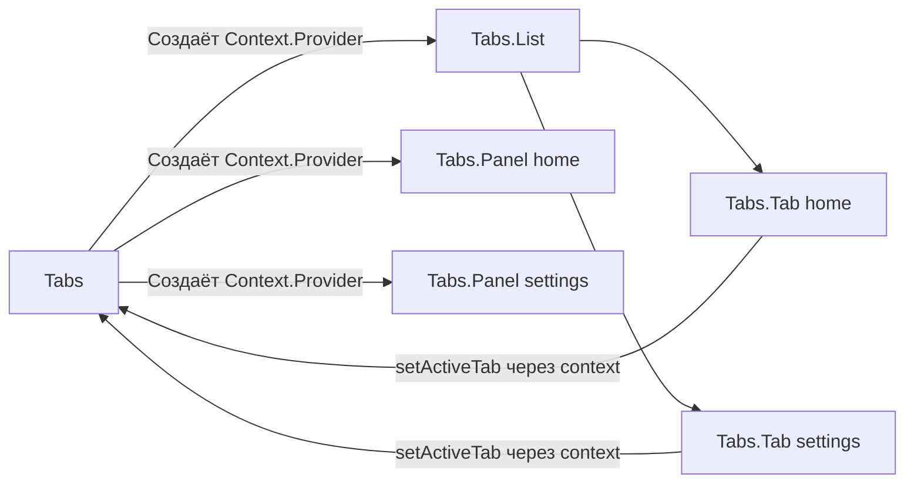

# Level 3: Compound Components — Подробная теория

## Откуда растут ноги: проблема prop explosion

Начнём с боли. Вы создаёте компонент `<Tabs>`. Сначала он простой:

```tsx
<Tabs tabs={tabs} activeTab={active} onTabChange={setActive} />
```

Потом приходят требования: "сделай иконки в табах", "добавь бейджи с числом уведомлений", "нужно отключить отдельные табы", "хочу кастомный рендер таба". И вы добавляете пропсы:

```tsx
// ❌ Prop explosion — компонент знает слишком много
<Tabs
  tabs={tabs}
  activeTab={active}
  onTabChange={setActive}
  renderTab={(tab) => <span>{tab.icon} {tab.label}</span>}
  renderPanel={(tab) => tab.content}
  tabClassName="custom-tab"
  panelClassName="custom-panel"
  disabledTabs={['settings']}
  tabBadges={{ notifications: 5 }}
  tabPosition="top"
  onChange={handleChange}
  onMount={handleMount}
/>
```

Это называется **prop explosion** — компонент обрастает пропсами, пытаясь покрыть все случаи использования. Проблемы:

1. API сложно запомнить и документировать
2. Каждый новый кейс требует нового пропса
3. Компонент знает обо всех возможных вариациях заранее

## Аналогия из HTML: `<select>` и `<option>`

Браузеры решили эту задачу элегантно ещё в 1990-х:

```html
<select name="country">
  <option value="ru">Россия</option>
  <option value="us" disabled>США (недоступно)</option>
  <optgroup label="Европа">
    <option value="de">Германия</option>
    <option value="fr">Франция</option>
  </optgroup>
</select>
```

Посмотрите, что здесь происходит:
- `<option>` **знает** о своём `<select>` — когда вы кликаете на опцию, select обновляет значение
- `<option>` **не получает** никаких колбэков через атрибуты
- Вы можете вкладывать `<optgroup>` — и это работает
- Структура декларативная и читаемая

React Compound Components — это тот же паттерн, но в мире компонентов.

## Механизм: как children "видят" state parent

В HTML браузер управляет коммуникацией между `<select>` и `<option>`. В React мы используем **Context** как канал связи.

Вот полная архитектура:

```
Tabs (хранит activeTab, предоставляет Context)
├── Tabs.List (просто обёртка, не знает о state)
│   ├── Tabs.Tab id="home" (читает activeTab из Context, вызывает setActiveTab)
│   └── Tabs.Tab id="settings" (то же самое)
├── Tabs.Panel id="home" (читает activeTab, показывает/скрывает контент)
└── Tabs.Panel id="settings" (то же самое)
```

Ключевое: **ни один промежуточный компонент не передаёт пропсы вниз**. Context работает напрямую.



## Реализация шаг за шагом

### Шаг 1: Определяем типы и создаём контекст

```tsx
interface TabsContextValue {
  activeTab: string
  setActiveTab: (id: string) => void
}

const TabsContext = createContext<TabsContextValue | null>(null)

// Хук для безопасного использования контекста
function useTabsContext() {
  const ctx = useContext(TabsContext)
  if (!ctx) {
    throw new Error('useTabsContext must be used within <Tabs>')
  }
  return ctx
}
```

Почему бросаем ошибку? Потому что `<Tabs.Tab>` вне `<Tabs>` — это программная ошибка. Лучше получить понятное сообщение, чем загадочный `TypeError: Cannot read property 'activeTab' of null`.

### Шаг 2: Root-компонент хранит state

```tsx
interface TabsProps {
  children: ReactNode
  defaultTab: string
}

function TabsRoot({ children, defaultTab }: TabsProps) {
  const [activeTab, setActiveTab] = useState(defaultTab)

  return (
    <TabsContext.Provider value={{ activeTab, setActiveTab }}>
      <div className="tabs">
        {children}
      </div>
    </TabsContext.Provider>
  )
}
```

💡 **Совет:** Называйте внутреннюю функцию `TabsRoot`, а не `Tabs`. Имя `Tabs` дайте финальному объекту — это упрощает отладку в DevTools.

### Шаг 3: Sub-компоненты читают контекст

```tsx
interface TabProps {
  id: string
  children: ReactNode
  disabled?: boolean
}

function Tab({ id, children, disabled = false }: TabProps) {
  const { activeTab, setActiveTab } = useTabsContext()
  const isActive = activeTab === id

  return (
    <button
      role="tab"
      aria-selected={isActive}
      aria-disabled={disabled}
      disabled={disabled}
      className={`tab ${isActive ? 'tab--active' : ''}`}
      onClick={() => !disabled && setActiveTab(id)}
    >
      {children}
    </button>
  )
}

interface PanelProps {
  id: string
  children: ReactNode
}

function Panel({ id, children }: PanelProps) {
  const { activeTab } = useTabsContext()

  if (activeTab !== id) return null

  return (
    <div role="tabpanel" className="tab-panel">
      {children}
    </div>
  )
}
```

### Шаг 4: Собираем всё через Object.assign

```tsx
export const Tabs = Object.assign(TabsRoot, {
  List: TabsList,
  Tab,
  Panel,
})
```

Теперь можно писать `<Tabs.Tab>` — TypeScript знает типы, автодополнение работает.

**Альтернатива — статические свойства:**

```tsx
TabsRoot.List = TabsList
TabsRoot.Tab = Tab
TabsRoot.Panel = Panel

export { TabsRoot as Tabs }
```

Оба подхода эквивалентны. `Object.assign` чуть компактнее.

## Старый подход: cloneElement (устарел, но встречается)

До React Context (до версии 16.3) использовали `React.Children.map` + `cloneElement`:

```tsx
// ❌ Устаревший подход — не делайте так
function TabsOld({ children, activeTab, onTabChange }) {
  return (
    <div>
      {React.Children.map(children, (child) =>
        React.cloneElement(child, { activeTab, onTabChange })
      )}
    </div>
  )
}
```

**Почему это плохо:**
- Работает только для **прямых** детей — если `<Tab>` обёрнут в `<div>`, он не получит пропсы
- TypeScript не может проверить типы клонированных элементов
- Нарушает принцип явных зависимостей

## Keyboard Navigation: делаем Select доступным

Настоящий compound component должен работать с клавиатурой. Для `<Select>` это означает:

```
Enter / Space  → открыть/закрыть список
ArrowDown      → следующий вариант
ArrowUp        → предыдущий вариант
Home           → первый вариант
End            → последний вариант
Enter          → выбрать текущий вариант
Escape         → закрыть список
```

```tsx
function SelectRoot({ children, onChange }: SelectProps) {
  const [isOpen, setIsOpen] = useState(false)
  const [selected, setSelected] = useState<string | null>(null)
  const [focusedIndex, setFocusedIndex] = useState(0)

  const handleKeyDown = (e: KeyboardEvent) => {
    switch (e.key) {
      case 'ArrowDown':
        e.preventDefault()
        setFocusedIndex(i => Math.min(i + 1, optionsCount - 1))
        break
      case 'ArrowUp':
        e.preventDefault()
        setFocusedIndex(i => Math.max(i - 1, 0))
        break
      case 'Enter':
        if (isOpen) selectFocused()
        else setIsOpen(true)
        break
      case 'Escape':
        setIsOpen(false)
        break
    }
  }

  // ...
}
```

## Wizard-паттерн: Stepper

`<Stepper>` — это compound component для многошаговых форм. Его особенность: шаги линейные и упорядоченные.

```tsx
<Stepper initialStep={0} onComplete={handleComplete}>
  <Stepper.Step title="Личные данные">
    <PersonalForm />
  </Stepper.Step>
  <Stepper.Step title="Адрес доставки">
    <AddressForm />
  </Stepper.Step>
  <Stepper.Step title="Подтверждение">
    <ConfirmationView />
  </Stepper.Step>
  <Stepper.Controls />
</Stepper>
```

Stepper хранит `currentStep: number`, а не строковый id — потому что шаги имеют порядок и их можно перебирать.

## Паттерн "безопасного контекста"

Всегда создавайте хук-обёртку над `useContext`:

```tsx
// ✅ Всегда так
function useTabsContext(): TabsContextValue {
  const ctx = useContext(TabsContext)
  if (!ctx) {
    throw new Error(
      'Компоненты Tabs.Tab и Tabs.Panel должны использоваться внутри <Tabs>'
    )
  }
  return ctx
}

// ❌ Никогда так — null может прийти незаметно
function Tab({ id }: TabProps) {
  const ctx = useContext(TabsContext) // может быть null!
  return <button onClick={() => ctx!.setActiveTab(id)}>...</button>
}
```

## Displayname для DevTools

```tsx
TabsRoot.displayName = 'Tabs'
Tab.displayName = 'Tabs.Tab'
Panel.displayName = 'Tabs.Panel'
```

Без этого в React DevTools вы увидите безымянные компоненты. С этим — читаемое дерево.

## Поддерживаемый vs неуправляемый режим

Хороший compound component поддерживает оба режима:

```tsx
// Неуправляемый (uncontrolled) — state внутри
<Tabs defaultTab="home">

// Управляемый (controlled) — state снаружи
<Tabs activeTab={active} onTabChange={setActive}>
```

```tsx
function TabsRoot({ defaultTab, activeTab, onTabChange, children }: TabsProps) {
  // Uncontrolled: используем внутренний state
  const [internalTab, setInternalTab] = useState(defaultTab ?? '')

  // Контролируемый режим имеет приоритет
  const currentTab = activeTab ?? internalTab
  const setTab = onTabChange ?? setInternalTab

  return (
    <TabsContext.Provider value={{ activeTab: currentTab, setActiveTab: setTab }}>
      {children}
    </TabsContext.Provider>
  )
}
```

## Типичные ошибки

### ❌ Нет проверки контекста на null

```tsx
// ❌ Плохо — приложение упадёт с загадочной ошибкой
function Tab({ id }: TabProps) {
  const { activeTab } = useContext(TabsContext)! // принудительный non-null
  // ...
}
```

```tsx
// ✅ Хорошо — понятная ошибка разработчику
function useTabsContext() {
  const ctx = useContext(TabsContext)
  if (!ctx) throw new Error('<Tabs.Tab> must be inside <Tabs>')
  return ctx
}
```

### ❌ Передача index вместо id

```tsx
// ❌ Плохо — хрупко при изменении порядка табов
<Tabs.Tab index={0}>Главная</Tabs.Tab>

// ✅ Хорошо — id стабильный идентификатор
<Tabs.Tab id="home">Главная</Tabs.Tab>
```

### ❌ Лишние ре-рендеры через контекст

```tsx
// ❌ Плохо — новый объект на каждый рендер
<TabsContext.Provider value={{ activeTab, setActiveTab }}>

// ✅ Хорошо — мемоизируем значение
const value = useMemo(() => ({ activeTab, setActiveTab }), [activeTab])
<TabsContext.Provider value={value}>
```

### ❌ Всё в одном контексте

Если у компонента много независимых частей состояния, разбейте на несколько контекстов. Иначе любое изменение перерендерит все sub-компоненты.

## Итог: когда использовать Compound Components

| Используйте | Не используйте |
|---|---|
| Компонент имеет 2+ взаимозависимых части | Простой компонент с 1-2 пропсами |
| Нужна гибкость в расположении частей | Фиксированная структура устраивает |
| API должен быть декларативным | Пользователь не меняет структуру |
| Компонент — часть дизайн-системы | Быстрый одноразовый компонент |
