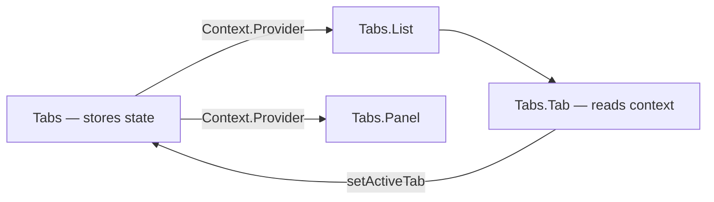

# Level 3: Compound Components

## The problem: components with rigid API

Imagine a `<Tabs>` component with 15 props: `tabs`, `activeTab`, `onTabChange`, `tabStyle`, `panelStyle`, `renderTab`, `renderPanel`... It tries to anticipate everything in advance. But what if you need to add an icon to a tab? Or place panels in a different part of the page?

Compound Components solve this differently: instead of one component with props — a family of components that communicate implicitly through Context.

## The pattern: like `<select>` and `<option>`

HTML has long used this pattern:

```html
<select>
  <option value="ru">Russian</option>
  <option value="en">English</option>
</select>
```

`<option>` knows about `<select>` without explicitly passing props. The same can be done in React via Context:

```tsx
// Rigid API — everything through props
<Tabs
  tabs={[{ id: 'a', label: 'Tab A', content: <div>A</div> }]}
  activeTab="a"
  onTabChange={setActive}
/>

// Compound Components — declarative, flexible
<Tabs defaultTab="a">
  <Tabs.List>
    <Tabs.Tab id="a">Tab A</Tabs.Tab>
    <Tabs.Tab id="b">Tab B</Tabs.Tab>
  </Tabs.List>
  <Tabs.Panel id="a"><div>A</div></Tabs.Panel>
  <Tabs.Panel id="b"><div>B</div></Tabs.Panel>
</Tabs>
```

## How it works: Context for sharing state

```tsx
// 1. Create context
const TabsContext = createContext<TabsContextValue | null>(null)

// 2. Parent stores state and provides it
function TabsRoot({ children, defaultTab }: TabsProps) {
  const [activeTab, setActiveTab] = useState(defaultTab)
  return (
    <TabsContext.Provider value={{ activeTab, setActiveTab }}>
      {children}
    </TabsContext.Provider>
  )
}

// 3. Children read state without props
function Tab({ id, children }: TabProps) {
  const { activeTab, setActiveTab } = useContext(TabsContext)!
  return (
    <button
      className={activeTab === id ? 'active' : ''}
      onClick={() => setActiveTab(id)}
    >
      {children}
    </button>
  )
}

// 4. Assembly via Object.assign
export const Tabs = Object.assign(TabsRoot, { List: TabsList, Tab, Panel: TabsPanel })
```

## Communication through Context



## Two approaches: cloneElement vs Context

| | `React.Children` + `cloneElement` | Context |
|---|---|---|
| **Flexibility** | Only direct children | Any nesting |
| **Transparency** | Implicit magic | Explicit contract |
| **Modernity** | Outdated approach | Recommended |

## Common mistakes

- ⚠️ Using `useContext` without null check — component breaks outside Provider
- ⚠️ Storing all state in children via cloneElement — doesn't work with nesting
- ⚠️ Forgetting `displayName` — unreadable tree in DevTools

## When to use

- Component has several interconnected parts (Tab/Panel, Select/Option)
- Need flexibility in positioning child elements
- Component user should control the structure
