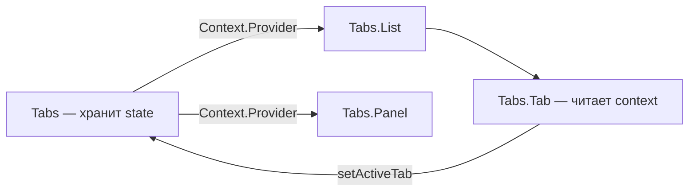

# Level 3: Compound Components

## Проблема: компоненты с жёстким API

Представьте компонент `<Tabs>`, у которого 15 пропсов: `tabs`, `activeTab`, `onTabChange`, `tabStyle`, `panelStyle`, `renderTab`, `renderPanel`... Он пытается предусмотреть всё заранее. Но что если нужно добавить иконку в таб? Или поместить панели в другое место страницы?

Compound Components решают это иначе: вместо одного компонента с пропсами — семейство компонентов, которые неявно общаются через Context.

## Паттерн: как `<select>` и `<option>`

HTML давно использует этот паттерн:

```html
<select>
  <option value="ru">Русский</option>
  <option value="en">English</option>
</select>
```

`<option>` знает о `<select>` без явной передачи пропсов. То же самое можно сделать в React через Context:

```tsx
// Жёсткий API — всё через пропсы
<Tabs
  tabs={[{ id: 'a', label: 'Tab A', content: <div>A</div> }]}
  activeTab="a"
  onTabChange={setActive}
/>

// Compound Components — декларативный, гибкий
<Tabs defaultTab="a">
  <Tabs.List>
    <Tabs.Tab id="a">Tab A</Tabs.Tab>
    <Tabs.Tab id="b">Tab B</Tabs.Tab>
  </Tabs.List>
  <Tabs.Panel id="a"><div>A</div></Tabs.Panel>
  <Tabs.Panel id="b"><div>B</div></Tabs.Panel>
</Tabs>
```

## Как работает: Context для sharing state

```tsx
// 1. Создаём контекст
const TabsContext = createContext<TabsContextValue | null>(null)

// 2. Parent хранит состояние и предоставляет его
function TabsRoot({ children, defaultTab }: TabsProps) {
  const [activeTab, setActiveTab] = useState(defaultTab)
  return (
    <TabsContext.Provider value={{ activeTab, setActiveTab }}>
      {children}
    </TabsContext.Provider>
  )
}

// 3. Children читают состояние без пропсов
function Tab({ id, children }: TabProps) {
  const { activeTab, setActiveTab } = useContext(TabsContext)!
  return (
    <button
      className={activeTab === id ? 'active' : ''}
      onClick={() => setActiveTab(id)}
    >
      {children}
    </button>
  )
}

// 4. Сборка через Object.assign
export const Tabs = Object.assign(TabsRoot, { List: TabsList, Tab, Panel: TabsPanel })
```

## Коммуникация через Context



## Два подхода: cloneElement vs Context

| | `React.Children` + `cloneElement` | Context |
|---|---|---|
| **Гибкость** | Только прямые дети | Любая вложенность |
| **Прозрачность** | Неявная магия | Явный контракт |
| **Современность** | Устаревший подход | Рекомендованный |

## Типичные ошибки

- ⚠️ Использовать `useContext` без проверки на `null` — компонент сломается вне Provider
- ⚠️ Хранить всё состояние в children через cloneElement — не работает при вложенности
- ⚠️ Забыть про `displayName` — в DevTools будет нечитаемое дерево

## Когда использовать

- Компонент имеет несколько взаимосвязанных частей (Tab/Panel, Select/Option)
- Нужна гибкость в расположении дочерних элементов
- Пользователь компонента должен контролировать структуру
