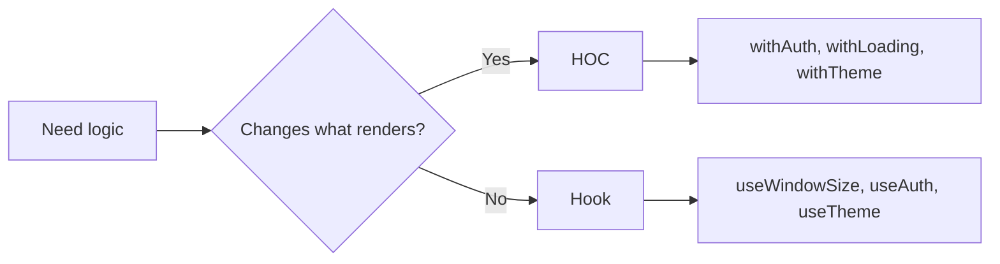

# Level 4: Higher-Order Components (HOC)

## The problem: cross-cutting logic is duplicated

Imagine: you have 10 components, each needs to show a spinner while loading. Or check authorization before rendering. Copying the same code into each component is bad. HOC solves this elegantly.

## HOC = a function that takes a component and returns an enhanced component

```tsx
// Accepts any component → returns an "improved" version
function withLoading<P>(Component: React.ComponentType<P>) {
  return function WithLoading(props: P & { isLoading: boolean }) {
    if (props.isLoading) return <Spinner />
    return <Component {...props as P} />
  }
}

const UserCardWithLoading = withLoading(UserCard)
// Now UserCardWithLoading accepts all UserCard props + isLoading
```

## Typing with generics

An HOC must "know" the wrapped component's props and add its own:

```tsx
// P — original component's props
// Returns component with P + { isLoading: boolean }
function withLoading<P extends object>(
  Component: React.ComponentType<P>
) {
  const WithLoading = ({ isLoading, ...props }: P & { isLoading: boolean }) => {
    if (isLoading) return <div>Loading...</div>
    return <Component {...(props as P)} />
  }
  WithLoading.displayName = `withLoading(${Component.displayName ?? Component.name})`
  return WithLoading
}
```

## DisplayName — a mandatory rule

Without `displayName` you'll see anonymous components in React DevTools. Convention:

```
withLoading(UserCard)
withAuth(Dashboard)
compose(withLoading, withAuth)(ProfilePage)
```

## When HOC, when hook?



| | HOC | Hook |
|---|---|---|
| **Application** | Conditional rendering, wrapping in elements | Logic, state, effects |
| **Reusability** | Component level | Any functional component |
| **Debugging** | Harder (nesting) | Easier (visible in DevTools) |
| **Composability** | Via compose() | Via calling inside component |

## Composing HOCs via compose

```tsx
// Without compose — unreadable
const Enhanced = withLoading(withAuth(withErrorBoundary(MyComponent)))

// With compose — left to right
const Enhanced = compose(withErrorBoundary, withAuth, withLoading)(MyComponent)
```

## Common mistakes

- ⚠️ Creating component inside render — HOCs must be called outside render, otherwise React creates a new type on every render
- ⚠️ Not passing `ref` — use `React.forwardRef` if needed
- ⚠️ Not setting `displayName` — DevTools turn into chaos

## When to use HOC in 2024

HOC is appropriate when:
- You need to conditionally wrap rendering (`if (condition) return <Fallback />` pattern)
- Integrating third-party libraries into components (e.g., Redux `connect`)
- Compatibility with class components is needed

In other cases — prefer hooks.
