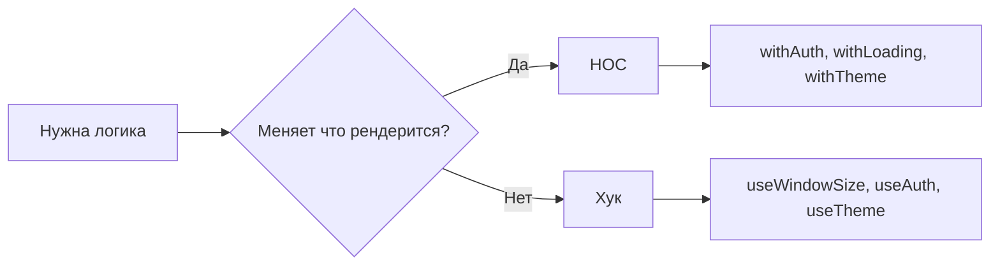

# Level 4: Higher-Order Components (HOC)

## Проблема: сквозная логика дублируется

Представьте: у вас 10 компонентов, каждый должен показывать спиннер при загрузке. Или проверять авторизацию перед рендером. Копировать один и тот же код в каждый компонент — плохо. HOC решает это элегантно.

## HOC = функция, которая принимает компонент и возвращает усиленный компонент

```tsx
// Принимает любой компонент → возвращает "улучшенную" версию
function withLoading<P>(Component: React.ComponentType<P>) {
  return function WithLoading(props: P & { isLoading: boolean }) {
    if (props.isLoading) return <Spinner />
    return <Component {...props as P} />
  }
}

const UserCardWithLoading = withLoading(UserCard)
// Теперь UserCardWithLoading принимает все пропсы UserCard + isLoading
```

## Типизация с generics

HOC должен "знать" пропсы оборачиваемого компонента и добавлять свои:

```tsx
// P — пропсы оригинального компонента
// Возвращает компонент с P + { isLoading: boolean }
function withLoading<P extends object>(
  Component: React.ComponentType<P>
) {
  const WithLoading = ({ isLoading, ...props }: P & { isLoading: boolean }) => {
    if (isLoading) return <div>Загрузка...</div>
    return <Component {...(props as P)} />
  }
  WithLoading.displayName = `withLoading(${Component.displayName ?? Component.name})`
  return WithLoading
}
```

## DisplayName — обязательное правило

Без `displayName` в React DevTools вы увидите анонимные компоненты. Соглашение:

```
withLoading(UserCard)
withAuth(Dashboard)
compose(withLoading, withAuth)(ProfilePage)
```

## Когда HOC, а когда хук?



| | HOC | Хук |
|---|---|---|
| **Применение** | Условный рендер, обёртка в элементы | Логика, state, эффекты |
| **Переиспользование** | Компонентный уровень | Любой функциональный компонент |
| **Отладка** | Труднее (вложенность) | Проще (видно в DevTools) |
| **Composability** | Через compose() | Через вызов внутри компонента |

## Композиция HOC через compose

```tsx
// Без compose — нечитаемо
const Enhanced = withLoading(withAuth(withErrorBoundary(MyComponent)))

// С compose — слева направо
const Enhanced = compose(withErrorBoundary, withAuth, withLoading)(MyComponent)
```

## Типичные ошибки

- ⚠️ Создавать компонент внутри render — HOC нужно вызывать вне рендера, иначе React создаёт новый тип на каждый рендер
- ⚠️ Не передавать `ref` — используйте `React.forwardRef` если нужно
- ⚠️ Не ставить `displayName` — DevTools превращаются в хаос

## Когда использовать HOC в 2024

HOC уместен когда:
- Нужно условно оборачивать рендер (шаблон `if (condition) return <Fallback />`)
- Интегрируете сторонние библиотеки в компоненты (например, Redux `connect`)
- Нужна совместимость с классовыми компонентами

В остальных случаях — предпочитайте хуки.
