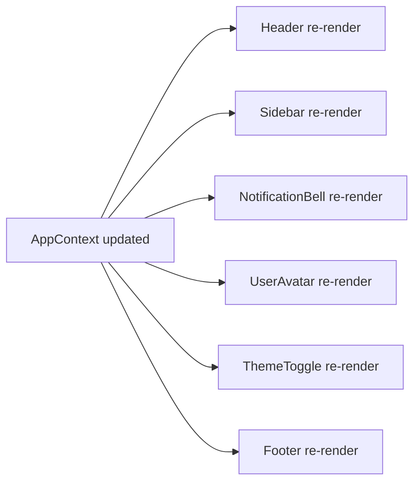
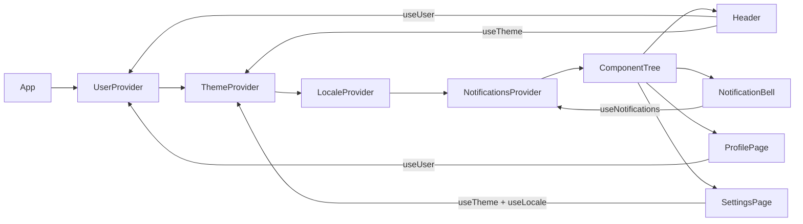

# Level 5: Context API Architecture — Detailed Guide

## Why do we need Context?

Imagine a large shopping mall. Every store wants to know the lighting mode (day/night), the language of signs, and data about a regular customer. Without centralized management, each store would have to "pass through" this data from the main entrance through every corridor — that's prop drilling.

Context API is like Wi-Fi in the mall. Set it up once, and any store (component) connects directly, without asking the corridor (intermediate component).

In programming terms, Context implements the **Dependency Injection** pattern: dependencies are injected into the point of use, bypassing intermediate layers.

---

## The problem: prop drilling

Consider a real example. An app has a theme, and it needs to be used in deeply nested components:

```tsx
// ❌ Prop drilling — theme is passed through all levels
function App() {
  const [theme, setTheme] = useState<'light' | 'dark'>('light')
  return <Layout theme={theme} setTheme={setTheme} />
}

function Layout({ theme, setTheme }: { theme: string; setTheme: ... }) {
  // Layout doesn't use theme itself, but must pass it further
  return (
    <div>
      <Header theme={theme} setTheme={setTheme} />
      <Sidebar theme={theme} />
      <Main theme={theme} />
    </div>
  )
}

function Header({ theme, setTheme }: ...) {
  // Header also doesn't use it, but passes to ThemeToggle
  return <nav><ThemeToggle theme={theme} setTheme={setTheme} /></nav>
}

function ThemeToggle({ theme, setTheme }: ...) {
  // Here it's finally used!
  return <button onClick={() => setTheme(t => t === 'light' ? 'dark' : 'light')}>{theme}</button>
}
```

Layout and Header know about `theme` and `setTheme`, even though they don't use them. Add `locale`, `user`, `featureFlags` — and every component gets bloated with unnecessary props.

### Context as the solution

```tsx
// ✅ Context — any component subscribes directly
const ThemeContext = createContext<ThemeValue | undefined>(undefined)

function ThemeProvider({ children }: { children: React.ReactNode }) {
  const [mode, setMode] = useState<'light' | 'dark'>('light')
  const value = useMemo(() => ({ mode, setMode }), [mode])
  return <ThemeContext.Provider value={value}>{children}</ThemeContext.Provider>
}

// From any component, regardless of nesting:
function ThemeToggle() {
  const { mode, setMode } = useTheme() // no props!
  return <button onClick={() => setMode(m => m === 'light' ? 'dark' : 'light')}>{mode}</button>
}
```

---

## Antipattern: one global context

This is the most common mistake when working with Context API. A beginner developer thinks: "Why have multiple contexts? I'll put everything in one — more convenient!"

```tsx
// ❌ AppContext monolith: everything in one
interface AppState {
  user: User | null
  theme: 'light' | 'dark'
  locale: 'ru' | 'en'
  notifications: Notification[]
  setUser: (user: User | null) => void
  setTheme: (theme: 'light' | 'dark') => void
  setLocale: (locale: 'ru' | 'en') => void
  addNotification: (n: Notification) => void
  removeNotification: (id: string) => void
}

const AppContext = createContext<AppState | undefined>(undefined)

function AppProvider({ children }: { children: React.ReactNode }) {
  const [user, setUser] = useState<User | null>(null)
  const [theme, setTheme] = useState<'light' | 'dark'>('light')
  const [locale, setLocale] = useState<'ru' | 'en'>('ru')
  const [notifications, setNotifications] = useState<Notification[]>([])
  // ...
}
```

What happens when a new notification arrives? `notifications` updates → entire `AppContext` creates a new value → **all** components that called `useContext(AppContext)` re-render. Even `UserAvatar`, which doesn't need notifications.

### Visualizing the problem



Only one field changed, but the whole tree re-renders. With frequent updates (e.g., real-time notifications every 3 seconds), this is a noticeable performance degradation.

---

## Correct architecture: separation by update frequency

Key principle: **context updates as a whole**. Therefore, everything that changes with the same frequency should be in one context. Data with different update frequencies — in different contexts.

### Classification by frequency

| Context | When it changes | What it contains |
|---|---|---|
| `UserContext` | Login/logout, rarely | id, name, role, avatar |
| `ThemeContext` | Manual toggle, sometimes | mode (light/dark) |
| `LocaleContext` | Language change, very rarely | locale, formatters |
| `NotificationsContext` | Constantly (push, polling) | list of notifications |

### Architecture with separated contexts



Now when `notifications` update:
- `NotificationBell` re-renders (subscribed to `NotificationsContext`)
- `Header`, `ProfilePage`, `SettingsPage` — **untouched** (subscribed to other contexts)

This is not magic — it's the law: a component re-renders only if the context it subscribes to has changed.

---

## The createStrictContext pattern

Standard `createContext` has a problem: if you forget to wrap a component in a Provider, `useContext` returns the default value without error. The bug will be silent and hard to track.

```tsx
// ❌ Silent bug: ThemeToggle outside provider → mode === undefined
const ThemeContext = createContext({ mode: undefined, setMode: () => {} })

function ThemeToggle() {
  const { mode } = useContext(ThemeContext)
  return <button>{mode}</button> // renders empty button, doesn't crash
}
```

The solution is the `createStrictContext` factory, which always throws an error when used outside a provider:

```tsx
// ✅ Type-safe factory with mandatory provider
function createStrictContext<T>(displayName: string) {
  const Context = createContext<T | undefined>(undefined)
  // displayName is displayed in React DevTools
  Context.displayName = displayName

  function useCtx(): T {
    const value = useContext(Context)
    if (value === undefined) {
      throw new Error(
        `use${displayName} must be called within a ${displayName}Provider.\n` +
        `Wrap your component tree with <${displayName}Provider>.`
      )
    }
    return value
  }

  return [Context, useCtx] as const
}
```

Using the factory:

```tsx
// Type of context value
interface ThemeValue {
  mode: 'light' | 'dark'
  setMode: (mode: 'light' | 'dark') => void
}

// Create context and hook in one line
const [ThemeContext, useTheme] = createStrictContext<ThemeValue>('Theme')

// Provider with memoized value
export function ThemeProvider({ children }: { children: React.ReactNode }) {
  const [mode, setMode] = useState<'light' | 'dark'>('light')
  const value = useMemo(() => ({ mode, setMode }), [mode])
  return <ThemeContext.Provider value={value}>{children}</ThemeContext.Provider>
}

// Hook is ready to export
export { useTheme }
```

### Why `undefined` instead of `null`?

You could write `createContext<T | null>(null)`. The difference is that `undefined` means "the value was not passed at all", while `null` means "explicitly passed emptiness". For checking provider presence, `undefined` is semantically more correct.

---

## Breaking up a monolithic AppContext

Let's walk through the refactoring process step by step.

### Before: monolith

```tsx
// ❌ One context for the entire app
const AppContext = createContext<AppState | undefined>(undefined)

function AppProvider({ children }: { children: React.ReactNode }) {
  const [user, setUser] = useState<User | null>(null)
  const [theme, setTheme] = useState<'light' | 'dark'>('light')
  const [locale, setLocale] = useState<'ru' | 'en'>('ru')
  const [notifications, setNotifications] = useState<Notification[]>([])

  const value = useMemo(() => ({
    user, setUser,
    theme, setTheme,
    locale, setLocale,
    notifications, addNotification, removeNotification,
  }), [user, theme, locale, notifications]) // memoization doesn't help — everything is coupled

  return <AppContext.Provider value={value}>{children}</AppContext.Provider>
}
```

### After: 4 independent contexts

```tsx
// ✅ Each context is independent

// --- user-context.tsx ---
interface UserValue {
  user: User | null
  setUser: (user: User | null) => void
}
const [UserCtx, useUser] = createStrictContext<UserValue>('User')

export function UserProvider({ children }: { children: React.ReactNode }) {
  const [user, setUser] = useState<User | null>(null)
  const value = useMemo(() => ({ user, setUser }), [user])
  return <UserCtx.Provider value={value}>{children}</UserCtx.Provider>
}
export { useUser }

// --- theme-context.tsx ---
interface ThemeValue {
  mode: 'light' | 'dark'
  setMode: (mode: 'light' | 'dark') => void
}
const [ThemeCtx, useTheme] = createStrictContext<ThemeValue>('Theme')
// ...similar
```

### Optimization proof: render counter

To verify the correctness of separation, use `useRef` to count renders without triggering them:

```tsx
function RenderCounter({ label }: { label: string }) {
  const countRef = useRef(0)
  countRef.current += 1
  // Using ref, not state — counting doesn't cause render
  return (
    <span style={{ fontSize: '0.75rem', color: '#999' }}>
      {label}: {countRef.current} renders
    </span>
  )
}

// In a component that reads only UserContext:
function UserInfo() {
  const { user } = useUser()
  return (
    <div>
      <RenderCounter label="UserInfo" />
      <span>{user?.name}</span>
    </div>
  )
}
```

Now when adding notifications, `UserInfo.renderCount` doesn't grow — visual proof of isolation.

---

## The ComposeProviders pattern

When there are many contexts, a "pyramid of doom" appears:

```tsx
// ❌ Hard to read, easy to lose a closing tag
function App() {
  return (
    <UserProvider>
      <ThemeProvider>
        <LocaleProvider>
          <NotificationsProvider>
            <RouterProvider>
              <QueryClientProvider client={queryClient}>
                <MainApp />
              </QueryClientProvider>
            </RouterProvider>
          </NotificationsProvider>
        </LocaleProvider>
      </ThemeProvider>
    </UserProvider>
  )
}
```

The solution is the `ComposeProviders` component, which takes an array of providers and composes them via `reduce`:

```tsx
type ProviderComponent = React.ComponentType<{ children: React.ReactNode }>

interface ComposeProvidersProps {
  providers: ProviderComponent[]
  children: React.ReactNode
}

function ComposeProviders({ providers, children }: ComposeProvidersProps) {
  // Wrap children sequentially from outside-in
  return providers.reduceRight(
    (acc, Provider) => <Provider>{acc}</Provider>,
    children
  )
}

// Usage
function App() {
  return (
    <ComposeProviders providers={[
      UserProvider,
      ThemeProvider,
      LocaleProvider,
      NotificationsProvider,
    ]}>
      <MainApp />
    </ComposeProviders>
  )
}
```

`reduceRight` (not `reduce`) because we need the first provider in the array to be the outermost:
- `[A, B, C]` → `<A><B><C>{children}</C></B></A>`
- If we used `reduce`, the order would be reversed

---

## Performance implications: when Context is not enough

Context is good for global data that changes infrequently. If data updates very often (60fps animations, mouse cursor) — Context creates too many re-renders even with proper separation.

```tsx
// For high-frequency data — useRef + subscriptions instead of Context
// Or zustand, jotai, nanostores — they use pub/sub without re-renders

// For rare updates (themes, users, locales) — Context is ideal
```

Rule of thumb:
- Updates once per second or less — Context is suitable
- Updates > 10 times per second — need a more specialized tool

---

## Common mistakes

### 1. Forgot to wrap in provider

```tsx
// ❌ Hook outside provider — bug without error when createContext(null)
function ProfilePage() {
  const { user } = useUser() // user === null, but that's default value, not error
  return <div>{user?.name}</div> // renders emptiness
}

// ✅ createStrictContext throws a clear error:
// "useUser must be called within a UserProvider"
```

### 2. New value object on every render

```tsx
// ❌ Every ThemeProvider render creates a new object → all subscribers re-render
function ThemeProvider({ children }: { children: React.ReactNode }) {
  const [mode, setMode] = useState<'light' | 'dark'>('light')
  return (
    <ThemeContext.Provider value={{ mode, setMode }}> {/* new object! */}
      {children}
    </ThemeContext.Provider>
  )
}

// ✅ useMemo stabilizes the object reference
function ThemeProvider({ children }: { children: React.ReactNode }) {
  const [mode, setMode] = useState<'light' | 'dark'>('light')
  const value = useMemo(() => ({ mode, setMode }), [mode]) // changes only when mode changes
  return <ThemeContext.Provider value={value}>{children}</ThemeContext.Provider>
}
```

### 3. Exporting Context instead of hook

```tsx
// ❌ Export Context — consumers write useContext(ThemeContext)
// No provider check, no typing from one place
export const ThemeContext = createContext(...)

// ✅ Export only the hook — it's your public API
export function useTheme() {
  const value = useContext(ThemeCtx)
  if (!value) throw new Error(...)
  return value
}
// Consumers write: const { mode } = useTheme()
```

### 4. One provider manages too much

```tsx
// ❌ UserProvider knows about theme, locale and notifications
function UserProvider({ children }) {
  const [user, setUser] = useState(null)
  const [theme, setTheme] = useState('light') // this is not UserProvider!
  // ...
}

// ✅ One provider — one area of responsibility
function UserProvider({ children }) {
  const [user, setUser] = useState<User | null>(null)
  const value = useMemo(() => ({ user, setUser }), [user])
  return <UserCtx.Provider value={value}>{children}</UserCtx.Provider>
}
```

---

## Best practices

1. **`createStrictContext` instead of raw `createContext`** — always. An "outside provider" error must be loud.

2. **Memoize context value** via `useMemo`. Without it, every provider render recreates the object.

3. **Don't export Context** — only the hook. The hook is the public API, Context is an implementation detail.

4. **Separate by update frequency**, not by meaning. Even if `user` and `theme` are semantically close, if they update at different frequencies — they belong in different contexts.

5. **`ComposeProviders`** is mandatory if you have 4 or more providers.

6. **Name contexts by domain**: `UserContext`, `ThemeContext`, `NotificationsContext` — not `AppContext`, `GlobalContext`, `StoreContext`.

---

## Summary

Context is a powerful tool that's easy to misuse. A monolithic `AppContext` is an antipattern: it destroys re-render granularity. Correct architecture is built on three principles:

1. **One context — one update frequency**
2. **Strict hook** via `createStrictContext` — no silent bugs
3. **`ComposeProviders`** — get rid of pyramid of doom

When contexts are properly separated, notification changes don't touch user components. Theme changes don't touch notification components. Each part of the app updates exactly when its data changes.
