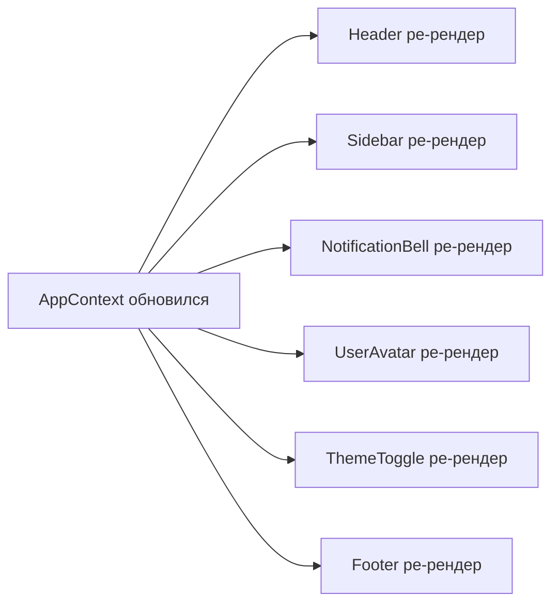
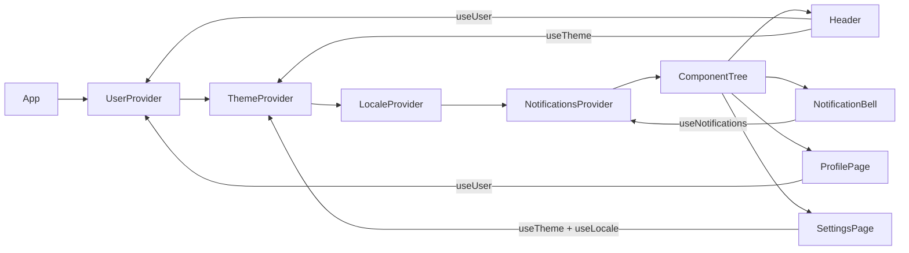

# Level 5: Архитектура Context API — Подробное руководство

## Зачем нам нужен Context?

Представьте большой торговый центр. Каждый магазин хочет знать, какой сейчас режим освещения (день/ночь), язык вывесок и данные о постоянном клиенте. Без централизованного управления каждый магазин пришлось бы "прокидывать" эти данные от главного входа через каждый коридор — это и есть prop drilling.

Context API — это как Wi-Fi в торговом центре. Один раз настроили, и любой магазин (компонент) подключается напрямую, не спрашивая у коридора (промежуточного компонента).

В терминах программирования Context реализует паттерн **Dependency Injection**: зависимости внедряются в точку использования, минуя промежуточные слои.

---

## Проблема: prop drilling

Рассмотрим реальный пример. В приложении есть тема оформления, и её нужно использовать в глубоко вложенных компонентах:

```tsx
// ❌ Prop drilling — theme прокидывается через все уровни
function App() {
  const [theme, setTheme] = useState<'light' | 'dark'>('light')
  return <Layout theme={theme} setTheme={setTheme} />
}

function Layout({ theme, setTheme }: { theme: string; setTheme: ... }) {
  // Layout не использует theme сам, но должен передать его дальше
  return (
    <div>
      <Header theme={theme} setTheme={setTheme} />
      <Sidebar theme={theme} />
      <Main theme={theme} />
    </div>
  )
}

function Header({ theme, setTheme }: ...) {
  // Header тоже не использует, но передаёт в ThemeToggle
  return <nav><ThemeToggle theme={theme} setTheme={setTheme} /></nav>
}

function ThemeToggle({ theme, setTheme }: ...) {
  // Вот здесь наконец используется!
  return <button onClick={() => setTheme(t => t === 'light' ? 'dark' : 'light')}>{theme}</button>
}
```

Layout и Header знают о `theme` и `setTheme`, хотя сами их не используют. Добавьте ещё `locale`, `user`, `featureFlags` — и каждый компонент обрастает ненужными props.

### Context как решение

```tsx
// ✅ Context — любой компонент подписывается напрямую
const ThemeContext = createContext<ThemeValue | undefined>(undefined)

function ThemeProvider({ children }: { children: React.ReactNode }) {
  const [mode, setMode] = useState<'light' | 'dark'>('light')
  const value = useMemo(() => ({ mode, setMode }), [mode])
  return <ThemeContext.Provider value={value}>{children}</ThemeContext.Provider>
}

// Из любого компонента, независимо от вложенности:
function ThemeToggle() {
  const { mode, setMode } = useTheme() // нет props!
  return <button onClick={() => setMode(m => m === 'light' ? 'dark' : 'light')}>{mode}</button>
}
```

---

## Антипаттерн: один глобальный контекст

Это самая распространённая ошибка при работе с Context API. Начинающий разработчик думает: "Зачем несколько контекстов? Положу всё в один — удобнее!"

```tsx
// ❌ AppContext-монолит: всё в одном
interface AppState {
  user: User | null
  theme: 'light' | 'dark'
  locale: 'ru' | 'en'
  notifications: Notification[]
  setUser: (user: User | null) => void
  setTheme: (theme: 'light' | 'dark') => void
  setLocale: (locale: 'ru' | 'en') => void
  addNotification: (n: Notification) => void
  removeNotification: (id: string) => void
}

const AppContext = createContext<AppState | undefined>(undefined)

function AppProvider({ children }: { children: React.ReactNode }) {
  const [user, setUser] = useState<User | null>(null)
  const [theme, setTheme] = useState<'light' | 'dark'>('light')
  const [locale, setLocale] = useState<'ru' | 'en'>('ru')
  const [notifications, setNotifications] = useState<Notification[]>([])
  // ...
}
```

Что происходит, когда приходит новое уведомление? Обновляется `notifications` → весь `AppContext` создаёт новое значение → **все** компоненты, которые вызвали `useContext(AppContext)`, ре-рендерятся. Даже `UserAvatar`, которому уведомления не нужны.

### Визуализация проблемы



Обновилось только одно поле, а ре-рендерится всё дерево. При частых обновлениях (например, реалтайм-уведомления каждые 3 секунды) это заметная деградация производительности.

---

## Правильная архитектура: разделение по частоте обновлений

Ключевой принцип: **контекст обновляется целиком**. Значит, всё, что меняется с одинаковой частотой, должно быть в одном контексте. Данные с разной частотой обновлений — в разных.

### Классификация по частоте

| Контекст | Когда меняется | Что содержит |
|---|---|---|
| `UserContext` | Логин/логаут, редко | id, name, role, avatar |
| `ThemeContext` | Ручное переключение, иногда | mode (light/dark) |
| `LocaleContext` | Смена языка, очень редко | locale, форматтеры |
| `NotificationsContext` | Постоянно (push, polling) | список уведомлений |

### Архитектура с разделёнными контекстами



Теперь когда обновляются `notifications`:
- `NotificationBell` ре-рендерится (подписан на `NotificationsContext`)
- `Header`, `ProfilePage`, `SettingsPage` — **не трогаются** (подписаны на другие контексты)

Это не магия — это закон: компонент ре-рендерится только если изменился контекст, на который он подписан.

---

## Паттерн createStrictContext

Стандартный `createContext` имеет проблему: если забыть обернуть компонент в Provider, `useContext` вернёт дефолтное значение без ошибки. Баг будет молчаливым и трудноотслеживаемым.

```tsx
// ❌ Молчаливый баг: ThemeToggle вне провайдера → mode === undefined
const ThemeContext = createContext({ mode: undefined, setMode: () => {} })

function ThemeToggle() {
  const { mode } = useContext(ThemeContext)
  return <button>{mode}</button> // рендерит пустую кнопку, не падает
}
```

Решение — фабрика `createStrictContext`, которая всегда выбрасывает ошибку при использовании вне провайдера:

```tsx
// ✅ Типобезопасная фабрика с обязательным провайдером
function createStrictContext<T>(displayName: string) {
  const Context = createContext<T | undefined>(undefined)
  // displayName отображается в React DevTools
  Context.displayName = displayName

  function useCtx(): T {
    const value = useContext(Context)
    if (value === undefined) {
      throw new Error(
        `use${displayName} must be called within a ${displayName}Provider.\n` +
        `Wrap your component tree with <${displayName}Provider>.`
      )
    }
    return value
  }

  return [Context, useCtx] as const
}
```

Использование фабрики:

```tsx
// Тип значения контекста
interface ThemeValue {
  mode: 'light' | 'dark'
  setMode: (mode: 'light' | 'dark') => void
}

// Создаём контекст и хук одной строкой
const [ThemeContext, useTheme] = createStrictContext<ThemeValue>('Theme')

// Провайдер с мемоизацией значения
export function ThemeProvider({ children }: { children: React.ReactNode }) {
  const [mode, setMode] = useState<'light' | 'dark'>('light')
  const value = useMemo(() => ({ mode, setMode }), [mode])
  return <ThemeContext.Provider value={value}>{children}</ThemeContext.Provider>
}

// Хук готов к экспорту
export { useTheme }
```

### Почему `undefined` вместо `null`?

Можно было бы написать `createContext<T | null>(null)`. Разница в том, что `undefined` — это "значение не было передано вообще", а `null` — "явно передали пустоту". Для проверки наличия провайдера семантически правильнее `undefined`.

---

## Разбиение монолитного AppContext

Рассмотрим процесс рефакторинга шаг за шагом.

### Было: монолит

```tsx
// ❌ Один контекст на всё приложение
const AppContext = createContext<AppState | undefined>(undefined)

function AppProvider({ children }: { children: React.ReactNode }) {
  const [user, setUser] = useState<User | null>(null)
  const [theme, setTheme] = useState<'light' | 'dark'>('light')
  const [locale, setLocale] = useState<'ru' | 'en'>('ru')
  const [notifications, setNotifications] = useState<Notification[]>([])

  const value = useMemo(() => ({
    user, setUser,
    theme, setTheme,
    locale, setLocale,
    notifications, addNotification, removeNotification,
  }), [user, theme, locale, notifications]) // мемоизация не помогает — всё связано

  return <AppContext.Provider value={value}>{children}</AppContext.Provider>
}
```

### Стало: 4 независимых контекста

```tsx
// ✅ Каждый контекст независим

// --- user-context.tsx ---
interface UserValue {
  user: User | null
  setUser: (user: User | null) => void
}
const [UserCtx, useUser] = createStrictContext<UserValue>('User')

export function UserProvider({ children }: { children: React.ReactNode }) {
  const [user, setUser] = useState<User | null>(null)
  const value = useMemo(() => ({ user, setUser }), [user])
  return <UserCtx.Provider value={value}>{children}</UserCtx.Provider>
}
export { useUser }

// --- theme-context.tsx ---
interface ThemeValue {
  mode: 'light' | 'dark'
  setMode: (mode: 'light' | 'dark') => void
}
const [ThemeCtx, useTheme] = createStrictContext<ThemeValue>('Theme')
// ...аналогично
```

### Доказательство оптимизации: счётчик рендеров

Чтобы убедиться в правильности разделения, используем `useRef` для подсчёта рендеров без их провоцирования:

```tsx
function RenderCounter({ label }: { label: string }) {
  const countRef = useRef(0)
  countRef.current += 1
  // Используем ref, не state — подсчёт не вызывает рендер
  return (
    <span style={{ fontSize: '0.75rem', color: '#999' }}>
      {label}: {countRef.current} рендеров
    </span>
  )
}

// В компоненте, который читает только UserContext:
function UserInfo() {
  const { user } = useUser()
  return (
    <div>
      <RenderCounter label="UserInfo" />
      <span>{user?.name}</span>
    </div>
  )
}
```

Теперь при добавлении уведомлений `UserInfo.renderCount` не растёт — визуальное доказательство изоляции.

---

## Паттерн ComposeProviders

Когда контекстов много, возникает "pyramid of doom":

```tsx
// ❌ Трудно читать, легко потерять закрывающий тег
function App() {
  return (
    <UserProvider>
      <ThemeProvider>
        <LocaleProvider>
          <NotificationsProvider>
            <RouterProvider>
              <QueryClientProvider client={queryClient}>
                <MainApp />
              </QueryClientProvider>
            </RouterProvider>
          </NotificationsProvider>
        </LocaleProvider>
      </ThemeProvider>
    </UserProvider>
  )
}
```

Решение — компонент `ComposeProviders`, который принимает массив провайдеров и компонует их через `reduce`:

```tsx
type ProviderComponent = React.ComponentType<{ children: React.ReactNode }>

interface ComposeProvidersProps {
  providers: ProviderComponent[]
  children: React.ReactNode
}

function ComposeProviders({ providers, children }: ComposeProvidersProps) {
  // Оборачиваем children последовательно снаружи-внутрь
  return providers.reduceRight(
    (acc, Provider) => <Provider>{acc}</Provider>,
    children
  )
}

// Использование
function App() {
  return (
    <ComposeProviders providers={[
      UserProvider,
      ThemeProvider,
      LocaleProvider,
      NotificationsProvider,
    ]}>
      <MainApp />
    </ComposeProviders>
  )
}
```

`reduceRight` (не `reduce`) потому что нам нужно, чтобы первый провайдер в массиве оказался самым внешним:
- `[A, B, C]` → `<A><B><C>{children}</C></B></A>`
- Если бы использовали `reduce`, порядок был бы обратным

---

## Performance implications: когда Context недостаточен

Context хорош для глобальных данных, которые меняются нечасто. Если данные обновляются очень часто (60fps анимации, курсор мыши) — Context создаёт слишком много ре-рендеров даже при правильном разделении.

```tsx
// Для высокочастотных данных — useRef + подписки вместо Context
// Или zustand, jotai, nanostores — они используют pub/sub без ре-рендеров

// Для редких обновлений (темы, пользователи, локали) — Context идеален
```

Правило большого пальца:
- Обновления 1 раз в секунду и реже — Context подходит
- Обновления > 10 раз в секунду — нужен более специализированный инструмент

---

## Типичные ошибки

### 1. Забыли обернуть в провайдер

```tsx
// ❌ Хук вне провайдера — баг без ошибки при createContext(null)
function ProfilePage() {
  const { user } = useUser() // user === null, но это дефолтное значение, не ошибка
  return <div>{user?.name}</div> // рендерит пустоту
}

// ✅ createStrictContext выбросит понятную ошибку:
// "useUser must be called within a UserProvider"
```

### 2. Новый объект значения на каждый рендер

```tsx
// ❌ Каждый рендер ThemeProvider создаёт новый объект → все подписчики ре-рендерятся
function ThemeProvider({ children }: { children: React.ReactNode }) {
  const [mode, setMode] = useState<'light' | 'dark'>('light')
  return (
    <ThemeContext.Provider value={{ mode, setMode }}> {/* новый объект! */}
      {children}
    </ThemeContext.Provider>
  )
}

// ✅ useMemo стабилизирует ссылку на объект
function ThemeProvider({ children }: { children: React.ReactNode }) {
  const [mode, setMode] = useState<'light' | 'dark'>('light')
  const value = useMemo(() => ({ mode, setMode }), [mode]) // меняется только при смене mode
  return <ThemeContext.Provider value={value}>{children}</ThemeContext.Provider>
}
```

### 3. Экспорт самого Context вместо хука

```tsx
// ❌ Экспорт Context — потребители пишут useContext(ThemeContext)
// Нет проверки на наличие провайдера, нет типизации из одного места
export const ThemeContext = createContext(...)

// ✅ Экспортируйте только хук — это ваш публичный API
export function useTheme() {
  const value = useContext(ThemeCtx)
  if (!value) throw new Error(...)
  return value
}
// Потребители пишут: const { mode } = useTheme()
```

### 4. Один провайдер управляет слишком многим

```tsx
// ❌ UserProvider знает о теме, локали и уведомлениях
function UserProvider({ children }) {
  const [user, setUser] = useState(null)
  const [theme, setTheme] = useState('light') // это не UserProvider!
  // ...
}

// ✅ Один провайдер — одна область ответственности
function UserProvider({ children }) {
  const [user, setUser] = useState<User | null>(null)
  const value = useMemo(() => ({ user, setUser }), [user])
  return <UserCtx.Provider value={value}>{children}</UserCtx.Provider>
}
```

---

## Лучшие практики

1. **`createStrictContext` вместо сырого `createContext`** — всегда. Ошибка "вне провайдера" должна быть громкой.

2. **Мемоизируйте значение контекста** через `useMemo`. Без этого каждый рендер провайдера пересоздаёт объект.

3. **Не экспортируйте Context** — только хук. Хук — публичный API, Context — деталь реализации.

4. **Разделяйте по частоте обновлений**, не по смыслу. Даже если `user` и `theme` семантически близки, если они обновляются с разной частотой — им место в разных контекстах.

5. **`ComposeProviders`** обязателен если провайдеров 4 и больше.

6. **Называйте контексты по домену**: `UserContext`, `ThemeContext`, `NotificationsContext` — не `AppContext`, `GlobalContext`, `StoreContext`.

---

## Итог

Context — мощный инструмент, который легко использовать неправильно. Монолитный `AppContext` — антипаттерн: он уничтожает гранулярность ре-рендеров. Правильная архитектура строится на трёх принципах:

1. **Один контекст — одна частота обновлений**
2. **Строгий хук** через `createStrictContext` — никаких молчаливых багов
3. **`ComposeProviders`** — избавляемся от pyramid of doom

Когда контексты правильно разделены, изменение уведомлений не трогает компоненты пользователя. Изменение темы не трогает компоненты уведомлений. Каждая часть приложения обновляется ровно тогда, когда меняются её данные.
