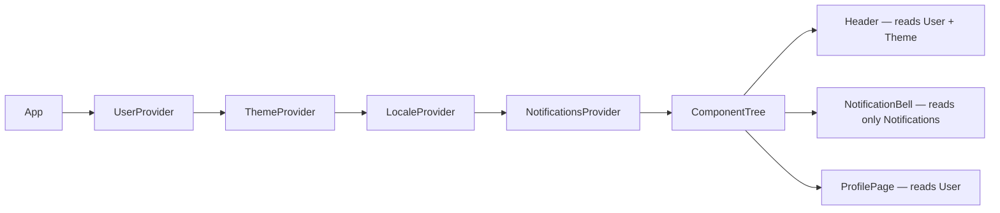

# Level 5: Context API Architecture

## Context = dependency injection in React

Context API solves the problem of passing data deep into the component tree without prop drilling. Think of it as a DI container: register a value once (Provider), use it everywhere without explicitly passing through props.

```tsx
// ❌ Prop drilling: userId through 4 levels
<Page userId={userId}>
  <Layout userId={userId}>
    <Sidebar userId={userId}>
      <UserAvatar userId={userId} />
    </Sidebar>
  </Layout>
</Page>

// ✅ Context: direct access from any component
const user = useUserContext()
```

## Why one global context is an antipattern

The most common beginner mistake — putting everything in one `AppContext`. This destroys performance: on any update (even notification changes), all components subscribed to the context re-render.

```tsx
// ❌ One context for everything — any change re-renders the whole tree
const AppContext = createContext({ user, theme, locale, notifications })
```

## Separation by update frequency

The rule: **one context — one update frequency**.

| Context | Change frequency | Example |
|---|---|---|
| `UserContext` | Rarely (login/logout) | name, role, avatar |
| `ThemeContext` | Sometimes (manual toggle) | light/dark |
| `LocaleContext` | Very rarely | ru/en |
| `NotificationsContext` | Often (every few seconds) | list of notifications |



When notifications update — only `NotificationBell` and other `NotificationsContext` subscribers re-render. `Header` and `ProfilePage` are untouched.

## The createStrictContext pattern

A type-safe factory that:
1. Creates a context with `undefined` default (not `null` — to catch the error)
2. Creates a hook that throws an error when used outside the provider

```tsx
function createStrictContext<T>(displayName: string) {
  const Context = createContext<T | undefined>(undefined)
  Context.displayName = displayName

  function useCtx(): T {
    const value = useContext(Context)
    if (value === undefined) {
      throw new Error(`use${displayName} must be used within ${displayName}Provider`)
    }
    return value
  }

  return [Context, useCtx] as const
}

// Usage
const [ThemeContext, useTheme] = createStrictContext<ThemeValue>('Theme')
```

## The ComposeProviders pattern

Nested providers create a "pyramid of doom":

```tsx
// ❌ Hard to read, easy to mess up nesting
<UserProvider>
  <ThemeProvider>
    <LocaleProvider>
      <NotificationsProvider>
        <App />
      </NotificationsProvider>
    </LocaleProvider>
  </ThemeProvider>
</UserProvider>

// ✅ Array of providers → one component
<ComposeProviders providers={[UserProvider, ThemeProvider, LocaleProvider, NotificationsProvider]}>
  <App />
</ComposeProviders>
```

## ⚠️ Common beginner mistakes

**1. Using hook outside provider:**
```tsx
// ❌ useTheme() returns undefined silently
const ThemeContext = createContext(null)
const useTheme = () => useContext(ThemeContext) // silent bug

// ✅ Strict hook with clear error
function useTheme() {
  const value = useContext(ThemeContext)
  if (!value) throw new Error('useTheme must be inside ThemeProvider')
  return value
}
```

**2. Mutating context object directly:**
```tsx
// ❌ Mutation — context won't update, components won't re-render
const ctx = useTheme()
ctx.mode = 'dark' // mutating object in context

// ✅ Always via setter
const { setTheme } = useTheme()
setTheme({ mode: 'dark' })
```

**3. Creating a new object on every render:**
```tsx
// ❌ New object = all subscribers re-render on every parent render
function ThemeProvider({ children }) {
  const [mode, setMode] = useState('light')
  return (
    <ThemeContext.Provider value={{ mode, setMode }}> {/* new object! */}
      {children}
    </ThemeContext.Provider>
  )
}

// ✅ Memoize the value
const value = useMemo(() => ({ mode, setMode }), [mode])
return <ThemeContext.Provider value={value}>{children}</ThemeContext.Provider>
```
