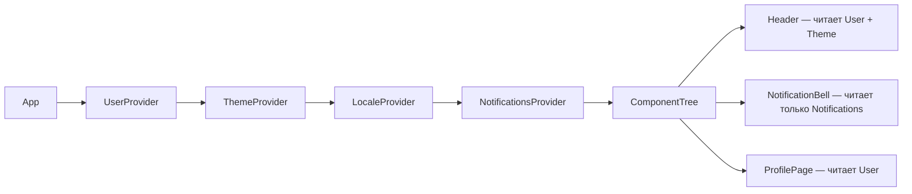

# Level 5: Архитектура Context API

## Context = dependency injection в React

Context API решает задачу передачи данных вглубь дерева компонентов без prop drilling. Думайте о нём как о DI-контейнере: один раз регистрируем значение (Provider), везде используем без явной передачи через props.

```tsx
// ❌ Prop drilling: userId через 4 уровня
<Page userId={userId}>
  <Layout userId={userId}>
    <Sidebar userId={userId}>
      <UserAvatar userId={userId} />
    </Sidebar>
  </Layout>
</Page>

// ✅ Context: доступ напрямую из любого компонента
const user = useUserContext()
```

## Почему один глобальный контекст — антипаттерн

Самая частая ошибка новичков — положить всё приложение в один `AppContext`. Это уничтожает производительность: при любом обновлении (даже изменении уведомлений) ре-рендерятся все компоненты, подписанные на контекст.

```tsx
// ❌ Один контекст на всё — любое изменение перерисовывает всё дерево
const AppContext = createContext({ user, theme, locale, notifications })
```

## Разделение по частоте обновлений

Правило: **один контекст — одна частота обновления**.

| Контекст | Частота изменений | Пример |
|---|---|---|
| `UserContext` | Редко (логин/логаут) | имя, роль, аватар |
| `ThemeContext` | Иногда (ручное переключение) | light/dark |
| `LocaleContext` | Очень редко | ru/en |
| `NotificationsContext` | Часто (каждые секунды) | список уведомлений |



Когда обновляются уведомления — ре-рендерятся только `NotificationBell` и другие подписчики `NotificationsContext`. `Header` и `ProfilePage` не трогаются.

## Паттерн createStrictContext

Типобезопасная фабрика, которая:
1. Создаёт контекст с `undefined` по умолчанию (не `null` — чтобы поймать ошибку)
2. Создаёт хук, который выбрасывает ошибку при использовании вне провайдера

```tsx
function createStrictContext<T>(displayName: string) {
  const Context = createContext<T | undefined>(undefined)
  Context.displayName = displayName

  function useCtx(): T {
    const value = useContext(Context)
    if (value === undefined) {
      throw new Error(`use${displayName} must be used within ${displayName}Provider`)
    }
    return value
  }

  return [Context, useCtx] as const
}

// Использование
const [ThemeContext, useTheme] = createStrictContext<ThemeValue>('Theme')
```

## Паттерн ComposeProviders

Вложенные провайдеры создают "pyramid of doom":

```tsx
// ❌ Трудно читать, легко ошибиться с вложенностью
<UserProvider>
  <ThemeProvider>
    <LocaleProvider>
      <NotificationsProvider>
        <App />
      </NotificationsProvider>
    </LocaleProvider>
  </ThemeProvider>
</UserProvider>

// ✅ Массив провайдеров → один компонент
<ComposeProviders providers={[UserProvider, ThemeProvider, LocaleProvider, NotificationsProvider]}>
  <App />
</ComposeProviders>
```

## ⚠️ Типичные ошибки новичков

**1. Использование хука вне провайдера:**
```tsx
// ❌ useTheme() возвращает undefined без ошибки
const ThemeContext = createContext(null)
const useTheme = () => useContext(ThemeContext) // молчаливый баг

// ✅ Строгий хук с понятной ошибкой
function useTheme() {
  const value = useContext(ThemeContext)
  if (!value) throw new Error('useTheme must be inside ThemeProvider')
  return value
}
```

**2. Мутация объекта контекста напрямую:**
```tsx
// ❌ Мутация — контекст не обновится, компоненты не перерендерятся
const ctx = useTheme()
ctx.mode = 'dark' // мутируем объект в контексте

// ✅ Всегда через setter
const { setTheme } = useTheme()
setTheme({ mode: 'dark' })
```

**3. Создание нового объекта при каждом рендере:**
```tsx
// ❌ Новый объект = все подписчики перерендерятся при каждом рендере родителя
function ThemeProvider({ children }) {
  const [mode, setMode] = useState('light')
  return (
    <ThemeContext.Provider value={{ mode, setMode }}> {/* новый объект! */}
      {children}
    </ThemeContext.Provider>
  )
}

// ✅ Мемоизация значения
const value = useMemo(() => ({ mode, setMode }), [mode])
return <ThemeContext.Provider value={value}>{children}</ThemeContext.Provider>
```
