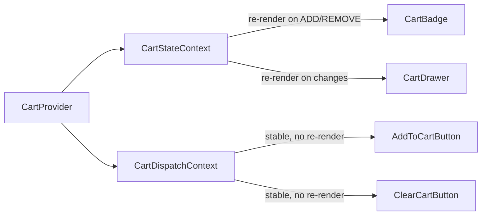
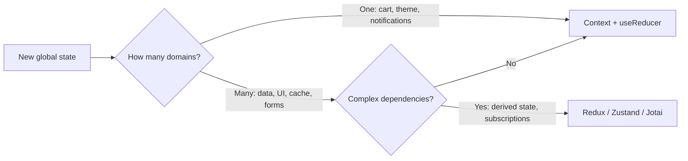

# Level 6: Context + State Management — Detailed Guide

## Why is this needed?

Imagine an online store. The "Add to cart" button is on every product card. The cart counter is displayed in the header. The cart drawer shows the full list.

Passing cart state through props is impossible — components are located in different branches of the tree. This is a classic scenario for Context: global state needed in different parts of the app.

But `useState` in Context quickly turns into unmanageable chaos when there are many actions:
- Add item (or increment quantity if already there)
- Decrease quantity (and remove if it becomes 0)
- Remove completely
- Clear cart

Here `useReducer` comes to the rescue.

---

## useReducer: predictable state management

`useReducer` is a pattern from functional programming. Its essence: state transitions are described by a **pure function** (reducer), which takes the current state and an action, and returns a new state.

```
(state, action) => newState
```

Analogy: imagine a bank account. State is the balance. Actions are deposit, withdrawal, blocking. Each action unambiguously describes what happened. Transaction history is the history of actions.

### When to choose useReducer over useState?

```tsx
// ❌ useState becomes cumbersome with related fields
const [items, setItems] = useState<CartItem[]>([])
const [loading, setLoading] = useState(false)
const [error, setError] = useState<string | null>(null)
const [lastAction, setLastAction] = useState<string | null>(null)

// Adding an item requires synchronous update of multiple fields
const addItem = (item: CartItem) => {
  setItems(prev => [...prev, item])
  setLastAction('add')
  setError(null) // reset error
}

// ✅ useReducer — everything in one transaction, state is always consistent
type State = { items: CartItem[]; loading: boolean; error: string | null }
type Action = { type: 'ADD'; item: CartItem } | { type: 'SET_ERROR'; message: string }

function reducer(state: State, action: Action): State {
  switch (action.type) {
    case 'ADD':
      return { ...state, items: [...state.items, action.item], error: null }
    case 'SET_ERROR':
      return { ...state, error: action.message }
    default:
      return state
  }
}
```

**Key signs it's time to switch to useReducer:**
- 3+ related states that change together
- Complex conditional transitions ("if X — do A, else B")
- Need to log or test state transitions

### Typing reducer with discriminated union

TypeScript makes reducers especially safe through discriminated union — a type with a shared discriminator field:

```tsx
// Each action is a separate type with literal type
type CartAction =
  | { type: 'ADD'; item: Omit<CartItem, 'quantity'> }
  | { type: 'REMOVE'; id: string }
  | { type: 'INCREMENT'; id: string }
  | { type: 'DECREMENT'; id: string }
  | { type: 'CLEAR' }

// TypeScript automatically narrows the type inside each case
function cartReducer(state: CartState, action: CartAction): CartState {
  switch (action.type) {
    case 'ADD':
      // action here has type { type: 'ADD'; item: ... }
      // TypeScript knows about action.item
      return { items: [...state.items, { ...action.item, quantity: 1 }] }
    case 'REMOVE':
      // action here has type { type: 'REMOVE'; id: string }
      return { items: state.items.filter(i => i.id !== action.id) }
    // ...
  }
}
```

---

## Separating State and Dispatch contexts

This is the key pattern of the level, and it's important to understand it deeply.

**Problem:** if you put `state` and `dispatch` in one context, every component using `dispatch` will re-render on every `state` change — even if the component itself doesn't visually change.

```tsx
// ❌ One context — performance problem
const CartContext = createContext<{ state: CartState; dispatch: Dispatch } | null>(null)

function CartProvider({ children }) {
  const [state, dispatch] = useReducer(cartReducer, initialState)
  // Every action creates a new object { state, dispatch }
  // All CartContext consumers re-render, even those who only use dispatch
  return <CartContext.Provider value={{ state, dispatch }}>{children}</CartContext.Provider>
}

function AddToCartButton({ item }) {
  const { dispatch } = useContext(CartContext) // ❌ re-renders on every cart change
  return <button onClick={() => dispatch({ type: 'ADD', item })}>Buy</button>
}
```

**Solution:** two separate contexts. `dispatch` from `useReducer` is stable — React guarantees its reference doesn't change between renders.

```tsx
// ✅ Two contexts — optimal solution
const CartStateContext = createContext<CartState | null>(null)
const CartDispatchContext = createContext<Dispatch<CartAction> | null>(null)

function CartProvider({ children }) {
  const [state, dispatch] = useReducer(cartReducer, initialState)
  return (
    <CartStateContext.Provider value={state}>
      <CartDispatchContext.Provider value={dispatch}>
        {children}
      </CartDispatchContext.Provider>
    </CartStateContext.Provider>
  )
}

function AddToCartButton({ item }) {
  const dispatch = useContext(CartDispatchContext) // ✅ never re-renders due to state
  return <button onClick={() => dispatch({ type: 'ADD', item })}>Buy</button>
}

function CartBadge() {
  const state = useContext(CartStateContext) // ✅ re-renders only when cart changes
  const count = state?.items.reduce((sum, i) => sum + i.quantity, 0) ?? 0
  return <span>{count}</span>
}
```

Visually it looks like this:



---

## Notification system: queue with auto-dismiss

Notifications are a great example for studying complex state management: each has a unique ID, an auto-dismiss timer, and timers need to be cleaned up properly.

### Key techniques

**1. Generating unique IDs:**

```tsx
const id = `notif-${Date.now()}-${Math.random().toString(36).slice(2, 7)}`
```

`Date.now()` gives uniqueness over time, random suffix protects against collisions on rapid calls.

**2. Storing timers in a ref:**

```tsx
const timersRef = useRef<Map<string, ReturnType<typeof setTimeout>>>(new Map())
```

Why ref, not state? Timers are a side effect, not UI state. Changing ref doesn't cause re-render. `Map` is convenient for finding and deleting by ID.

**3. useCallback for stable functions:**

```tsx
const dismiss = useCallback((id: string) => {
  setNotifications(prev => prev.filter(n => n.id !== id))
  clearTimeout(timersRef.current.get(id))
  timersRef.current.delete(id)
}, []) // empty array — function created once

const notify = useCallback((message: string, type = 'info', duration = 4000) => {
  const id = generateId()
  setNotifications(prev => [...prev, { id, message, type, duration }])
  if (duration > 0) {
    timersRef.current.set(id, setTimeout(() => dismiss(id), duration))
  }
}, [dismiss]) // depends on dismiss, which is stable
```

**4. Cleaning timers on unmount:**

```tsx
useEffect(() => {
  const timers = timersRef.current
  return () => { timers.forEach(clearTimeout) } // cleanup
}, [])
```

This is the "save ref to a variable before useEffect" pattern — needed so the cleanup function has the actual ref at the time of unmounting.

---

## Generic createStore: provider factory

Creating Provider + two contexts for every global state involves a lot of duplication. The factory pattern solves this:

```tsx
function createStore<S, A>(reducer: (s: S, a: A) => S, initialState: S) {
  const StateCtx = createContext<S>(initialState)
  const DispatchCtx = createContext<Dispatch<A>>(() => {})

  const Provider: React.FC<{ children: ReactNode }> = ({ children }) => {
    const [state, dispatch] = useReducer(reducer, initialState)
    return (
      <StateCtx.Provider value={state}>
        <DispatchCtx.Provider value={dispatch}>
          {children}
        </DispatchCtx.Provider>
      </StateCtx.Provider>
    )
  }

  function useStore<R>(selector: (state: S) => R): R {
    return selector(useContext(StateCtx))
  }

  function useDispatch(): Dispatch<A> {
    return useContext(DispatchCtx)
  }

  return { Provider, useStore, useDispatch }
}
```

### Usage:

```tsx
const { Provider: CartProvider, useStore: useCartStore, useDispatch: useCartDispatch }
  = createStore(cartReducer, initialCartState)

// In component — subscribe only to the needed slice
function CartBadge() {
  // Re-renders only when totalCount changes
  const totalCount = useCartStore(s => s.items.reduce((sum, i) => sum + i.quantity, 0))
  return <span>{totalCount}</span>
}

function ProductCard({ item }) {
  const dispatch = useCartDispatch() // stable
  return <button onClick={() => dispatch({ type: 'ADD', item })}>Add to cart</button>
}
```

### Limitation: no deep comparison

The current implementation uses `===` to compare selector results. This works for primitives but creates problems for objects:

```tsx
// ❌ Re-renders on every dispatch, even if todos haven't changed
const todos = useStore(s => s.todos.filter(t => !t.done)) // new array every time

// ✅ For complex calculations, use useMemo inside the component
const activeTodos = useMemo(
  () => useStore(s => s.todos).filter(t => !t.done),
  [todos]
)
```

For production, `shallowEqual` from react-redux or libraries like Zustand with built-in selectors are used.

---

## Is Context enough or external state management needed



**Context + useReducer is suitable when:**
- Limited domain — theme, language, cart, notifications
- No complex computed dependencies between different state parts
- No need for DevTools or time-travel debugging
- Small team, clear structure

**Consider external state management when:**
- Many related domains with dependencies between them
- Need advanced selectors with memoization out of the box
- DevTools for debugging are important
- Async operations and caching (then more likely React Query)

---

## Antipatterns

### 1. Object in Provider value

```tsx
// ❌ New object on every render — all consumers re-render
<MyContext.Provider value={{ user, setUser }}>

// ✅ Split into two contexts or use useMemo
const value = useMemo(() => ({ user, setUser }), [user])
<MyContext.Provider value={value}>
```

### 2. Missing null check

```tsx
// ❌ Crashes with confusing error
function useCart() {
  return useContext(CartContext) // can be null outside Provider
}

// ✅ Clear error message
function useCart(): CartContextValue {
  const ctx = useContext(CartContext)
  if (!ctx) throw new Error('useCart must be used inside CartProvider')
  return ctx
}
```

### 3. Too broad context

```tsx
// ❌ One App Context for everything — all components re-render on any change
const AppContext = createContext({ user, cart, notifications, theme, locale })

// ✅ Separate context for each domain
<UserProvider>
  <CartProvider>
    <NotificationProvider>
      <ThemeProvider>
        <App />
      </ThemeProvider>
    </NotificationProvider>
  </CartProvider>
</UserProvider>
```

---

## Summary

Context + useReducer is "built-in Redux". It handles limited domains of global state well. Separating State and Dispatch contexts is the key to performance. The `createStore` factory pattern eliminates duplication. Understanding when Context is enough and when an external tool is needed — that's the mark of a mature developer.
