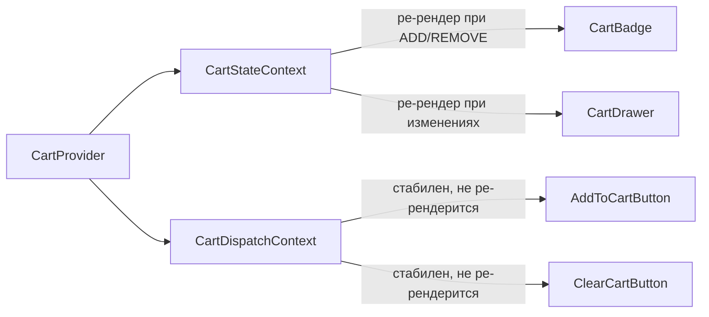
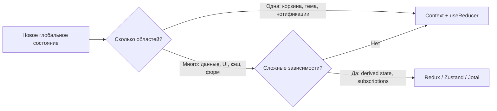

# Level 6: Context + State Management — Подробное руководство

## Зачем это нужно?

Представьте интернет-магазин. Кнопка "В корзину" есть на каждой карточке товара. Счётчик корзины отображается в шапке. Шторка корзины показывает весь список.

Передавать состояние корзины через props невозможно — компоненты расположены в разных ветках дерева. Это классический сценарий для Context: глобальное состояние, нужное в разных частях приложения.

Но `useState` в Context быстро превращается в неуправляемый хаос, когда действий много:
- Добавить товар (или увеличить количество, если уже есть)
- Уменьшить количество (и удалить, если стало 0)
- Удалить полностью
- Очистить корзину

Здесь на помощь приходит `useReducer`.

---

## useReducer: предсказуемый стейт-менеджмент

`useReducer` — это паттерн из функционального программирования. Его суть: переходы состояния описываются **чистой функцией** (reducer), которая принимает текущее состояние и действие, и возвращает новое состояние.

```
(state, action) => newState
```

Аналогия: представьте банковский счёт. Состояние — это баланс. Действия — пополнение, снятие, блокировка. Каждое действие однозначно описывает, что произошло. История транзакций — это история actions.

### Когда выбирать useReducer вместо useState?

```tsx
// ❌ useState становится громоздким при связанных полях
const [items, setItems] = useState<CartItem[]>([])
const [loading, setLoading] = useState(false)
const [error, setError] = useState<string | null>(null)
const [lastAction, setLastAction] = useState<string | null>(null)

// Добавление товара требует синхронного обновления нескольких полей
const addItem = (item: CartItem) => {
  setItems(prev => [...prev, item])
  setLastAction('add')
  setError(null) // сброс ошибки
}

// ✅ useReducer — всё в одной транзакции, состояние всегда согласовано
type State = { items: CartItem[]; loading: boolean; error: string | null }
type Action = { type: 'ADD'; item: CartItem } | { type: 'SET_ERROR'; message: string }

function reducer(state: State, action: Action): State {
  switch (action.type) {
    case 'ADD':
      return { ...state, items: [...state.items, action.item], error: null }
    case 'SET_ERROR':
      return { ...state, error: action.message }
    default:
      return state
  }
}
```

**Ключевые признаки, что пора переходить на useReducer:**
- 3+ связанных состояния, которые меняются вместе
- Сложные условные переходы ("если X — делай A, иначе B")
- Нужно логировать или тестировать переходы состояния

### Типизация reducer с discriminated union

TypeScript делает reducer особенно безопасным через discriminated union — тип с общим полем-дискриминатором:

```tsx
// Каждый action — отдельный тип с буквальным type
type CartAction =
  | { type: 'ADD'; item: Omit<CartItem, 'quantity'> }
  | { type: 'REMOVE'; id: string }
  | { type: 'INCREMENT'; id: string }
  | { type: 'DECREMENT'; id: string }
  | { type: 'CLEAR' }

// TypeScript автоматически сужает тип внутри каждого case
function cartReducer(state: CartState, action: CartAction): CartState {
  switch (action.type) {
    case 'ADD':
      // action здесь имеет тип { type: 'ADD'; item: ... }
      // TypeScript знает про action.item
      return { items: [...state.items, { ...action.item, quantity: 1 }] }
    case 'REMOVE':
      // action здесь имеет тип { type: 'REMOVE'; id: string }
      return { items: state.items.filter(i => i.id !== action.id) }
    // ...
  }
}
```

---

## Разделение State и Dispatch контекстов

Это главный паттерн уровня, и понять его важно глубоко.

**Проблема:** если поместить `state` и `dispatch` в один контекст, каждый компонент, использующий `dispatch`, будет ре-рендериться при каждом изменении `state` — даже если сам компонент визуально не меняется.

```tsx
// ❌ Один контекст — проблема производительности
const CartContext = createContext<{ state: CartState; dispatch: Dispatch } | null>(null)

function CartProvider({ children }) {
  const [state, dispatch] = useReducer(cartReducer, initialState)
  // При каждом action создаётся новый объект { state, dispatch }
  // Все потребители CartContext ре-рендерятся, даже те, кто использует только dispatch
  return <CartContext.Provider value={{ state, dispatch }}>{children}</CartContext.Provider>
}

function AddToCartButton({ item }) {
  const { dispatch } = useContext(CartContext) // ❌ ре-рендерится при каждом изменении корзины
  return <button onClick={() => dispatch({ type: 'ADD', item })}>Купить</button>
}
```

**Решение:** два отдельных контекста. `dispatch` из `useReducer` стабилен — React гарантирует, что его референс не меняется между рендерами.

```tsx
// ✅ Два контекста — оптимальное решение
const CartStateContext = createContext<CartState | null>(null)
const CartDispatchContext = createContext<Dispatch<CartAction> | null>(null)

function CartProvider({ children }) {
  const [state, dispatch] = useReducer(cartReducer, initialState)
  return (
    <CartStateContext.Provider value={state}>
      <CartDispatchContext.Provider value={dispatch}>
        {children}
      </CartDispatchContext.Provider>
    </CartStateContext.Provider>
  )
}

function AddToCartButton({ item }) {
  const dispatch = useContext(CartDispatchContext) // ✅ никогда не ре-рендерится из-за state
  return <button onClick={() => dispatch({ type: 'ADD', item })}>Купить</button>
}

function CartBadge() {
  const state = useContext(CartStateContext) // ✅ ре-рендерится только при изменении корзины
  const count = state?.items.reduce((sum, i) => sum + i.quantity, 0) ?? 0
  return <span>{count}</span>
}
```

Визуально это выглядит так:



---

## Система нотификаций: очередь с auto-dismiss

Нотификации — отличный пример для изучения сложного управления состоянием: у каждой есть уникальный ID, таймер на auto-dismiss, и нужно корректно очищать таймеры.

### Ключевые приёмы

**1. Генерация уникальных ID:**

```tsx
const id = `notif-${Date.now()}-${Math.random().toString(36).slice(2, 7)}`
```

`Date.now()` даёт уникальность во времени, случайный суффикс защищает от коллизий при быстрых вызовах.

**2. Хранение таймеров в ref:**

```tsx
const timersRef = useRef<Map<string, ReturnType<typeof setTimeout>>>(new Map())
```

Почему ref, а не state? Таймеры — это побочный эффект, не UI-состояние. Изменение ref не вызывает ре-рендер. `Map` удобен для поиска и удаления по ID.

**3. useCallback для стабильных функций:**

```tsx
const dismiss = useCallback((id: string) => {
  setNotifications(prev => prev.filter(n => n.id !== id))
  clearTimeout(timersRef.current.get(id))
  timersRef.current.delete(id)
}, []) // пустой массив — функция создаётся один раз

const notify = useCallback((message: string, type = 'info', duration = 4000) => {
  const id = generateId()
  setNotifications(prev => [...prev, { id, message, type, duration }])
  if (duration > 0) {
    timersRef.current.set(id, setTimeout(() => dismiss(id), duration))
  }
}, [dismiss]) // зависит от dismiss, который стабилен
```

**4. Очистка таймеров при размонтировании:**

```tsx
useEffect(() => {
  const timers = timersRef.current
  return () => { timers.forEach(clearTimeout) } // cleanup
}, [])
```

Это паттерн "сохрани ref в переменную перед useEffect" — нужен чтобы в cleanup функции был актуальный ref на момент размонтирования.

---

## Generic createStore: фабрика провайдеров

Создавать Provider + два контекста для каждого глобального состояния — много дублирования. Фабричный паттерн решает это:

```tsx
function createStore<S, A>(reducer: (s: S, a: A) => S, initialState: S) {
  const StateCtx = createContext<S>(initialState)
  const DispatchCtx = createContext<Dispatch<A>>(() => {})

  const Provider: React.FC<{ children: ReactNode }> = ({ children }) => {
    const [state, dispatch] = useReducer(reducer, initialState)
    return (
      <StateCtx.Provider value={state}>
        <DispatchCtx.Provider value={dispatch}>
          {children}
        </DispatchCtx.Provider>
      </StateCtx.Provider>
    )
  }

  function useStore<R>(selector: (state: S) => R): R {
    return selector(useContext(StateCtx))
  }

  function useDispatch(): Dispatch<A> {
    return useContext(DispatchCtx)
  }

  return { Provider, useStore, useDispatch }
}
```

### Использование:

```tsx
const { Provider: CartProvider, useStore: useCartStore, useDispatch: useCartDispatch }
  = createStore(cartReducer, initialCartState)

// В компоненте — подписка только на нужный срез
function CartBadge() {
  // Ре-рендерится только при изменении totalCount
  const totalCount = useCartStore(s => s.items.reduce((sum, i) => sum + i.quantity, 0))
  return <span>{totalCount}</span>
}

function ProductCard({ item }) {
  const dispatch = useCartDispatch() // стабилен
  return <button onClick={() => dispatch({ type: 'ADD', item })}>В корзину</button>
}
```

### Ограничение: нет глубокого сравнения

Текущая реализация использует `===` для сравнения результата селектора. Это работает для примитивов, но для объектов создаёт проблему:

```tsx
// ❌ Ре-рендерится при каждом dispatch, даже если todos не изменились
const todos = useStore(s => s.todos.filter(t => !t.done)) // новый массив каждый раз

// ✅ Для сложных вычислений используйте useMemo внутри компонента
const activeTodos = useMemo(
  () => useStore(s => s.todos).filter(t => !t.done),
  [todos]
)
```

Для продакшна используют `shallowEqual` из react-redux или библиотеки типа Zustand со встроенными селекторами.

---

## Context достаточно vs нужен внешний стейт-менеджмент



**Context + useReducer подходит когда:**
- Ограниченная область — тема, язык, корзина, уведомления
- Нет сложных вычисляемых зависимостей между разными частями состояния
- Нет нужды в DevTools или time-travel debugging
- Небольшая команда, понятная структура

**Внешний стейт-менеджмент стоит рассмотреть когда:**
- Много связанных областей с зависимостями между ними
- Нужны продвинутые селекторы с мемоизацией из коробки
- Важны DevTools для отладки
- Асинхронные операции и кэширование (тогда скорее React Query)

---

## Антипаттерны

### 1. Объект в value Provider

```tsx
// ❌ Новый объект при каждом рендере — все потребители ре-рендерятся
<MyContext.Provider value={{ user, setUser }}>

// ✅ Разделите на два контекста или используйте useMemo
const value = useMemo(() => ({ user, setUser }), [user])
<MyContext.Provider value={value}>
```

### 2. Отсутствие проверки на null

```tsx
// ❌ Падение с непонятной ошибкой
function useCart() {
  return useContext(CartContext) // может быть null вне Provider
}

// ✅ Понятное сообщение об ошибке
function useCart(): CartContextValue {
  const ctx = useContext(CartContext)
  if (!ctx) throw new Error('useCart must be used inside CartProvider')
  return ctx
}
```

### 3. Слишком широкий контекст

```tsx
// ❌ Один App Context для всего — все компоненты ре-рендерятся при любом изменении
const AppContext = createContext({ user, cart, notifications, theme, locale })

// ✅ Отдельный контекст для каждой области
<UserProvider>
  <CartProvider>
    <NotificationProvider>
      <ThemeProvider>
        <App />
      </ThemeProvider>
    </NotificationProvider>
  </CartProvider>
</UserProvider>
```

---

## Итог

Context + useReducer — это "встроенный Redux". Он отлично справляется с ограниченными областями глобального состояния. Разделение State и Dispatch контекстов — ключ к производительности. Фабричный паттерн `createStore` устраняет дублирование. Понимание, когда Context достаточен, а когда нужен внешний инструмент — признак зрелого разработчика.
