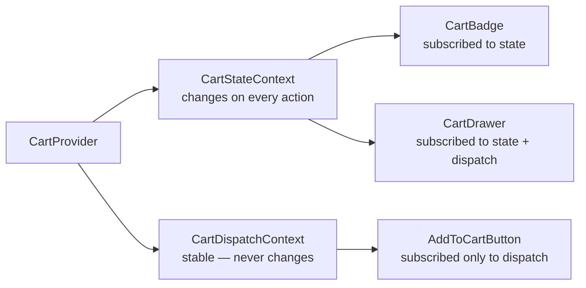

# Level 6: Context + State Management

## The problem: useState doesn't scale

When app state becomes complex — cart, notifications, current user — `useState` turns into a web of prop drilling. We need a tool that stores state globally and updates only the necessary components.

## useReducer + Context

`useReducer` replaces `useState` when:
- Multiple state fields are interconnected
- Transition logic is complex (ADD, REMOVE, INCREMENT, CLEAR)
- Predictability and testability are needed (pure function)

```tsx
type Action = { type: 'ADD'; item: Item } | { type: 'REMOVE'; id: string }

function reducer(state: State, action: Action): State {
  switch (action.type) {
    case 'ADD': return { ...state, items: [...state.items, action.item] }
    case 'REMOVE': return { ...state, items: state.items.filter(i => i.id !== action.id) }
    default: return state
  }
}

const [state, dispatch] = useReducer(reducer, { items: [] })
```

## Key technique: separating contexts



**Why this matters:** the `AddToCartButton` component shouldn't re-render when an item is added to the cart. If it's subscribed only to `CartDispatchContext` — it won't re-render, because dispatch never changes.

## Context vs external state management

| | Context + useReducer | Redux / Zustand |
|---|---|---|
| Dependencies | None (built-in) | npm package |
| Suitable for | Local global state | Large apps |
| Selectors | Manual implementation | Built-in |
| DevTools | None | Available |
| When to choose | One domain (cart, theme) | Multiple domains, complex dependencies |

## Common mistakes

⚠️ **One big context for everything** — any change re-renders all subscribers.

⚠️ **Creating a new object in value** — `<Ctx.Provider value={{ state, dispatch }}>` creates a new object on every render, causing re-render of all consumers.

⚠️ **Calling useContext outside Provider** — always add a check and a clear error message.
