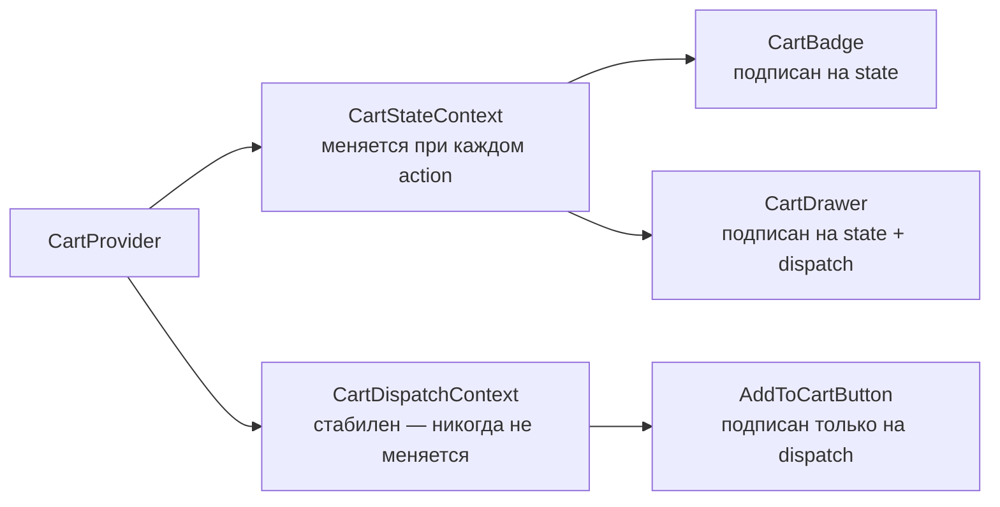

# Level 6: Context + State Management

## Проблема: useState не масштабируется

Когда состояние приложения становится сложным — корзина, нотификации, текущий пользователь — `useState` превращается в паутину prop drilling. Нужен инструмент, который хранит состояние глобально и обновляет только нужные компоненты.

## useReducer + Context

`useReducer` заменяет `useState` когда:
- Несколько полей state связаны между собой
- Логика переходов сложна (ADD, REMOVE, INCREMENT, CLEAR)
- Нужна предсказуемость и тестируемость (чистая функция)

```tsx
type Action = { type: 'ADD'; item: Item } | { type: 'REMOVE'; id: string }

function reducer(state: State, action: Action): State {
  switch (action.type) {
    case 'ADD': return { ...state, items: [...state.items, action.item] }
    case 'REMOVE': return { ...state, items: state.items.filter(i => i.id !== action.id) }
    default: return state
  }
}

const [state, dispatch] = useReducer(reducer, { items: [] })
```

## Ключевой приём: разделение контекстов



**Почему это важно:** компонент `AddToCartButton` не должен ре-рендериться при добавлении товара в корзину. Если он подписан только на `CartDispatchContext` — он не ре-рендерится, потому что dispatch никогда не меняется.

## Context vs внешний стейт-менеджмент

| | Context + useReducer | Redux / Zustand |
|---|---|---|
| Зависимости | Нет (встроен) | npm пакет |
| Подходит для | Локальное глобальное состояние | Большие приложения |
| Селекторы | Ручная реализация | Встроены |
| DevTools | Нет | Есть |
| Когда выбрать | Одна область (корзина, тема) | Много областей, сложные зависимости |

## Типичные ошибки

⚠️ **Один большой контекст для всего** — при любом изменении ре-рендерятся все подписчики.

⚠️ **Создание нового объекта в value** — `<Ctx.Provider value={{ state, dispatch }}>` создаёт новый объект при каждом рендере, вызывая ре-рендер всех потребителей.

⚠️ **Вызов useContext вне Provider** — всегда добавляйте проверку и понятное сообщение об ошибке.
