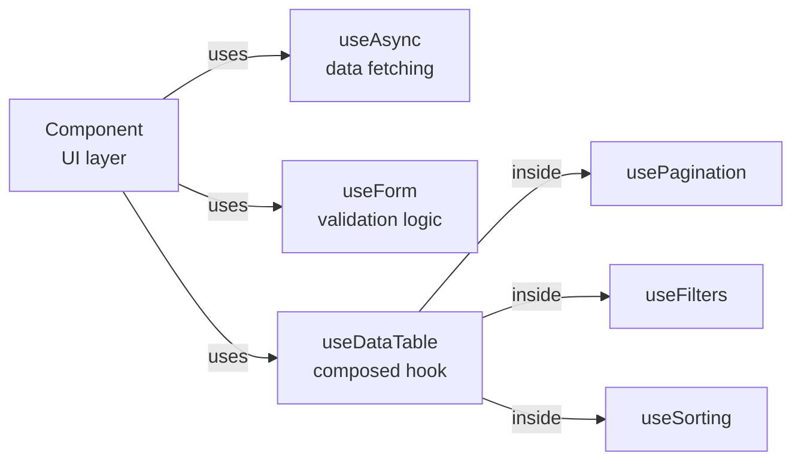

# Level 7: Hooks as Architectural Tool

## The problem: logic in components

A component that fetches data itself, validates a form itself, and manages pagination itself — that's not a component, it's a monolith. It can't be reused, is hard to test, and painful to read.

Hooks solve this problem. They allow extracting logic from a component into a reusable function — so the component becomes a thin UI layer, and the hook is the smart logic layer.

## Component = UI, hook = logic

```tsx
// ❌ Logic and UI mixed — monolithic component
function UserList() {
  const [data, setData] = useState(null)
  const [loading, setLoading] = useState(false)
  const [error, setError] = useState(null)

  useEffect(() => {
    setLoading(true)
    fetch('/api/users')
      .then(r => r.json())
      .then(d => { setData(d); setLoading(false) })
      .catch(e => { setError(e.message); setLoading(false) })
  }, [])

  if (loading) return <Spinner />
  if (error) return <ErrorMsg text={error} />
  return <ul>{data?.map(u => <li key={u.id}>{u.name}</li>)}</ul>
}

// ✅ Logic in hook — component only renders
function UserList() {
  const { data, loading, error } = useAsync(() => fetch('/api/users').then(r => r.json()))

  if (loading) return <Spinner />
  if (error) return <ErrorMsg text={error} />
  return <ul>{data?.map(u => <li key={u.id}>{u.name}</li>)}</ul>
}
```

## Layered architecture



The component only knows what to render. The hooks know how it works.

## Hook composition

Hooks can call other hooks. This is the main tool for logic reuse:

```tsx
// Base hook
function useAsync<T>(fn: () => Promise<T>) {
  const [state, setState] = useState<AsyncState<T>>({ loading: false, data: null, error: null })
  // ... loading logic
  return state
}

// Specialized hook built on top
function useApi<T>(endpoint: string) {
  const abortRef = useRef<AbortController | null>(null)
  return useAsync(() => {
    abortRef.current?.abort()
    abortRef.current = new AbortController()
    return fetch(endpoint, { signal: abortRef.current.signal }).then(r => r.json())
  })
}
```

## Naming convention

All hooks must start with `use`. This isn't just style — React's linter (and React itself) uses this rule to determine where hook rules apply. A hook without the `use` prefix will lose all call correctness checks.

## Common mistakes

⚠️ **Hook with side effects outside useEffect** — direct fetch call in the hook body will run on every render.

⚠️ **Validation logic in the component** — if the form gets more complex, all code needs rewriting. A validation hook is reusable without changes.

⚠️ **Passing too many parameters to a hook** — if a hook takes 7 arguments, that's a sign it needs to be split into several.
