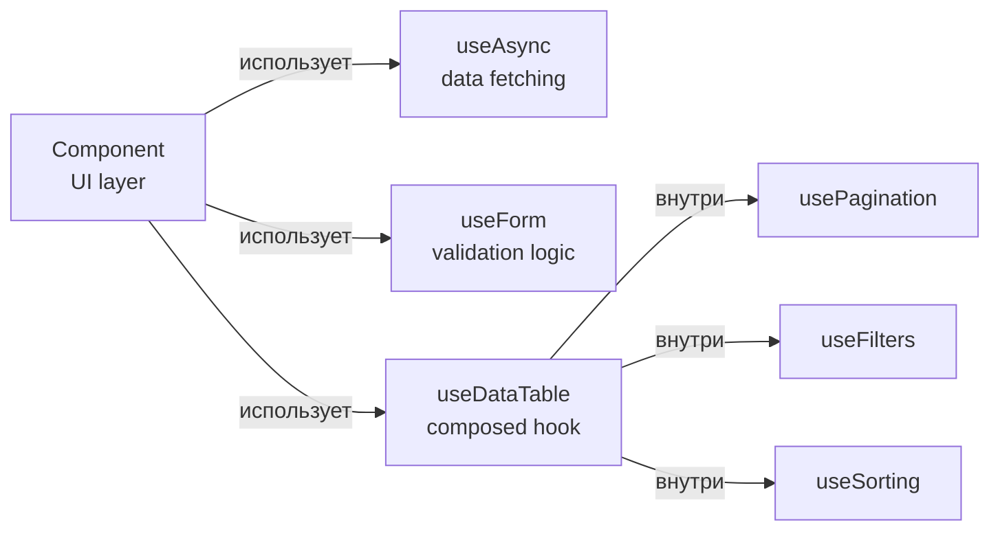

# Level 7: Хуки как архитектурный инструмент

## Проблема: логика в компонентах

Компонент, который сам загружает данные, сам валидирует форму и сам управляет пагинацией — это не компонент, это монолит. Его невозможно переиспользовать, трудно тестировать и больно читать.

Хуки решают эту проблему. Они позволяют вынести логику из компонента в переиспользуемую функцию — так компонент становится тонким UI-слоем, а хук — умным слоем логики.

## Компонент = UI, хук = логика

```tsx
// ❌ Логика и UI перемешаны — компонент-монолит
function UserList() {
  const [data, setData] = useState(null)
  const [loading, setLoading] = useState(false)
  const [error, setError] = useState(null)

  useEffect(() => {
    setLoading(true)
    fetch('/api/users')
      .then(r => r.json())
      .then(d => { setData(d); setLoading(false) })
      .catch(e => { setError(e.message); setLoading(false) })
  }, [])

  if (loading) return <Spinner />
  if (error) return <ErrorMsg text={error} />
  return <ul>{data?.map(u => <li key={u.id}>{u.name}</li>)}</ul>
}

// ✅ Логика в хуке — компонент только рендерит
function UserList() {
  const { data, loading, error } = useAsync(() => fetch('/api/users').then(r => r.json()))

  if (loading) return <Spinner />
  if (error) return <ErrorMsg text={error} />
  return <ul>{data?.map(u => <li key={u.id}>{u.name}</li>)}</ul>
}
```

## Архитектура слоёв



Компонент знает только о том, что рендерить. Хуки знают о том, как это работает.

## Композиция хуков

Хуки могут вызывать другие хуки. Это главный инструмент переиспользования логики:

```tsx
// Базовый хук
function useAsync<T>(fn: () => Promise<T>) {
  const [state, setState] = useState<AsyncState<T>>({ loading: false, data: null, error: null })
  // ... логика загрузки
  return state
}

// Специализированный хук строится поверх базового
function useApi<T>(endpoint: string) {
  const abortRef = useRef<AbortController | null>(null)
  return useAsync(() => {
    abortRef.current?.abort()
    abortRef.current = new AbortController()
    return fetch(endpoint, { signal: abortRef.current.signal }).then(r => r.json())
  })
}
```

## Конвенция именования

Все хуки должны начинаться с `use`. Это не просто стиль — React линтер (и React сам) использует это правило, чтобы определять, где применяются правила хуков. Хук без префикса `use` потеряет все проверки на корректность вызова.

## Типичные ошибки

⚠️ **Хук с побочными эффектами вне useEffect** — прямой вызов fetch в теле хука запустится при каждом рендере.

⚠️ **Логика валидации в компоненте** — если форма стала сложнее, весь код нужно переписывать. Хук с валидацией переиспользуется без изменений.

⚠️ **Передача слишком много параметров хуку** — если хук принимает 7 аргументов, это признак, что его нужно разбить на несколько.
