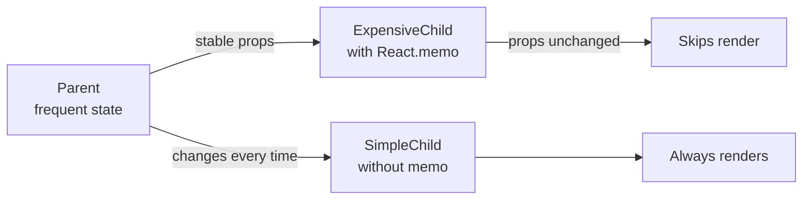
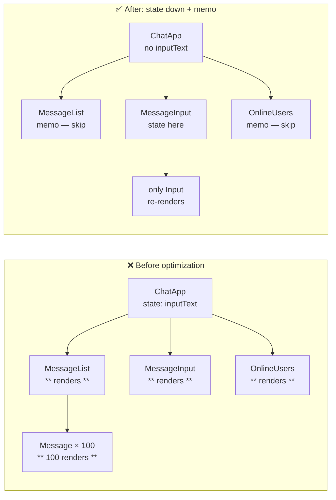

# Level 8: Render Optimization — Detailed Guide

## How React decides to re-render

Imagine a React tree as a company with a hierarchical structure. When the CEO (root component) gets a new instruction (state change), they call a meeting — and all subordinates (child components) must attend, even if the instruction concerns only one department.

This is called **recursive rendering**. React traverses the tree top to bottom, calls each component's function, and compares the result with the previous one (reconciliation). If the result is the same — the DOM doesn't change. But **the function was still called**.

```
Parent (state changed)
├── ChildA  ← renders (parent updated)
│   └── GrandChildA  ← renders (parent updated)
└── ChildB  ← renders (parent updated)
    └── GrandChildB  ← renders (parent updated)
```

Calling a component function is not a free operation. If a component renders a long list or performs complex computations, it's noticeable.

## Four causes of re-render

### 1. Own state changed

```tsx
function Counter() {
  const [count, setCount] = useState(0)
  // Button click → setCount → Counter re-renders
  return <button onClick={() => setCount(c => c + 1)}>{count}</button>
}
```

This is normal — the component should update since its data changed.

### 2. Parent re-rendered (most common cause of problems)

```tsx
function Parent() {
  const [tick, setTick] = useState(0)
  return (
    <>
      <button onClick={() => setTick(t => t + 1)}>Tick: {tick}</button>
      <ExpensiveChild />  {/* re-renders on every click, even though no props! */}
    </>
  )
}
```

### 3. Context changed

Any component reading context via `useContext` re-renders on every provider `value` change. Even if a part of the object that the component doesn't use has changed.

```tsx
// ❌ Problem: one object for the entire context
const AppContext = createContext({ user: null, theme: 'light', cart: [] })

// cart changed → all subscribers re-render, including those that only read user
```

### 4. Props changed

Strictly speaking, this is a consequence of point 2. Parent re-rendered → passed new prop values (or new object/function references).

## React reconciliation: how it works internally

After rendering, React gets a new tree of React elements and compares it with the previous one. This comparison is called diffing.

Key rules:
- Elements of the same type (`div`, `MyComponent`) — React updates props and recursively compares children
- Elements of different types — React completely destroys the old subtree and creates a new one
- Lists are compared by `key` — that's why key matters

```
Before:       After:
<div>         <div>
  <A />  →      <A />  (updated)
  <B />         <B />  (updated)
</div>        </div>

Before:       After:
<div>         <span>   ← different type!
  <A />  →      <A />  ← recreated (unmount+mount)
</div>        </span>
```

## React.memo — how it actually works

`React.memo` wraps a component in an HOC that remembers the last props and render result. On the next parent render — it compares new props with old ones (shallowEqual). If nothing changed — returns the cached result.

```tsx
const ExpensiveList = React.memo(function ExpensiveList({
  items,
  onSelect,
}: {
  items: Item[]
  onSelect: (id: string) => void
}) {
  return (
    <ul>
      {items.map(item => (
        <li key={item.id} onClick={() => onSelect(item.id)}>
          {item.name}
        </li>
      ))}
    </ul>
  )
})
```

### When memo HELPS



### When memo DOESN'T HELP (and even hurts)

```tsx
// ❌ Function prop created anew on every render
function Parent() {
  const [count, setCount] = useState(0)

  return (
    <ExpensiveChild
      // New function on every render → memo always skips!
      onClick={() => setCount(c => c + 1)}
    />
  )
}

// ❌ Object prop created anew on every render
function Parent() {
  return (
    <ExpensiveChild
      // New object on every render → memo always skips!
      config={{ theme: 'dark', size: 'large' }}
    />
  )
}

// ❌ children — React element, created anew
function Parent() {
  return (
    <MemoizedWrapper>
      <div>This children is always new!</div>
    </MemoizedWrapper>
  )
}
```

## useCallback — stable function references

`useCallback` returns the same function between renders until dependencies change. This is needed precisely so `React.memo` can correctly compare function props.

```tsx
function Parent() {
  const [count, setCount] = useState(0)
  const [query, setQuery] = useState('')

  // ✅ Stable reference — not recreated when count or query changes
  const handleSelect = useCallback((id: string) => {
    console.log('Selected:', id)
  }, []) // no deps — created once

  // ✅ Stable reference — recreated only when query changes
  const handleSearch = useCallback((term: string) => {
    setQuery(term)
  }, []) // setState is stable — no deps needed

  return <ExpensiveList items={items} onSelect={handleSelect} />
}
```

### useCallback dependency rule

Everything read inside the function (except useState setters) — must be in the dependency array. If you ignore this rule, you'll get a stale closure.

```tsx
// ❌ Stale closure — userId read from closure but not in deps
const handleSubmit = useCallback(() => {
  submitForm(userId, formData) // userId might be stale!
}, [formData]) // userId not listed → bug!

// ✅ Correct
const handleSubmit = useCallback(() => {
  submitForm(userId, formData)
}, [userId, formData])
```

## useMemo — stable object references and expensive computations

```tsx
function Dashboard({ userId, period }: Props) {
  const [rawData, setRawData] = useState<DataPoint[]>([])

  // ✅ Heavy computation — recalculates only when rawData or period change
  const processedData = useMemo(
    () => rawData
      .filter(d => d.period === period)
      .map(d => ({ ...d, value: d.value * COEFFICIENT }))
      .sort((a, b) => b.value - a.value),
    [rawData, period]
  )

  // ✅ Stable object prop — without useMemo would be recreated on every render
  const chartConfig = useMemo(
    () => ({ userId, showLegend: true, theme: 'light' }),
    [userId]
  )

  return <ExpensiveChart data={processedData} config={chartConfig} />
}
```

### When useMemo is NOT needed

```tsx
// ❌ Excessive: simple computations are faster without memoization
const doubled = useMemo(() => count * 2, [count])

// ✅ Just write inline
const doubled = count * 2

// ❌ Excessive: primitive values are compared by value, not reference
const isActive = useMemo(() => status === 'active', [status])

// ✅ Just write inline
const isActive = status === 'active'
```

## Structural optimizations — the most powerful and without memo

### "State down" pattern

If state is used only in part of the tree — move it there. Other components stop re-rendering.

```tsx
// ❌ Before: entire Parent re-renders on text input
function Page() {
  const [searchQuery, setSearchQuery] = useState('')

  return (
    <div>
      <SearchInput value={searchQuery} onChange={setSearchQuery} />
      <ExpensiveDataTable />  {/* re-renders on every keystroke! */}
    </div>
  )
}

// ✅ After: state moved down, ExpensiveDataTable untouched
function SearchSection() {
  const [searchQuery, setSearchQuery] = useState('')
  return <SearchInput value={searchQuery} onChange={setSearchQuery} />
}

function Page() {
  return (
    <div>
      <SearchSection />       {/* state here */}
      <ExpensiveDataTable />  {/* never re-renders due to search */}
    </div>
  )
}
```

### "Children up" pattern

If a stateful component wraps an expensive component — pass the expensive component via `children`. The `children` parent creates it outside and it doesn't get recreated.

```tsx
// ❌ Before: ColorPicker wraps ExpensiveBackground directly
function ColorPicker() {
  const [color, setColor] = useState('#ffffff')
  return (
    <div style={{ background: color }}>
      <input type="color" value={color} onChange={e => setColor(e.target.value)} />
      <ExpensiveBackground />  {/* re-renders on every color change! */}
    </div>
  )
}

// ✅ After: ExpensiveBackground passed as children — doesn't depend on state
function ColorWrapper({ children }: { children: React.ReactNode }) {
  const [color, setColor] = useState('#ffffff')
  return (
    <div style={{ background: color }}>
      <input type="color" value={color} onChange={e => setColor(e.target.value)} />
      {children}  {/* created outside — not recreated! */}
    </div>
  )
}

function Page() {
  return (
    <ColorWrapper>
      <ExpensiveBackground />
    </ColorWrapper>
  )
}
```

### Re-render cascade: before and after



## Diagnostics: render counters and React DevTools

### Render counter via useRef

```tsx
function MyComponent({ data }: Props) {
  // useRef — doesn't cause re-render on change
  const renderCount = useRef(0)
  renderCount.current++

  return (
    <div>
      <span style={{ color: 'gray', fontSize: 11 }}>
        renders: {renderCount.current}
      </span>
      {/* main content */}
    </div>
  )
}
```

### React DevTools Profiler

1. Open React DevTools → Profiler tab
2. Click "Record", perform an action, click "Stop"
3. Look at the flamegraph — gray components didn't render, colored ones did
4. Click on a component — see "why it re-rendered" (props changed / hooks changed / parent rendered)

### Highlight renders

In React DevTools: Settings → General → "Highlight updates when components render". Components will highlight green on every render.

## Common antipatterns

### ❌ Premature optimization

```tsx
// Adding memo/useMemo everywhere "just in case"
// Result: harder to read code, dependency bugs, no real gain
const value = useMemo(() => 'hello', []) // why?!
```

### ❌ Unstable key in list

```tsx
// ❌ index as key → when elements reorder, React recreates components
{items.map((item, index) => <Card key={index} item={item} />)}

// ✅ Stable unique ID
{items.map(item => <Card key={item.id} item={item} />)}
```

### ❌ Creating components inside render

```tsx
// ❌ New component type on every render → React recreates DOM
function Parent() {
  const ListItem = ({ item }) => <li>{item.name}</li> // declaration INSIDE!
  return <ul>{items.map(item => <ListItem key={item.id} item={item} />)}</ul>
}

// ✅ Components declared outside
function ListItem({ item }) { return <li>{item.name}</li> }
function Parent() {
  return <ul>{items.map(item => <ListItem key={item.id} item={item} />)}</ul>
}
```

### ❌ Context with one big object

```tsx
// ❌ Any field change → all subscribers re-render
const AppContext = createContext({ user, theme, notifications, cart })

// ✅ Separate contexts — each re-renders only its own subscribers
const UserContext = createContext(user)
const ThemeContext = createContext(theme)
```

## The three-step rule

Before adding `React.memo` or `useMemo`:

1. **Measure** — make sure the problem is real (render counter, Profiler)
2. **Structural solution** — can it be solved with state down / children up?
3. **Memoization** — only if structural solution is impossible

Memoization is not a silver bullet, it's a bandage. Structural solutions cure the cause.

## Summary

| Approach | Complexity | When to apply |
|--------|-----------|---------------|
| State down | Low | State used only in part of the tree |
| Children up | Medium | Expensive component inside stateful component |
| React.memo | Medium | Expensive component with rarely changing props |
| useCallback | Medium | Function props for memo components |
| useMemo | Medium | Expensive computations or stable object props |
