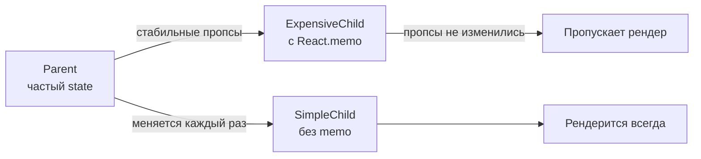
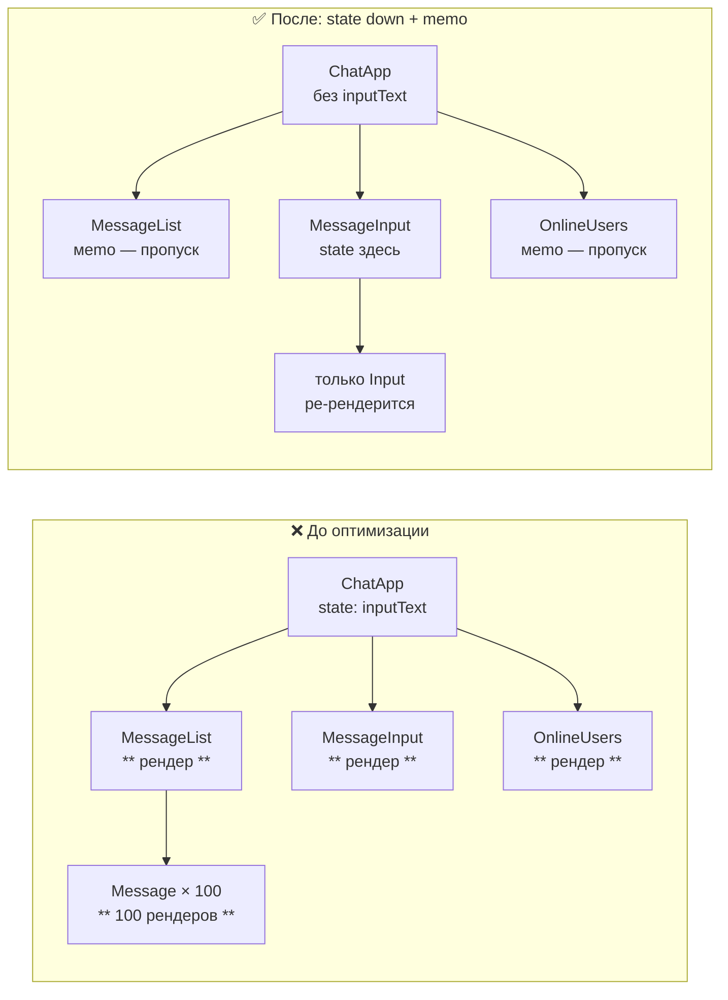

# Level 8: Оптимизация рендеринга — подробное руководство

## Как React решает что перерисовывать

Представь React-дерево как компанию с иерархической структурой. Когда CEO (корневой компонент) получает новую инструкцию (изменение state), он созывает совещание — и все подчинённые (дочерние компонеты) обязаны присутствовать, даже если инструкция касается только одного отдела.

Это называется **рекурсивный рендеринг**. React проходит по дереву сверху вниз, вызывает функцию каждого компонента и сравнивает результат с предыдущим (reconciliation). Если результат одинаковый — DOM не меняется. Но **функция всё равно была вызвана**.

```
Parent (state изменился)
├── ChildA  ← рендерится (родитель обновился)
│   └── GrandChildA  ← рендерится (родитель обновился)
└── ChildB  ← рендерится (родитель обновился)
    └── GrandChildB  ← рендерится (родитель обновился)
```

Вызов функции компонента — это не бесплатная операция. Если компонент рендерит длинный список или выполняет сложные вычисления, это ощутимо.

## Четыре причины ре-рендера

### 1. Изменился собственный state

```tsx
function Counter() {
  const [count, setCount] = useState(0)
  // Нажатие кнопки → setCount → Counter ре-рендерится
  return <button onClick={() => setCount(c => c + 1)}>{count}</button>
}
```

Это нормально — компонент должен обновиться, ведь у него изменились данные.

### 2. Ре-рендерился родитель (самая частая причина проблем)

```tsx
function Parent() {
  const [tick, setTick] = useState(0)
  return (
    <>
      <button onClick={() => setTick(t => t + 1)}>Tick: {tick}</button>
      <ExpensiveChild />  {/* рендерится при каждом нажатии, хотя пропсов нет! */}
    </>
  )
}
```

### 3. Изменился контекст

Любой компонент, читающий контекст через `useContext`, рендерится при каждом изменении `value` провайдера. Даже если изменилась часть объекта, которую компонент не использует.

```tsx
// ❌ Проблема: один объект на весь контекст
const AppContext = createContext({ user: null, theme: 'light', cart: [] })

// Изменился cart → ре-рендерятся все подписчики, включая те что читают только user
```

### 4. Изменились пропсы

Строго говоря, это следствие пункта 2. Родитель ре-рендерился → передал новые значения пропсов (или новые ссылки на объекты/функции).

## React reconciliation: как это работает изнутри

После рендера React получает новое дерево React-элементов и сравнивает его с предыдущим. Это сравнение называется diffing.

Ключевые правила:
- Элементы одного типа (`div`, `MyComponent`) — React обновляет пропсы и рекурсивно сравнивает детей
- Элементы разного типа — React полностью уничтожает старое поддерево и создаёт новое
- Списки сравниваются по `key` — именно поэтому key важен

```
До:           После:
<div>         <div>
  <A />  →      <A />  (обновлён)
  <B />         <B />  (обновлён)
</div>        </div>

До:           После:
<div>         <span>   ← другой тип!
  <A />  →      <A />  ← создан заново (unmount+mount)
</div>        </span>
```

## React.memo — как работает на самом деле

`React.memo` оборачивает компонент в HOC, который запоминает последние пропсы и результат рендера. При следующем рендере родителя — сравнивает новые пропсы со старыми (shallowEqual). Если ничего не изменилось — возвращает закешированный результат.

```tsx
const ExpensiveList = React.memo(function ExpensiveList({
  items,
  onSelect,
}: {
  items: Item[]
  onSelect: (id: string) => void
}) {
  return (
    <ul>
      {items.map(item => (
        <li key={item.id} onClick={() => onSelect(item.id)}>
          {item.name}
        </li>
      ))}
    </ul>
  )
})
```

### Когда memo ПОМОГАЕТ



### Когда memo НЕ ПОМОГАЕТ (и даже вредит)

```tsx
// ❌ Пропс-функция создаётся заново при каждом рендере
function Parent() {
  const [count, setCount] = useState(0)

  return (
    <ExpensiveChild
      // Новая функция при каждом рендере → memo всегда пропускает!
      onClick={() => setCount(c => c + 1)}
    />
  )
}

// ❌ Пропс-объект создаётся заново при каждом рендере
function Parent() {
  return (
    <ExpensiveChild
      // Новый объект при каждом рендере → memo всегда пропускает!
      config={{ theme: 'dark', size: 'large' }}
    />
  )
}

// ❌ children — это элемент React, создаётся заново
function Parent() {
  return (
    <MemoizedWrapper>
      <div>Этот children всегда новый!</div>
    </MemoizedWrapper>
  )
}
```

## useCallback — стабильные ссылки на функции

`useCallback` возвращает одну и ту же функцию между рендерами, пока не изменятся зависимости. Это нужно именно для того, чтобы `React.memo` мог правильно сравнить пропсы-функции.

```tsx
function Parent() {
  const [count, setCount] = useState(0)
  const [query, setQuery] = useState('')

  // ✅ Стабильная ссылка — не пересоздаётся при изменении count или query
  const handleSelect = useCallback((id: string) => {
    console.log('Selected:', id)
  }, []) // нет зависимостей — создаётся один раз

  // ✅ Стабильная ссылка — пересоздаётся только при изменении query
  const handleSearch = useCallback((term: string) => {
    setQuery(term)
  }, []) // setState стабилен — зависимости не нужны

  return <ExpensiveList items={items} onSelect={handleSelect} />
}
```

### Правило зависимостей useCallback

Всё, что читается внутри функции (кроме setter-функций useState) — должно быть в массиве зависимостей. Если игнорировать это правило, получится stale closure.

```tsx
// ❌ Stale closure — userId читается из замыкания, но не в зависимостях
const handleSubmit = useCallback(() => {
  submitForm(userId, formData) // userId может быть устаревшим!
}, [formData]) // userId не указан → баг!

// ✅ Правильно
const handleSubmit = useCallback(() => {
  submitForm(userId, formData)
}, [userId, formData])
```

## useMemo — стабильные ссылки на объекты и дорогие вычисления

```tsx
function Dashboard({ userId, period }: Props) {
  const [rawData, setRawData] = useState<DataPoint[]>([])

  // ✅ Тяжёлое вычисление — пересчитывается только при изменении rawData или period
  const processedData = useMemo(
    () => rawData
      .filter(d => d.period === period)
      .map(d => ({ ...d, value: d.value * COEFFICIENT }))
      .sort((a, b) => b.value - a.value),
    [rawData, period]
  )

  // ✅ Стабильный объект-пропс — без useMemo создавался бы заново при каждом рендере
  const chartConfig = useMemo(
    () => ({ userId, showLegend: true, theme: 'light' }),
    [userId]
  )

  return <ExpensiveChart data={processedData} config={chartConfig} />
}
```

### Когда useMemo НЕ нужен

```tsx
// ❌ Избыточно: простые вычисления быстрее без мемоизации
const doubled = useMemo(() => count * 2, [count])

// ✅ Просто пишите инлайн
const doubled = count * 2

// ❌ Избыточно: примитивные значения сравниваются по значению, не по ссылке
const isActive = useMemo(() => status === 'active', [status])

// ✅ Просто пишите инлайн
const isActive = status === 'active'
```

## Структурные оптимизации — самые мощные и без memo

### Паттерн "State down"

Если state используется только в части дерева — перенеси его туда. Остальные компоненты перестанут ре-рендериться.

```tsx
// ❌ До: весь Parent ре-рендерится при вводе текста
function Page() {
  const [searchQuery, setSearchQuery] = useState('')

  return (
    <div>
      <SearchInput value={searchQuery} onChange={setSearchQuery} />
      <ExpensiveDataTable />  {/* ре-рендерится при каждом символе! */}
    </div>
  )
}

// ✅ После: state спущен вниз, ExpensiveDataTable не трогается
function SearchSection() {
  const [searchQuery, setSearchQuery] = useState('')
  return <SearchInput value={searchQuery} onChange={setSearchQuery} />
}

function Page() {
  return (
    <div>
      <SearchSection />       {/* state здесь */}
      <ExpensiveDataTable />  {/* никогда не ре-рендерится из-за поиска */}
    </div>
  )
}
```

### Паттерн "Children up"

Если компонент со state оборачивает дорогой компонент — передай дорогой компонент через `children`. Родитель `children` создаётся снаружи и не пересоздаётся.

```tsx
// ❌ До: ColorPicker оборачивает ExpensiveBackground напрямую
function ColorPicker() {
  const [color, setColor] = useState('#ffffff')
  return (
    <div style={{ background: color }}>
      <input type="color" value={color} onChange={e => setColor(e.target.value)} />
      <ExpensiveBackground />  {/* ре-рендерится при каждом изменении цвета! */}
    </div>
  )
}

// ✅ После: ExpensiveBackground передаётся как children — не зависит от state
function ColorWrapper({ children }: { children: React.ReactNode }) {
  const [color, setColor] = useState('#ffffff')
  return (
    <div style={{ background: color }}>
      <input type="color" value={color} onChange={e => setColor(e.target.value)} />
      {children}  {/* создан снаружи — не пересоздаётся! */}
    </div>
  )
}

function Page() {
  return (
    <ColorWrapper>
      <ExpensiveBackground />
    </ColorWrapper>
  )
}
```

### Каскад ре-рендеров: до и после



## Диагностика: render counters и React DevTools

### Render counter через useRef

```tsx
function MyComponent({ data }: Props) {
  // useRef — не вызывает ре-рендер при изменении
  const renderCount = useRef(0)
  renderCount.current++

  return (
    <div>
      <span style={{ color: 'gray', fontSize: 11 }}>
        renders: {renderCount.current}
      </span>
      {/* основной контент */}
    </div>
  )
}
```

### React DevTools Profiler

1. Открой React DevTools → вкладка Profiler
2. Нажми "Record", выполни действие, нажми "Stop"
3. Посмотри flamegraph — серые компоненты не рендерились, цветные — рендерились
4. Кликни на компонент — увидишь "почему ре-рендерился" (props changed / hooks changed / parent rendered)

### Highlight renders

В React DevTools: Settings → General → "Highlight updates when components render". Компоненты будут подсвечиваться зелёным при каждом рендере.

## Типичные антипаттерны

### ❌ Premature optimization

```tsx
// Добавляем memo/useMemo везде "на всякий случай"
// Результат: код сложнее читать, баги с зависимостями, нет реального выигрыша
const value = useMemo(() => 'hello', []) // зачем?!
```

### ❌ Нестабильный key в списке

```tsx
// ❌ index как key → при перестановке элементов React пересоздаёт компоненты
{items.map((item, index) => <Card key={index} item={item} />)}

// ✅ Стабильный уникальный ID
{items.map(item => <Card key={item.id} item={item} />)}
```

### ❌ Создание компонентов внутри render

```tsx
// ❌ Новый тип компонента при каждом рендере → React пересоздаёт DOM
function Parent() {
  const ListItem = ({ item }) => <li>{item.name}</li> // объявление ВНУТРИ!
  return <ul>{items.map(item => <ListItem key={item.id} item={item} />)}</ul>
}

// ✅ Компоненты объявляются снаружи
function ListItem({ item }) { return <li>{item.name}</li> }
function Parent() {
  return <ul>{items.map(item => <ListItem key={item.id} item={item} />)}</ul>
}
```

### ❌ Context с одним большим объектом

```tsx
// ❌ Любое изменение любого поля → все подписчики ре-рендерятся
const AppContext = createContext({ user, theme, notifications, cart })

// ✅ Раздельные контексты — каждый ре-рендерит только своих подписчиков
const UserContext = createContext(user)
const ThemeContext = createContext(theme)
```

## Правило трёх шагов

Перед тем как добавить `React.memo` или `useMemo`:

1. **Измерь** — убедись что проблема реальна (render counter, Profiler)
2. **Структурное решение** — можно ли решить state down / children up?
3. **Мемоизация** — только если структурное решение невозможно

Мемоизация — это не серебряная пуля, а пластырь. Структурные решения лечат причину.

## Итог

| Подход | Сложность | Когда применять |
|--------|-----------|-----------------|
| State down | Низкая | State используется только в части дерева |
| Children up | Средняя | Дорогой компонент внутри компонента со state |
| React.memo | Средняя | Дорогой компонент с редко меняющимися пропсами |
| useCallback | Средняя | Функции-пропсы для memo-компонентов |
| useMemo | Средняя | Дорогие вычисления или стабильные объекты-пропсы |
