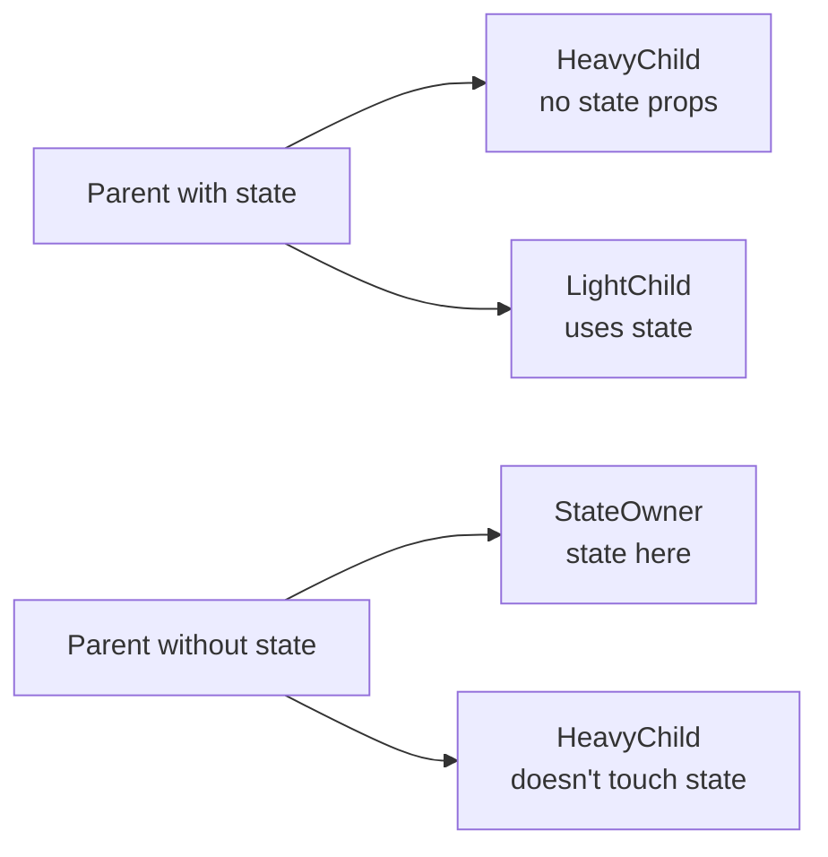

# Level 8: Render Optimization

## Why optimize at all?

React is fast. But it has one peculiarity: when a component's state changes, **all its descendants re-render** — even those whose props haven't changed. In most cases this is unnoticeable. But there are scenarios where it becomes a problem: heavy lists, complex computations, frequent updates.

The main rule: **optimize a measurable problem, not an imaginary one**.

## Why does a component re-render?

Four reasons:

1. **Own state changed** — `useState`, `useReducer`
2. **Parent re-rendered** — the most common cause of unnecessary renders
3. **Context changed** — any subscriber re-renders when value changes
4. **Props changed** — a consequence of point 2

## React.memo — shield from parent re-renders

```tsx
// Without memo: renders every time Parent renders
function UserCard({ user }: { user: User }) { ... }

// With memo: renders only if user changed (by reference)
const UserCard = React.memo(function UserCard({ user }: { user: User }) { ... })
```

**When to use:** expensive component + receives stable props + parent renders often.

**When NOT to use:** simple components, components with children (children is always a new object), if props change every time anyway.

## useMemo and useCallback — stable references

```tsx
// Without useCallback: handleChange — new function on every render
// React.memo on Input is useless — onChange prop is always "new"
const handleChange = (value: string) => setValue(value)

// With useCallback: stable reference between renders
const handleChange = useCallback((value: string) => {
  setValue(value)
}, []) // empty deps — function created once
```

```tsx
// useMemo — for expensive computations
const filteredList = useMemo(
  () => items.filter(item => item.active),
  [items] // recalculates only when items change
)
```

## Structural optimizations — without a single memo

The most underrated approach. Often it's enough to move state closer to where it's used.



**State down:** move state to the child component that actually uses it. The rest stop re-rendering.

**Children up:** pass the expensive component via `children` — it's created outside and doesn't depend on state inside.

## Diagnostics: render counters

Before optimizing anything, make sure the problem is real:

```tsx
function MyComponent() {
  const renderCount = useRef(0)
  renderCount.current++
  console.log(`MyComponent rendered: ${renderCount.current}`)
  // ...
}
```

## Optimization checklist

```
[ ] Measured the problem (render counters / React DevTools Profiler)
[ ] Tried structural solutions (state down / children up)
[ ] Applied React.memo only where truly needed
[ ] Stabilized function props via useCallback
[ ] Stabilized object props via useMemo
[ ] Verified the optimization actually helped
```
