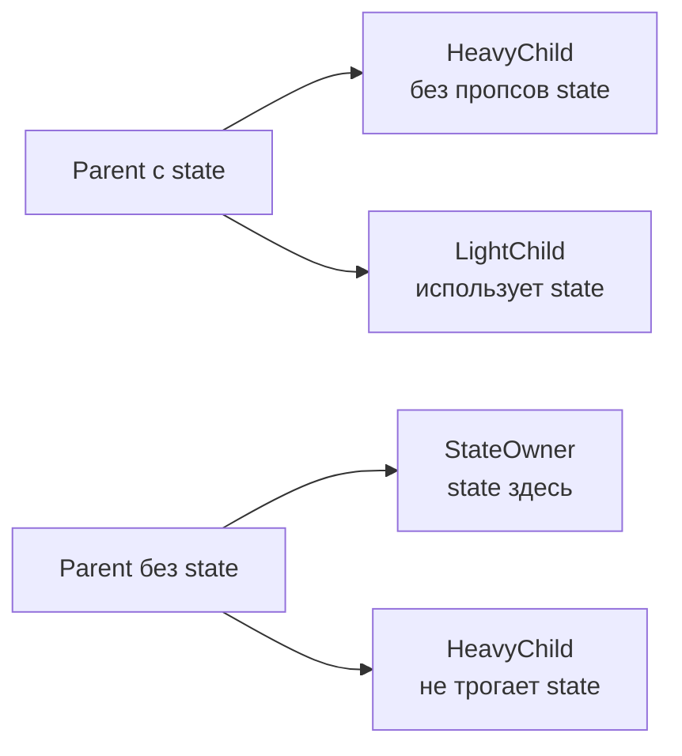

# Level 8: Оптимизация рендеринга

## Зачем вообще оптимизировать?

React быстрый. Но у него есть одна особенность: при изменении state компонента **все его потомки рендерятся заново** — даже те, чьи пропсы не изменились. В большинстве случаев это незаметно. Но есть сценарии, где это становится проблемой: тяжёлые списки, сложные вычисления, частые обновления.

Главное правило: **оптимизируй измеримую проблему, а не воображаемую**.

## Почему компонент ре-рендерится?

Четыре причины:

1. **Изменился собственный state** — `useState`, `useReducer`
2. **Ре-рендерился родитель** — самая частая причина лишних рендеров
3. **Изменился контекст** — любой подписчик рендерится при изменении value
4. **Изменились пропсы** — следствие пункта 2

## React.memo — щит от родительских ре-рендеров

```tsx
// Без memo: рендерится каждый раз когда рендерится Parent
function UserCard({ user }: { user: User }) { ... }

// С memo: рендерится только если user изменился (по ссылке)
const UserCard = React.memo(function UserCard({ user }: { user: User }) { ... })
```

**Когда использовать:** компонент дорогой + получает стабильные пропсы + часто рендерится родитель.

**Когда НЕ использовать:** простые компоненты, компоненты с children (children — всегда новый объект), если пропсы всё равно меняются каждый раз.

## useMemo и useCallback — стабильные ссылки

```tsx
// Без useCallback: handleChange — новая функция при каждом рендере
// React.memo на Input бесполезен — пропс onChange всегда "новый"
const handleChange = (value: string) => setValue(value)

// С useCallback: ссылка стабильна между рендерами
const handleChange = useCallback((value: string) => {
  setValue(value)
}, []) // пустые зависимости — функция создаётся один раз
```

```tsx
// useMemo — для дорогих вычислений
const filteredList = useMemo(
  () => items.filter(item => item.active),
  [items] // пересчитывается только при изменении items
)
```

## Структурные оптимизации — без единого memo

Самый недооценённый подход. Часто достаточно переместить state ближе к месту использования.



**State down:** переносим state в дочерний компонент, который реально его использует. Остальные перестают ре-рендериться.

**Children up:** передаём дорогой компонент через `children` — он создаётся снаружи и не зависит от state внутри.

## Диагностика: render counters

Прежде чем что-то оптимизировать, убедись что проблема реальна:

```tsx
function MyComponent() {
  const renderCount = useRef(0)
  renderCount.current++
  console.log(`MyComponent rendered: ${renderCount.current}`)
  // ...
}
```

## Чеклист оптимизации

```
[ ] Измерил проблему (render counters / React DevTools Profiler)
[ ] Попробовал структурные решения (state down / children up)
[ ] Применил React.memo только там где действительно нужно
[ ] Стабилизировал пропсы-функции через useCallback
[ ] Стабилизировал пропсы-объекты через useMemo
[ ] Проверил что оптимизация действительно помогла
```
