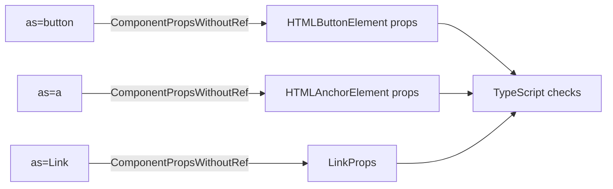
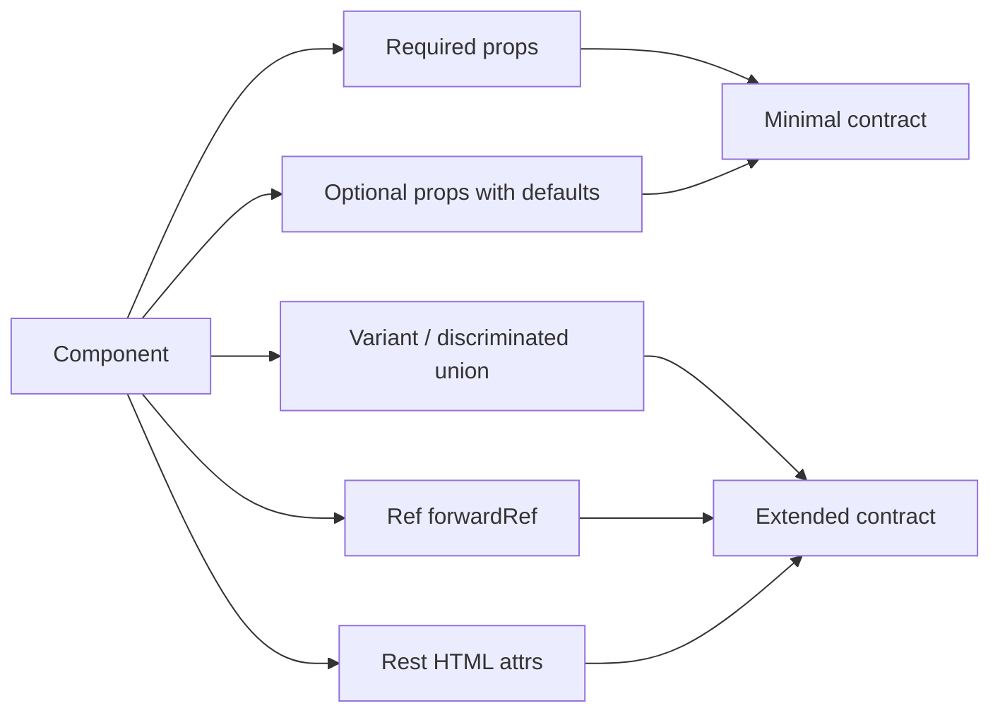

# Level 9: Component API Design — Detailed Guide

## Props as a contract

Imagine a power socket. A plug from an old iron fits an old socket. A German plug — a German socket. Nobody reads the manual: the physical form makes incorrect use impossible.

In React, the same is achieved through TypeScript. A properly designed props type is the shape of the connector. An attempt to pass a wrong prop immediately gives a compiler error, before running the code.

> 📌 Goal of a good API: make correct use obvious, and incorrect use — impossible at compile time.

---

## Discriminated unions: invalid states are inexpressible

### The problem: optional props

A classic trap — a component with lots of optional props:

```tsx
// ❌ Bad: what needs to be passed for each mode?
interface ModalProps {
  variant: 'alert' | 'confirm' | 'form'
  message?: string       // needed for alert and confirm, but not form
  onConfirm?: () => void // needed only for confirm
  children?: ReactNode   // needed only for form
  onSubmit?: () => void  // needed only for form
}

// Compiler won't warn that this is wrong:
<Modal variant="confirm" />                        // no message and onConfirm
<Modal variant="alert" onConfirm={() => {}} />     // extra onConfirm
<Modal variant="form" message="text" />            // no children and onSubmit
```

The developer has to remember what goes with what. This is **knowledge in the head**, not in types.

### Solution: discriminated union

```tsx
// ✅ Good: TypeScript knows which props are needed for each variant
type ModalProps =
  | {
      variant: 'alert'
      message: string
      onClose: () => void
    }
  | {
      variant: 'confirm'
      message: string
      onConfirm: () => void
      onCancel: () => void
    }
  | {
      variant: 'form'
      title: string
      children: ReactNode
      onSubmit: () => void
      onCancel: () => void
    }

// Now TypeScript itself will prompt what's needed:
<Modal variant="confirm" message="Delete?" onConfirm={handleDelete} onCancel={handleCancel} />
// Try skipping onConfirm — you'll get an error immediately
```

### How TypeScript narrows the type inside the component

```tsx
function Modal(props: ModalProps) {
  // props.variant — 'alert' | 'confirm' | 'form'

  if (props.variant === 'confirm') {
    // Here TypeScript knows: props.message and props.onConfirm definitely exist
    return (
      <div>
        <p>{props.message}</p>
        <button onClick={props.onConfirm}>Confirm</button>
        <button onClick={props.onCancel}>Cancel</button>
      </div>
    )
  }

  if (props.variant === 'form') {
    // And here props.message is unavailable — it's not in this branch of the union
    return (
      <div>
        <h2>{props.title}</h2>
        {props.children}
        <button onClick={props.onSubmit}>Submit</button>
      </div>
    )
  }

  // ... alert branch
}
```

This is called **type narrowing** — narrowing the type depending on the discriminant field.

---

## Polymorphic `as` prop

### Why this is needed

Design systems often have one visual component that needs to render differently:

- `<Button>` — usually `<button>`, but on a navigation page should be `<a>`
- `<Heading>` — can be `h1`, `h2`, `h3` depending on context
- `<Text>` — `p`, `span`, `label` in different places

```tsx
// We want this:
<Button as="button" onClick={handleSave}>Save</Button>
<Button as="a" href="/dashboard">To home</Button>
<Button as={Link} to="/profile">Profile</Button>
```

Meanwhile TypeScript should know: for `as="a"` `href` is needed, for `as="button"` — `onClick`, and `to` — only for `Link`.

### Implementation via generics

```tsx
// Base type for polymorphic component
type PolymorphicProps<C extends React.ElementType, OwnProps = {}> = OwnProps &
  Omit<React.ComponentPropsWithoutRef<C>, keyof OwnProps> & {
    as?: C
  }

// Concrete Button
type ButtonOwnProps = {
  variant?: 'primary' | 'secondary' | 'ghost'
  size?: 'sm' | 'md' | 'lg'
}

type ButtonProps<C extends React.ElementType = 'button'> = PolymorphicProps<C, ButtonOwnProps>

function Button<C extends React.ElementType = 'button'>({
  as,
  variant = 'primary',
  size = 'md',
  ...rest
}: ButtonProps<C>) {
  const Component = as ?? 'button'
  return <Component {...rest} />
}
```

### How it works



The key line — `React.ComponentPropsWithoutRef<C>`. This utility type tells TypeScript: "take all props that element `C` accepts". For `"button"` — that's `onClick`, `disabled`, `type`. For `"a"` — `href`, `target`, `rel`.

### Why `ComponentPropsWithoutRef` instead of `ComponentPropsWithRef`

`WithRef` includes `ref` in the props type. This creates a collision with `forwardRef`. If you're not using `forwardRef` — use `WithoutRef`.

---

## forwardRef in React 18

### The problem: ref doesn't pass through component

```tsx
// ❌ Without forwardRef: ref doesn't reach input
function SearchInput({ placeholder }: { placeholder: string }) {
  return <input placeholder={placeholder} />
}

// In parent:
const inputRef = useRef<HTMLInputElement>(null)
<SearchInput ref={inputRef} placeholder="Search..." />
// TypeScript error: SearchInput doesn't accept ref
```

Refs are not props. React doesn't pass them down automatically.

### Solution: forwardRef

```tsx
// ✅ With forwardRef: ref reaches the DOM element
interface SearchInputProps {
  placeholder: string
  onSearch?: (value: string) => void
}

const SearchInput = forwardRef<HTMLInputElement, SearchInputProps>(
  ({ placeholder, onSearch }, ref) => {
    return (
      <input
        ref={ref}
        placeholder={placeholder}
        onChange={e => onSearch?.(e.target.value)}
      />
    )
  }
)

SearchInput.displayName = 'SearchInput'

// In parent:
const inputRef = useRef<HTMLInputElement>(null)
<SearchInput ref={inputRef} placeholder="Search..." />

// Can control focus:
inputRef.current?.focus()
```

### Typing forwardRef

`forwardRef<RefType, PropsType>` — two generic parameters:
1. **RefType** — type of the DOM node or component (usually `HTMLInputElement`, `HTMLDivElement`)
2. **PropsType** — type of component props

```tsx
// Typing examples
forwardRef<HTMLInputElement, InputProps>     // for <input>
forwardRef<HTMLButtonElement, ButtonProps>  // for <button>
forwardRef<HTMLDivElement, CardProps>       // for <div>
```

### The problem: generic component + forwardRef

In React 18 there's a limitation: `forwardRef` "erases" the generic parameter of the component.

```tsx
// ❌ Doesn't work in React 18: TypeScript loses T
const List = forwardRef(<T,>(props: ListProps<T>, ref: Ref<HTMLUListElement>) => {
  // ...
})
```

There are two workarounds:

**Option 1: type assertion**
```tsx
function ListInner<T>(props: ListProps<T> & { forwardedRef?: Ref<HTMLUListElement> }) {
  // ...
}

const List = ListInner as <T>(
  props: ListProps<T> & { ref?: Ref<HTMLUListElement> }
) => ReactElement
```

**Option 2: declare function (recommended)**
```tsx
// Internal implementation
const AutocompleteInner = forwardRef(function AutocompleteImpl<T>(
  props: AutocompleteProps<T>,
  ref: React.Ref<HTMLInputElement>
) {
  // implementation
})

// Declare the correct typing
declare function Autocomplete<T>(
  props: AutocompleteProps<T> & { ref?: React.Ref<HTMLInputElement> }
): React.ReactElement

// Assign the implementation
const Autocomplete = AutocompleteInner as typeof Autocomplete
```

> 💡 In React 19 `forwardRef` is not needed — `ref` is passed as a regular prop. But while most projects are on React 18, you need to know this pattern.

---

## Generic components

### Why generics are needed

"List", "table", "select" type components work with any data. Without generics, you have to use `any` or duplicate components.

```tsx
// ❌ With any: lose typing
function List({ items, renderItem }: { items: any[]; renderItem: (item: any) => ReactNode }) {
  return <ul>{items.map((item, i) => <li key={i}>{renderItem(item)}</li>)}</ul>
}

// ✅ With generics: keep typing
function List<T>({
  items,
  renderItem,
  keyExtractor,
}: {
  items: T[]
  renderItem: (item: T) => ReactNode
  keyExtractor: (item: T) => string
}) {
  return (
    <ul>
      {items.map(item => (
        <li key={keyExtractor(item)}>{renderItem(item)}</li>
      ))}
    </ul>
  )
}

// Usage — TypeScript infers T automatically:
<List
  items={users}                          // T = User
  keyExtractor={user => user.id}         // TypeScript knows: user is User
  renderItem={user => <span>{user.name}</span>}
/>
```

### Pattern: renderItem + keyExtractor

This is an established pattern (from React Native `FlatList`):

- `keyExtractor` — instead of hardcoded `item.id`; component doesn't know what the key field is called
- `renderItem` — complete freedom in rendering the element
- `onSelect` — typed callback, TypeScript knows the element type

```tsx
interface SelectableListProps<T> {
  items: T[]
  selectedItem: T | null
  onSelect: (item: T) => void
  renderItem: (item: T, isSelected: boolean) => ReactNode
  keyExtractor: (item: T) => string
}

function SelectableList<T>({
  items,
  selectedItem,
  onSelect,
  renderItem,
  keyExtractor,
}: SelectableListProps<T>) {
  return (
    <ul style={{ listStyle: 'none', padding: 0 }}>
      {items.map(item => {
        const key = keyExtractor(item)
        const isSelected = selectedItem !== null && keyExtractor(selectedItem) === key

        return (
          <li
            key={key}
            onClick={() => onSelect(item)}
            style={{ cursor: 'pointer', background: isSelected ? '#e3f2fd' : 'transparent' }}
          >
            {renderItem(item, isSelected)}
          </li>
        )
      })}
    </ul>
  )
}
```

---

## Rest/Spread patterns

### The problem: custom component loses HTML attributes

```tsx
// ❌ className and data-testid are not forwarded
function Button({ onClick, children }: { onClick: () => void; children: ReactNode }) {
  return <button onClick={onClick}>{children}</button>
}

<Button onClick={fn} className="primary" data-testid="save-btn">
  Save
</Button>
// className and data-testid silently ignored
```

### Solution: rest props

```tsx
// ✅ Correct: extend native props, spread the rest
interface ButtonProps extends React.ButtonHTMLAttributes<HTMLButtonElement> {
  variant?: 'primary' | 'secondary'
  // Own props — without duplicating onClick, disabled etc.
}

function Button({ variant = 'primary', className, ...rest }: ButtonProps) {
  return (
    <button
      className={`btn btn-${variant}${className ? ` ${className}` : ''}`}
      {...rest} // forwards all other HTML attributes
    />
  )
}

// Now this works:
<Button variant="primary" onClick={fn} className="custom" data-testid="save-btn">
  Save
</Button>
```

> ⚠️ Order matters: `{...rest}` should come before or after overridden attributes — depending on whether you want to allow overriding your values.

---

## Component API surface



---

## API design antipatterns

### 1. Boolean props instead of variant

```tsx
// ❌ Combinations of boolean flags explode exponentially
interface ButtonProps {
  isPrimary?: boolean
  isSecondary?: boolean
  isDanger?: boolean
  isSmall?: boolean
  isLarge?: boolean
}

// Can write nonsense:
<Button isPrimary isSecondary isDanger />

// ✅ Instead:
interface ButtonProps {
  variant?: 'primary' | 'secondary' | 'danger'
  size?: 'sm' | 'md' | 'lg'
}
```

### 2. Excessively wide union

```tsx
// ❌ Too many variants — maintenance problem
type ModalProps =
  | { variant: 'alert'; ... }
  | { variant: 'confirm'; ... }
  | { variant: 'form'; ... }
  | { variant: 'drawer'; ... }
  | { variant: 'fullscreen'; ... }
  | { variant: 'tooltip'; ... }

// If 5+ variants — worth splitting into separate components
```

### 3. Missing displayName on forwardRef

```tsx
// ❌ In DevTools component shows as "ForwardRef"
const Input = forwardRef<HTMLInputElement, InputProps>((props, ref) => (
  <input ref={ref} {...props} />
))

// ✅ Always add displayName
const Input = forwardRef<HTMLInputElement, InputProps>((props, ref) => (
  <input ref={ref} {...props} />
))
Input.displayName = 'Input'
```

---

## Best practices

1. **Start with required props** — add optional only when really needed
2. **Discriminated union instead of optional** — if a prop is needed in only one mode
3. **Extend native types** — `ButtonHTMLAttributes`, `InputHTMLAttributes` — don't reinvent the wheel
4. **`as` prop = polymorphism** — one component, many HTML elements
5. **forwardRef = explicit contract** — documents that DOM can be controlled from outside
6. **displayName is mandatory** — for debugging convenience in React DevTools
7. **Generic component = reusability without any** — List, Select, Table
