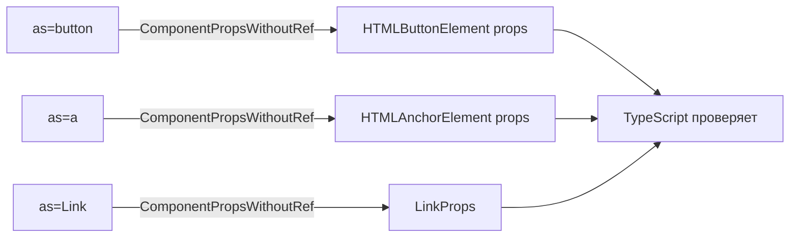
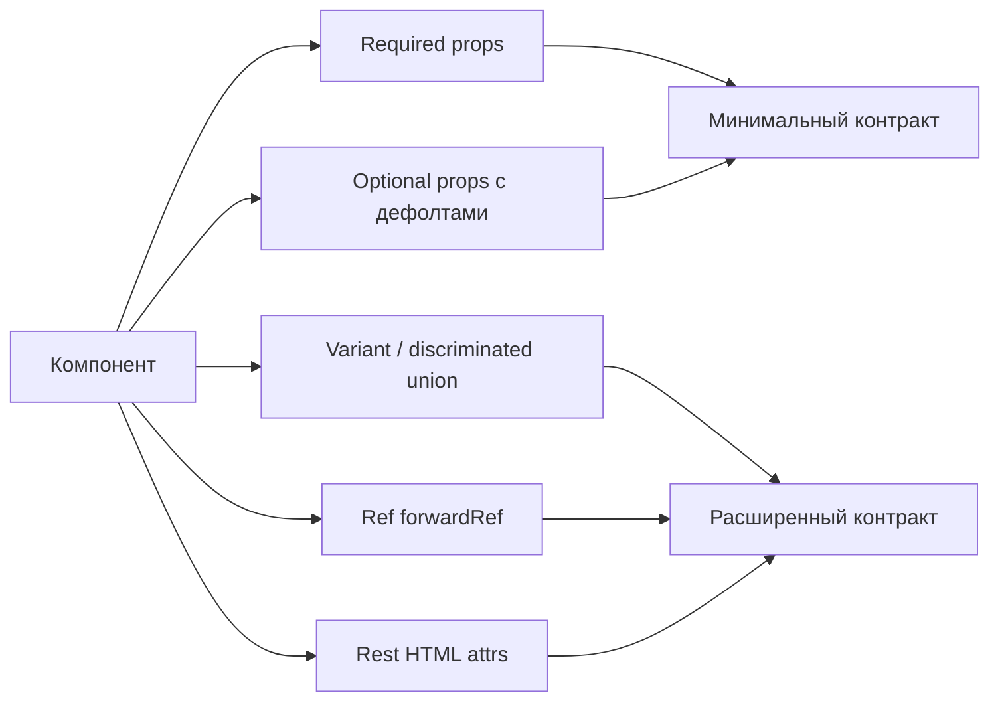

# Level 9: Проектирование API компонентов — Подробное руководство

## Props как контракт

Представьте розетку. Вилка от советского утюга подходит к советской розетке. Немецкая вилка — к немецкой. Никто не читает инструкцию: физическая форма делает неправильное использование невозможным.

В React то же самое достигается через TypeScript. Правильно спроектированный тип props — это форма разъёма. Попытка передать неправильный prop немедленно выдаёт ошибку компилятора, до запуска кода.

> 📌 Цель хорошего API: сделать правильное использование очевидным, а неправильное — невозможным на этапе компиляции.

---

## Discriminated unions: невалидные состояния невыразимы

### Проблема: необязательные props

Классическая ловушка — компонент с кучей optional props:

```tsx
// ❌ Плохо: что нужно передать для каждого режима?
interface ModalProps {
  variant: 'alert' | 'confirm' | 'form'
  message?: string       // нужен для alert и confirm, но не form
  onConfirm?: () => void // нужен только для confirm
  children?: ReactNode   // нужен только для form
  onSubmit?: () => void  // нужен только для form
}

// Компилятор не подскажет, что это неправильно:
<Modal variant="confirm" />                        // нет message и onConfirm
<Modal variant="alert" onConfirm={() => {}} />     // лишний onConfirm
<Modal variant="form" message="текст" />           // нет children и onSubmit
```

Разработчик должен помнить что с чем сочетается. Это **знание в голове**, не в типах.

### Решение: discriminated union

```tsx
// ✅ Хорошо: TypeScript знает, какие props нужны для каждого варианта
type ModalProps =
  | {
      variant: 'alert'
      message: string
      onClose: () => void
    }
  | {
      variant: 'confirm'
      message: string
      onConfirm: () => void
      onCancel: () => void
    }
  | {
      variant: 'form'
      title: string
      children: ReactNode
      onSubmit: () => void
      onCancel: () => void
    }

// Теперь TypeScript сам подскажет что нужно:
<Modal variant="confirm" message="Удалить?" onConfirm={handleDelete} onCancel={handleCancel} />
// Попробуй пропустить onConfirm — получишь ошибку сразу
```

### Как TypeScript сужает тип внутри компонента

```tsx
function Modal(props: ModalProps) {
  // props.variant — 'alert' | 'confirm' | 'form'

  if (props.variant === 'confirm') {
    // Здесь TypeScript знает: props.message и props.onConfirm точно существуют
    return (
      <div>
        <p>{props.message}</p>
        <button onClick={props.onConfirm}>Подтвердить</button>
        <button onClick={props.onCancel}>Отмена</button>
      </div>
    )
  }

  if (props.variant === 'form') {
    // А здесь props.message недоступен — его нет в этой ветке union
    return (
      <div>
        <h2>{props.title}</h2>
        {props.children}
        <button onClick={props.onSubmit}>Отправить</button>
      </div>
    )
  }

  // ... alert ветка
}
```

Это называется **type narrowing** — сужение типа в зависимости от дискриминирующего поля.

---

## Полиморфный `as` prop

### Зачем это нужно

Дизайн-системы часто имеют один визуальный компонент, который должен рендериться по-разному:

- `<Button>` — обычно `<button>`, но на странице навигации должен быть `<a>`
- `<Heading>` — может быть `h1`, `h2`, `h3` в зависимости от контекста
- `<Text>` — `p`, `span`, `label` в разных местах

```tsx
// Хотим так:
<Button as="button" onClick={handleSave}>Сохранить</Button>
<Button as="a" href="/dashboard">На главную</Button>
<Button as={Link} to="/profile">Профиль</Button>
```

При этом TypeScript должен знать: для `as="a"` нужен `href`, для `as="button"` — `onClick`, а `to` — только для `Link`.

### Реализация через generics

```tsx
// Базовый тип для полиморфного компонента
type PolymorphicProps<C extends React.ElementType, OwnProps = {}> = OwnProps &
  Omit<React.ComponentPropsWithoutRef<C>, keyof OwnProps> & {
    as?: C
  }

// Конкретный Button
type ButtonOwnProps = {
  variant?: 'primary' | 'secondary' | 'ghost'
  size?: 'sm' | 'md' | 'lg'
}

type ButtonProps<C extends React.ElementType = 'button'> = PolymorphicProps<C, ButtonOwnProps>

function Button<C extends React.ElementType = 'button'>({
  as,
  variant = 'primary',
  size = 'md',
  ...rest
}: ButtonProps<C>) {
  const Component = as ?? 'button'
  return <Component {...rest} />
}
```

### Как это работает



Ключевая строка — `React.ComponentPropsWithoutRef<C>`. Этот утилитарный тип говорит TypeScript: "возьми все props, которые принимает элемент `C`". Для `"button"` — это `onClick`, `disabled`, `type`. Для `"a"` — `href`, `target`, `rel`.

### Почему `ComponentPropsWithoutRef`, а не `ComponentPropsWithRef`

`WithRef` включает `ref` в тип props. Это создаёт коллизию с `forwardRef`. Если не используешь `forwardRef` — используй `WithoutRef`.

---

## forwardRef в React 18

### Проблема: ref не проходит через компонент

```tsx
// ❌ Без forwardRef: ref не достигает input
function SearchInput({ placeholder }: { placeholder: string }) {
  return <input placeholder={placeholder} />
}

// В родителе:
const inputRef = useRef<HTMLInputElement>(null)
<SearchInput ref={inputRef} placeholder="Поиск..." />
// Ошибка TypeScript: SearchInput не принимает ref
```

Refs — это не props. React не передаёт их вниз автоматически.

### Решение: forwardRef

```tsx
// ✅ С forwardRef: ref проходит до DOM-элемента
interface SearchInputProps {
  placeholder: string
  onSearch?: (value: string) => void
}

const SearchInput = forwardRef<HTMLInputElement, SearchInputProps>(
  ({ placeholder, onSearch }, ref) => {
    return (
      <input
        ref={ref}
        placeholder={placeholder}
        onChange={e => onSearch?.(e.target.value)}
      />
    )
  }
)

SearchInput.displayName = 'SearchInput'

// В родителе:
const inputRef = useRef<HTMLInputElement>(null)
<SearchInput ref={inputRef} placeholder="Поиск..." />

// Можно управлять фокусом:
inputRef.current?.focus()
```

### Типизация forwardRef

`forwardRef<RefType, PropsType>` — два generic параметра:
1. **RefType** — тип DOM-узла или компонента (обычно `HTMLInputElement`, `HTMLDivElement`)
2. **PropsType** — тип props компонента

```tsx
// Примеры типизации
forwardRef<HTMLInputElement, InputProps>     // для <input>
forwardRef<HTMLButtonElement, ButtonProps>  // для <button>
forwardRef<HTMLDivElement, CardProps>       // для <div>
```

### Проблема: generic компонент + forwardRef

В React 18 есть ограничение: `forwardRef` "стирает" generic параметр компонента.

```tsx
// ❌ Не работает в React 18: TypeScript теряет T
const List = forwardRef(<T,>(props: ListProps<T>, ref: Ref<HTMLUListElement>) => {
  // ...
})
```

Есть два workaround:

**Вариант 1: type assertion**
```tsx
function ListInner<T>(props: ListProps<T> & { forwardedRef?: Ref<HTMLUListElement> }) {
  // ...
}

const List = ListInner as <T>(
  props: ListProps<T> & { ref?: Ref<HTMLUListElement> }
) => ReactElement
```

**Вариант 2: declare function (рекомендуемый)**
```tsx
// Внутренняя реализация
const AutocompleteInner = forwardRef(function AutocompleteImpl<T>(
  props: AutocompleteProps<T>,
  ref: React.Ref<HTMLInputElement>
) {
  // реализация
})

// Объявляем правильную типизацию
declare function Autocomplete<T>(
  props: AutocompleteProps<T> & { ref?: React.Ref<HTMLInputElement> }
): React.ReactElement

// Присваиваем реализацию
const Autocomplete = AutocompleteInner as typeof Autocomplete
```

> 💡 В React 19 `forwardRef` не нужен — `ref` передаётся как обычный prop. Но пока большинство проектов на React 18, нужно знать этот паттерн.

---

## Generic компоненты

### Зачем нужны generics

Компоненты типа "список", "таблица", "select" работают с любыми данными. Без generics приходится использовать `any` или дублировать компоненты.

```tsx
// ❌ С any: теряем типизацию
function List({ items, renderItem }: { items: any[]; renderItem: (item: any) => ReactNode }) {
  return <ul>{items.map((item, i) => <li key={i}>{renderItem(item)}</li>)}</ul>
}

// ✅ С generics: сохраняем типизацию
function List<T>({
  items,
  renderItem,
  keyExtractor,
}: {
  items: T[]
  renderItem: (item: T) => ReactNode
  keyExtractor: (item: T) => string
}) {
  return (
    <ul>
      {items.map(item => (
        <li key={keyExtractor(item)}>{renderItem(item)}</li>
      ))}
    </ul>
  )
}

// Использование — TypeScript выводит T автоматически:
<List
  items={users}                          // T = User
  keyExtractor={user => user.id}         // TypeScript знает: user — это User
  renderItem={user => <span>{user.name}</span>}
/>
```

### Паттерн: renderItem + keyExtractor

Это устоявшийся паттерн (из React Native `FlatList`):

- `keyExtractor` — вместо hardcoded `item.id`; компонент не знает как называется ключевое поле
- `renderItem` — полная свобода в отображении элемента
- `onSelect` — типизированный колбэк, TypeScript знает тип элемента

```tsx
interface SelectableListProps<T> {
  items: T[]
  selectedItem: T | null
  onSelect: (item: T) => void
  renderItem: (item: T, isSelected: boolean) => ReactNode
  keyExtractor: (item: T) => string
}

function SelectableList<T>({
  items,
  selectedItem,
  onSelect,
  renderItem,
  keyExtractor,
}: SelectableListProps<T>) {
  return (
    <ul style={{ listStyle: 'none', padding: 0 }}>
      {items.map(item => {
        const key = keyExtractor(item)
        const isSelected = selectedItem !== null && keyExtractor(selectedItem) === key

        return (
          <li
            key={key}
            onClick={() => onSelect(item)}
            style={{ cursor: 'pointer', background: isSelected ? '#e3f2fd' : 'transparent' }}
          >
            {renderItem(item, isSelected)}
          </li>
        )
      })}
    </ul>
  )
}
```

---

## Rest/Spread patterns

### Проблема: кастомный компонент теряет HTML-атрибуты

```tsx
// ❌ className и data-testid не прокидываются
function Button({ onClick, children }: { onClick: () => void; children: ReactNode }) {
  return <button onClick={onClick}>{children}</button>
}

<Button onClick={fn} className="primary" data-testid="save-btn">
  Сохранить
</Button>
// className и data-testid молча игнорируются
```

### Решение: rest props

```tsx
// ✅ Правильно: расширяем нативные props, spread остаток
interface ButtonProps extends React.ButtonHTMLAttributes<HTMLButtonElement> {
  variant?: 'primary' | 'secondary'
  // Свои props — без дублирования onClick, disabled и т.д.
}

function Button({ variant = 'primary', className, ...rest }: ButtonProps) {
  return (
    <button
      className={`btn btn-${variant}${className ? ` ${className}` : ''}`}
      {...rest} // прокидывает все остальные HTML-атрибуты
    />
  )
}

// Теперь работает:
<Button variant="primary" onClick={fn} className="custom" data-testid="save-btn">
  Сохранить
</Button>
```

> ⚠️ Порядок важен: `{...rest}` должен идти до переопределяемых атрибутов, или после — зависит от того, хотите ли вы дать возможность перекрыть ваши значения.

---

## Поверхность API компонента



---

## Антипаттерны проектирования API

### 1. Boolean props вместо variant

```tsx
// ❌ Комбинации булевых флагов взрываются экспоненциально
interface ButtonProps {
  isPrimary?: boolean
  isSecondary?: boolean
  isDanger?: boolean
  isSmall?: boolean
  isLarge?: boolean
}

// Можно написать бессмысленное:
<Button isPrimary isSecondary isDanger />

// ✅ Вместо этого:
interface ButtonProps {
  variant?: 'primary' | 'secondary' | 'danger'
  size?: 'sm' | 'md' | 'lg'
}
```

### 2. Чрезмерно широкий union

```tsx
// ❌ Слишком много вариантов — проблема поддержки
type ModalProps =
  | { variant: 'alert'; ... }
  | { variant: 'confirm'; ... }
  | { variant: 'form'; ... }
  | { variant: 'drawer'; ... }
  | { variant: 'fullscreen'; ... }
  | { variant: 'tooltip'; ... }

// Если 5+ вариантов — стоит разбить на отдельные компоненты
```

### 3. Забытый displayName у forwardRef

```tsx
// ❌ В DevTools компонент показывается как "ForwardRef"
const Input = forwardRef<HTMLInputElement, InputProps>((props, ref) => (
  <input ref={ref} {...props} />
))

// ✅ Всегда добавляй displayName
const Input = forwardRef<HTMLInputElement, InputProps>((props, ref) => (
  <input ref={ref} {...props} />
))
Input.displayName = 'Input'
```

---

## Лучшие практики

1. **Начинай с обязательных props** — добавляй optional только при реальной необходимости
2. **Discriminated union вместо optional** — если prop нужен только в одном режиме
3. **Extend нативные типы** — `ButtonHTMLAttributes`, `InputHTMLAttributes` — не изобретай колесо
4. **`as` prop = полиморфизм** — один компонент, много HTML-элементов
5. **forwardRef = явный контракт** — документирует, что снаружи можно управлять DOM
6. **displayName обязателен** — для удобства отладки в React DevTools
7. **Generic компонент = переиспользуемость без any** — List, Select, Table
