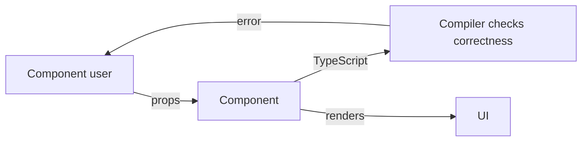

# Level 9: Component API Design

## Props are the public API

A component is a small library. Its props are the public API that other developers use (and yourself in a month). A good API is **predictable** and **hard to use incorrectly**.

TypeScript is the main tool for API design. It allows making invalid states inexpressible at the type level.



## Discriminated unions for variant props

Instead of a bunch of optional props — a single `variant` field that precisely defines the shape of the remaining props.

```tsx
// ❌ Bad: each variant — lots of optional props
type BadAlertProps = {
  message?: string
  onConfirm?: () => void
  children?: ReactNode
}

// ✅ Good: discriminated union — TypeScript knows which props are needed
type AlertProps =
  | { variant: 'info'; message: string }
  | { variant: 'confirm'; message: string; onConfirm: () => void }
  | { variant: 'form'; children: ReactNode; onSubmit: () => void }
```

## Polymorphic `as` prop

A component can render as different HTML elements or components. Classic example — `Button`, which sometimes should be a link.

```tsx
// Usage
<Button as="a" href="/login">Log in</Button>
<Button as="button" onClick={handleClick}>Save</Button>
```

TypeScript automatically pulls the right props for each element via `ComponentPropsWithoutRef<C>`.

## forwardRef in React 18

In React 18 `forwardRef` is still needed (in React 19 it's no longer needed). It allows a parent component to get a reference to the DOM node inside the child component.

```tsx
const Input = forwardRef<HTMLInputElement, InputProps>((props, ref) => (
  <input ref={ref} {...props} />
))
```

## Generic components

A component that works with any data type via TypeScript generics. Typical example — a list that doesn't know what data it contains.

```tsx
function List<T>({ items, renderItem }: { items: T[]; renderItem: (item: T) => ReactNode }) {
  return <ul>{items.map((item, i) => <li key={i}>{renderItem(item)}</li>)}</ul>
}
```

## Common mistakes

- ⚠️ Too many optional props instead of discriminated union — TypeScript doesn't help
- ⚠️ Forgetting to spread `...rest` props — HTML attributes are lost (className, style, data-*)
- ⚠️ Not forwarding ref — parent can't control focus
- ⚠️ Generic component + forwardRef — requires a special workaround in React 18
