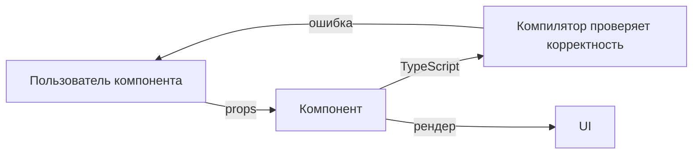

# Level 9: Проектирование API компонентов

## Props — это публичный API

Компонент — это маленькая библиотека. Его props — это публичный API, которым пользуются другие разработчики (и вы сами через месяц). Хороший API **предсказуем** и **трудно использовать неправильно**.

TypeScript — главный инструмент проектирования API. Он позволяет сделать невалидные состояния невыразимыми на уровне типов.



## Discriminated unions для variant props

Вместо кучи необязательных пропсов — одно поле `variant`, которое точно определяет форму остальных пропсов.

```tsx
// ❌ Плохо: каждый вариант — куча optional props
type BadAlertProps = {
  message?: string
  onConfirm?: () => void
  children?: ReactNode
}

// ✅ Хорошо: discriminated union — TypeScript знает какие props нужны
type AlertProps =
  | { variant: 'info'; message: string }
  | { variant: 'confirm'; message: string; onConfirm: () => void }
  | { variant: 'form'; children: ReactNode; onSubmit: () => void }
```

## Полиморфный `as` prop

Компонент умеет рендериться как разный HTML-элемент или компонент. Классический пример — `Button`, который иногда должен быть ссылкой.

```tsx
// Использование
<Button as="a" href="/login">Войти</Button>
<Button as="button" onClick={handleClick}>Сохранить</Button>
```

TypeScript через `ComponentPropsWithoutRef<C>` автоматически подтягивает нужные props для каждого элемента.

## forwardRef в React 18

В React 18 `forwardRef` ещё нужен (в React 19 он стал не нужен). Он позволяет родительскому компоненту получить ссылку на DOM-узел внутри дочернего компонента.

```tsx
const Input = forwardRef<HTMLInputElement, InputProps>((props, ref) => (
  <input ref={ref} {...props} />
))
```

## Generic компоненты

Компонент, который работает с любым типом данных через TypeScript generics. Типичный пример — список, который не знает что за данные в нём.

```tsx
function List<T>({ items, renderItem }: { items: T[]; renderItem: (item: T) => ReactNode }) {
  return <ul>{items.map((item, i) => <li key={i}>{renderItem(item)}</li>)}</ul>
}
```

## Типичные ошибки

- ⚠️ Слишком много optional props вместо discriminated union — TypeScript не помогает
- ⚠️ Забыть spread `...rest` пропсов — теряются HTML-атрибуты (className, style, data-*)
- ⚠️ Не пробрасывать ref — родитель не может управлять фокусом
- ⚠️ Generic компонент + forwardRef — требует специального workaround в React 18
