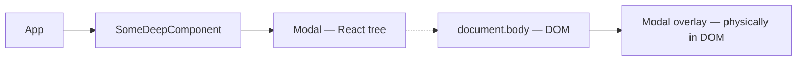

# Level 10: Layout Patterns and Portals — Detailed Guide

## 1. Layout components as architectural building blocks

Imagine building a house. The architect designs the room layout, but doesn't decide what furniture goes inside. Layout components are the architectural plan: they know **where** to place content, but not **what** that content is.

A common antipattern — when a business component sets its own width, padding, and position. This breaks reusability: you can't insert the component elsewhere without rewriting it.

```tsx
// ❌ Bad: UserCard knows about page layout
function UserCard({ user }: { user: User }) {
  return (
    <div style={{ width: '33%', padding: '24px', margin: '0 auto' }}>
      
      <h3>{user.name}</h3>
    </div>
  )
}

// ✅ Good: UserCard responsible only for content
function UserCard({ user }: { user: User }) {
  return (
    <div style={{ padding: '16px', border: '1px solid #eee', borderRadius: '8px' }}>
      
      <h3>{user.name}</h3>
    </div>
  )
}

// Layout positions UserCard in the right place
function TeamPage() {
  return (
    <ThreeColumnLayout>
      {team.map(user => <UserCard key={user.id} user={user} />)}
    </ThreeColumnLayout>
  )
}
```

### Types of layout components

**RootLayout** — root wrapper for the entire app. Contains header, footer, navigation. Through `children` or `Outlet` (React Router) accepts the current page content.

**SidebarLayout** — two-column layout with sidebar. Proportions (20%/80%, 25%/75%) set via props. Content doesn't know about the sidebar's existence.

**CenteredLayout** — centers content horizontally with a max width constraint. Often used for text pages and forms.

```tsx
// Usage: composing layout components
function DashboardPage() {
  return (
    <RootLayout>
      <SidebarLayout sidebar={<Navigation />}>
        <CenteredLayout maxWidth={800}>
          <DashboardContent />
        </CenteredLayout>
      </SidebarLayout>
    </RootLayout>
  )
}
```

### Layout via React Router Outlet

In real applications, layout components work as router wrappers:

```tsx
// router.tsx
const router = createBrowserRouter([
  {
    path: '/',
    element: <RootLayout />,   // wrapper with Outlet inside
    children: [
      { path: 'dashboard', element: <DashboardPage /> },
      { path: 'profile', element: <ProfilePage /> },
    ]
  }
])

// RootLayout.tsx
function RootLayout() {
  return (
    <div>
      <Header />
      <main>
        <Outlet />  {/* child route renders here */}
      </main>
      <Footer />
    </div>
  )
}
```

💡 In sandbox without router, Outlet is emulated via tabs/buttons — this is an honest replacement for demonstrating the concept.

---

## 2. Portals: rendering outside the component tree

### The problem: z-index and overflow

Classic modal problem:

```
<div style="overflow: hidden">        ← clips everything inside
  <div style="position: relative">   ← creates new stacking context
    <Modal />                         ← modal clipped and overlapped!
  </div>
</div>
```

The modal is physically inside a DOM node with `overflow: hidden` and can't break out, no matter how high the `z-index`.

### Solution: createPortal

```tsx
import { createPortal } from 'react-dom'

function Modal({ isOpen, onClose, children }: ModalProps) {
  if (!isOpen) return null

  return createPortal(
    <div
      style={{
        position: 'fixed', inset: 0,
        background: 'rgba(0,0,0,0.5)',
        display: 'flex', alignItems: 'center', justifyContent: 'center',
        zIndex: 1000,
      }}
      onClick={onClose}
    >
      <div
        style={{ background: '#fff', borderRadius: '8px', padding: '24px', maxWidth: '500px' }}
        onClick={e => e.stopPropagation()}  {/* don't close on content click */}
      >
        {children}
      </div>
    </div>,
    document.body  {/* render directly into body */}
  )
}
```



Arrow `-->` — React tree (events, context). Arrow `-.->` — physical DOM location.

### Portal behavior

**What stays "inside" the React tree:**
- Events bubble through React parents (not DOM parents)
- Context is available (useContext works)
- ref works

**What changes:**
- Physically DOM node is in `document.body`
- Parent CSS properties (overflow, z-index) don't affect it

---

## 3. Modal architecture

### Stacking multiple modals

When multiple modals can be open simultaneously, you need to manage the stack:

```tsx
// Simple stack via id array
const [modalStack, setModalStack] = useState<string[]>([])

const openModal = (id: string) =>
  setModalStack(prev => [...prev, id])

const closeModal = () =>
  setModalStack(prev => prev.slice(0, -1))
```

Each modal in the stack gets `z-index = 1000 + index`, so the last opened is on top.

### Closing on Escape

```tsx
useEffect(() => {
  if (!isOpen) return

  const handleKeyDown = (e: KeyboardEvent) => {
    if (e.key === 'Escape') onClose()
  }

  document.addEventListener('keydown', handleKeyDown)
  return () => document.removeEventListener('keydown', handleKeyDown)
}, [isOpen, onClose])
```

### Scroll locking

```tsx
useEffect(() => {
  if (!isOpen) return

  const originalOverflow = document.body.style.overflow
  document.body.style.overflow = 'hidden'

  return () => {
    document.body.style.overflow = originalOverflow
  }
}, [isOpen])
```

⚠️ Important to save the original value and restore it, not just remove the style. If multiple modals are open simultaneously, a counter is needed.

### Modal accessibility

```tsx
<div
  role="dialog"
  aria-modal="true"
  aria-labelledby="modal-title"
  aria-describedby="modal-description"
>
  <h2 id="modal-title">Title</h2>
  <p id="modal-description">Description</p>
</div>
```

📌 Focus should move inside the modal on open and return to the trigger element on close. This is called "focus trap".

---

## 4. Tooltip and Popover via portals

### The positioning problem

A tooltip should appear near the trigger element, but physically renders in `document.body`. We need to compute the trigger element's absolute coordinates.

```tsx
function Tooltip({ triggerRef, content, isVisible }: TooltipProps) {
  const [position, setPosition] = useState({ top: 0, left: 0 })

  useEffect(() => {
    if (!isVisible || !triggerRef.current) return

    const rect = triggerRef.current.getBoundingClientRect()
    setPosition({
      top: rect.bottom + window.scrollY + 8,   {/* 8px gap */}
      left: rect.left + window.scrollX + rect.width / 2,  {/* centered */}
    })
  }, [isVisible, triggerRef])

  if (!isVisible) return null

  return createPortal(
    <div style={{
      position: 'absolute',
      top: position.top,
      left: position.left,
      transform: 'translateX(-50%)',  {/* center */}
      background: '#333',
      color: '#fff',
      padding: '4px 8px',
      borderRadius: '4px',
      fontSize: '14px',
      pointerEvents: 'none',  {/* don't intercept mouse events */}
      zIndex: 9999,
    }}>
      {content}
    </div>,
    document.body
  )
}
```

### Handling viewport boundaries

Tooltip must not go off screen:

```tsx
function getTooltipPosition(
  triggerRect: DOMRect,
  tooltipWidth: number,
  placement: 'top' | 'bottom' | 'left' | 'right'
): { top: number; left: number } {
  const gap = 8
  const viewportWidth = window.innerWidth
  const viewportHeight = window.innerHeight

  let top = 0
  let left = 0

  if (placement === 'bottom') {
    top = triggerRect.bottom + window.scrollY + gap
    left = triggerRect.left + window.scrollX + triggerRect.width / 2 - tooltipWidth / 2
  } else if (placement === 'top') {
    top = triggerRect.top + window.scrollY - gap  {/* adjusted for tooltip height */}
    left = triggerRect.left + window.scrollX + triggerRect.width / 2 - tooltipWidth / 2
  }
  // ... other sides

  {/* Correct right edge overflow */}
  if (left + tooltipWidth > viewportWidth - 8) {
    left = viewportWidth - tooltipWidth - 8
  }
  {/* Correct left edge overflow */}
  if (left < 8) {
    left = 8
  }

  return { top, left }
}
```

### Auto-flip placement

If tooltip doesn't fit below — show above:

```tsx
const fitsBelow = triggerRect.bottom + tooltipHeight + gap < viewportHeight
const actualPlacement = fitsBelow ? 'bottom' : 'top'
```

---

## 5. Separating layout logic from business logic

### Single Responsibility principle in layout

```tsx
// ❌ Bad: ProductCard manages its own layout
function ProductCard({ product, isWide }: { product: Product; isWide: boolean }) {
  return (
    <div style={{
      width: isWide ? '100%' : '30%',
      display: isWide ? 'flex' : 'block',
      {/* business component knows about layout! */}
    }}>
      ...
    </div>
  )
}

// ✅ Good: layout extracted outward
function ProductCard({ product }: { product: Product }) {
  return <div>{/* only internal padding */}</div>
}

function ProductGrid({ products }: { products: Product[] }) {
  return (
    <div style={{ display: 'grid', gridTemplateColumns: 'repeat(3, 1fr)', gap: '16px' }}>
      {products.map(p => <ProductCard key={p.id} product={p} />)}
    </div>
  )
}
```

### Layout via children and slots

For complex layout components, use named slots via props:

```tsx
interface SidebarLayoutProps {
  sidebar: ReactNode    {/* left column */}
  children: ReactNode   {/* right column (main content) */}
  sidebarWidth?: number | string
}

function SidebarLayout({
  sidebar,
  children,
  sidebarWidth = 240
}: SidebarLayoutProps) {
  return (
    <div style={{ display: 'flex', gap: '24px', minHeight: '100vh' }}>
      <aside style={{ width: sidebarWidth, flexShrink: 0 }}>
        {sidebar}
      </aside>
      <main style={{ flex: 1, minWidth: 0 }}>
        {children}
      </main>
    </div>
  )
}
```

💡 `minWidth: 0` on `flex: 1` — a common trick. Without it, the flex-child can overflow the container if content is wider.

---

## ⚠️ Common beginner mistakes

### 1. Creating portal on every render

```tsx
// ❌ Bad: document.getElementById every render — can return null
function Modal({ children }) {
  return createPortal(children, document.getElementById('modal-root'))
}

// ✅ Good: stable mounting point
function Modal({ children }) {
  return createPortal(children, document.body)
}
```

### 2. Missing cleanup for keydown

```tsx
// ❌ Bad: listener not removed
useEffect(() => {
  document.addEventListener('keydown', handleKeyDown)
}, []) // no return with cleanup!

// ✅ Good
useEffect(() => {
  document.addEventListener('keydown', handleKeyDown)
  return () => document.removeEventListener('keydown', handleKeyDown)
}, [handleKeyDown])
```

### 3. Scroll lock without restore

```tsx
// ❌ Bad: closing one of two modals unlocks scroll
useEffect(() => {
  document.body.style.overflow = isOpen ? 'hidden' : ''
}, [isOpen])

// ✅ Good: counter of open modals
let openCount = 0
useEffect(() => {
  if (!isOpen) return
  openCount++
  document.body.style.overflow = 'hidden'
  return () => {
    openCount--
    if (openCount === 0) document.body.style.overflow = ''
  }
}, [isOpen])
```

### 4. Tooltip position without scroll consideration

```tsx
// ❌ Bad: rect.top — coordinate relative to viewport, not page
setPosition({ top: rect.top, left: rect.left })

// ✅ Good: add scroll offset
setPosition({
  top: rect.top + window.scrollY,
  left: rect.left + window.scrollX,
})
```

### 5. StopPropagation on overlay instead of content

```tsx
// ❌ Bad: clicking overlay doesn't close
<div onClick={e => e.stopPropagation()}>  {/* overlay */}
  <div onClick={onClose}>...</div>         {/* content closes!  */}
</div>

// ✅ Good: close on overlay click, stopPropagation on content
<div onClick={onClose}>            {/* overlay closes */}
  <div onClick={e => e.stopPropagation()}>  {/* content doesn't close */}
    ...
  </div>
</div>
```
