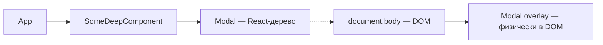

# Level 10: Layout-паттерны и порталы — подробное руководство

## 1. Layout-компоненты как архитектурные строительные блоки

Представьте строительство дома. Архитектор проектирует расположение комнат, но не решает, какая мебель будет стоять внутри. Layout-компоненты — это архитектурный план: они знают **где** разместить контент, но не знают **что** это за контент.

Типичный антипаттерн — когда бизнес-компонент сам задаёт свою ширину, отступы и позицию. Это нарушает переиспользуемость: вы не можете вставить компонент в другое место без его переписывания.

```tsx
// ❌ Плохо: UserCard знает о layout страницы
function UserCard({ user }: { user: User }) {
  return (
    <div style={{ width: '33%', padding: '24px', margin: '0 auto' }}>
      
      <h3>{user.name}</h3>
    </div>
  )
}

// ✅ Хорошо: UserCard отвечает только за содержимое
function UserCard({ user }: { user: User }) {
  return (
    <div style={{ padding: '16px', border: '1px solid #eee', borderRadius: '8px' }}>
      
      <h3>{user.name}</h3>
    </div>
  )
}

// Layout размещает UserCard в нужном месте
function TeamPage() {
  return (
    <ThreeColumnLayout>
      {team.map(user => <UserCard key={user.id} user={user} />)}
    </ThreeColumnLayout>
  )
}
```

### Типы layout-компонентов

**RootLayout** — корневая обёртка всего приложения. Содержит шапку, подвал, навигацию. Через `children` или `Outlet` (React Router) принимает содержимое текущей страницы.

**SidebarLayout** — двухколоночный layout с сайдбаром. Пропорции (20%/80%, 25%/75%) задаются через props. Контент не знает о существовании сайдбара.

**CenteredLayout** — центрирует контент по горизонтали с ограничением максимальной ширины. Часто используется для текстовых страниц и форм.

```tsx
// Использование: композиция layout-компонентов
function DashboardPage() {
  return (
    <RootLayout>
      <SidebarLayout sidebar={<Navigation />}>
        <CenteredLayout maxWidth={800}>
          <DashboardContent />
        </CenteredLayout>
      </SidebarLayout>
    </RootLayout>
  )
}
```

### Layout через React Router Outlet

В реальных приложениях layout-компоненты работают как роутерные обёртки:

```tsx
// router.tsx
const router = createBrowserRouter([
  {
    path: '/',
    element: <RootLayout />,   // обёртка с Outlet внутри
    children: [
      { path: 'dashboard', element: <DashboardPage /> },
      { path: 'profile', element: <ProfilePage /> },
    ]
  }
])

// RootLayout.tsx
function RootLayout() {
  return (
    <div>
      <Header />
      <main>
        <Outlet />  {/* сюда рендерится дочерний роут */}
      </main>
      <Footer />
    </div>
  )
}
```

💡 В sandbox без роутера Outlet имитируется через tabs/кнопки — это честная замена для демонстрации концепции.

---

## 2. Порталы: рендеринг вне дерева компонентов

### Проблема: z-index и overflow

Стандартная проблема модалок:

```
<div style="overflow: hidden">        ← обрезает всё внутри
  <div style="position: relative">   ← создаёт новый stacking context
    <Modal />                         ← модалка обрезана и перекрыта!
  </div>
</div>
```

Модалка физически находится внутри DOM-узла с `overflow: hidden` и не может выйти за его пределы, сколько бы большой `z-index` вы ни указали.

### Решение: createPortal

```tsx
import { createPortal } from 'react-dom'

function Modal({ isOpen, onClose, children }: ModalProps) {
  if (!isOpen) return null

  return createPortal(
    <div
      style={{
        position: 'fixed', inset: 0,
        background: 'rgba(0,0,0,0.5)',
        display: 'flex', alignItems: 'center', justifyContent: 'center',
        zIndex: 1000,
      }}
      onClick={onClose}
    >
      <div
        style={{ background: '#fff', borderRadius: '8px', padding: '24px', maxWidth: '500px' }}
        onClick={e => e.stopPropagation()}  // не закрываем при клике на контент
      >
        {children}
      </div>
    </div>,
    document.body  // рендерим прямо в body
  )
}
```



Стрелка `-->` — React-дерево (события, контекст). Стрелка `-.->` — физическое место в DOM.

### Поведение портала

**Что остаётся "внутри" React-дерева:**
- События всплывают через React-родителей (не через DOM-родителей)
- Контекст доступен (useContext работает)
- ref работает

**Что меняется:**
- Физически DOM-узел находится в `document.body`
- CSS-свойства родителей (overflow, z-index) не влияют

---

## 3. Архитектура модалок

### Стекинг нескольких модалок

Когда несколько модалок могут быть открыты одновременно, нужно управлять стеком:

```tsx
// Простой стек через массив id
const [modalStack, setModalStack] = useState<string[]>([])

const openModal = (id: string) =>
  setModalStack(prev => [...prev, id])

const closeModal = () =>
  setModalStack(prev => prev.slice(0, -1))
```

Каждой модалке в стеке назначается `z-index = 1000 + index`, чтобы последняя открытая была поверх.

### Закрытие по Escape

```tsx
useEffect(() => {
  if (!isOpen) return

  const handleKeyDown = (e: KeyboardEvent) => {
    if (e.key === 'Escape') onClose()
  }

  document.addEventListener('keydown', handleKeyDown)
  return () => document.removeEventListener('keydown', handleKeyDown)
}, [isOpen, onClose])
```

### Блокировка прокрутки

```tsx
useEffect(() => {
  if (!isOpen) return

  const originalOverflow = document.body.style.overflow
  document.body.style.overflow = 'hidden'

  return () => {
    document.body.style.overflow = originalOverflow
  }
}, [isOpen])
```

⚠️ Важно сохранять оригинальное значение и восстанавливать его, а не просто удалять стиль. Если несколько модалок открыты одновременно, нужен счётчик.

### Accessibility модалок

```tsx
<div
  role="dialog"
  aria-modal="true"
  aria-labelledby="modal-title"
  aria-describedby="modal-description"
>
  <h2 id="modal-title">Заголовок</h2>
  <p id="modal-description">Описание</p>
</div>
```

📌 Фокус должен уходить внутрь модалки при открытии и возвращаться к trigger-элементу при закрытии. Это называется "focus trap".

---

## 4. Tooltip и Popover через порталы

### Проблема позиционирования

Tooltip должен появляться рядом с trigger-элементом, но физически рендерится в `document.body`. Нужно вычислить абсолютные координаты trigger-элемента.

```tsx
function Tooltip({ triggerRef, content, isVisible }: TooltipProps) {
  const [position, setPosition] = useState({ top: 0, left: 0 })

  useEffect(() => {
    if (!isVisible || !triggerRef.current) return

    const rect = triggerRef.current.getBoundingClientRect()
    setPosition({
      top: rect.bottom + window.scrollY + 8,   // 8px gap
      left: rect.left + window.scrollX + rect.width / 2,  // по центру
    })
  }, [isVisible, triggerRef])

  if (!isVisible) return null

  return createPortal(
    <div style={{
      position: 'absolute',
      top: position.top,
      left: position.left,
      transform: 'translateX(-50%)',  // центрируем
      background: '#333',
      color: '#fff',
      padding: '4px 8px',
      borderRadius: '4px',
      fontSize: '14px',
      pointerEvents: 'none',  // не перехватывает события мыши
      zIndex: 9999,
    }}>
      {content}
    </div>,
    document.body
  )
}
```

### Обработка границ viewport

Tooltip не должен уходить за пределы экрана:

```tsx
function getTooltipPosition(
  triggerRect: DOMRect,
  tooltipWidth: number,
  placement: 'top' | 'bottom' | 'left' | 'right'
): { top: number; left: number } {
  const gap = 8
  const viewportWidth = window.innerWidth
  const viewportHeight = window.innerHeight

  let top = 0
  let left = 0

  if (placement === 'bottom') {
    top = triggerRect.bottom + window.scrollY + gap
    left = triggerRect.left + window.scrollX + triggerRect.width / 2 - tooltipWidth / 2
  } else if (placement === 'top') {
    top = triggerRect.top + window.scrollY - gap  // корректируется по высоте tooltip
    left = triggerRect.left + window.scrollX + triggerRect.width / 2 - tooltipWidth / 2
  }
  // ... другие стороны

  // Коррекция выхода за правый край
  if (left + tooltipWidth > viewportWidth - 8) {
    left = viewportWidth - tooltipWidth - 8
  }
  // Коррекция выхода за левый край
  if (left < 8) {
    left = 8
  }

  return { top, left }
}
```

### Auto-flip placement

Если tooltip не помещается снизу — показывать сверху:

```tsx
const fitsBelow = triggerRect.bottom + tooltipHeight + gap < viewportHeight
const actualPlacement = fitsBelow ? 'bottom' : 'top'
```

---

## 5. Разделение layout-логики от бизнес-логики

### Принцип Single Responsibility в layout

```tsx
// ❌ Плохо: ProductCard управляет своим layout
function ProductCard({ product, isWide }: { product: Product; isWide: boolean }) {
  return (
    <div style={{
      width: isWide ? '100%' : '30%',
      display: isWide ? 'flex' : 'block',
      // бизнес-компонент знает о layout!
    }}>
      ...
    </div>
  )
}

// ✅ Хорошо: layout вынесен наружу
function ProductCard({ product }: { product: Product }) {
  return <div>{/* только внутренние отступы */}</div>
}

function ProductGrid({ products }: { products: Product[] }) {
  return (
    <div style={{ display: 'grid', gridTemplateColumns: 'repeat(3, 1fr)', gap: '16px' }}>
      {products.map(p => <ProductCard key={p.id} product={p} />)}
    </div>
  )
}
```

### Layout через children и slots

Для сложных layout-компонентов используйте именованные слоты через props:

```tsx
interface SidebarLayoutProps {
  sidebar: ReactNode    // левая колонка
  children: ReactNode   // правая колонка (основной контент)
  sidebarWidth?: number | string
}

function SidebarLayout({
  sidebar,
  children,
  sidebarWidth = 240
}: SidebarLayoutProps) {
  return (
    <div style={{ display: 'flex', gap: '24px', minHeight: '100vh' }}>
      <aside style={{ width: sidebarWidth, flexShrink: 0 }}>
        {sidebar}
      </aside>
      <main style={{ flex: 1, minWidth: 0 }}>
        {children}
      </main>
    </div>
  )
}
```

💡 `minWidth: 0` у `flex: 1` — частый трюк. Без него flex-child может переполнить контейнер, если содержимое шире.

---

## ⚠️ Частые ошибки начинающих

### 1. Создание портала каждый рендер

```tsx
// ❌ Плохо: document.getElementById каждый рендер — может вернуть null
function Modal({ children }) {
  return createPortal(children, document.getElementById('modal-root'))
}

// ✅ Хорошо: стабильная точка монтирования
function Modal({ children }) {
  return createPortal(children, document.body)
}
```

### 2. Забытый cleanup для keydown

```tsx
// ❌ Плохо: слушатель не удаляется
useEffect(() => {
  document.addEventListener('keydown', handleKeyDown)
}, []) // нет return с cleanup!

// ✅ Хорошо
useEffect(() => {
  document.addEventListener('keydown', handleKeyDown)
  return () => document.removeEventListener('keydown', handleKeyDown)
}, [handleKeyDown])
```

### 3. Блокировка скролла без восстановления

```tsx
// ❌ Плохо: при закрытии одной из двух модалок скролл разблокируется
useEffect(() => {
  document.body.style.overflow = isOpen ? 'hidden' : ''
}, [isOpen])

// ✅ Хорошо: счётчик открытых модалок
let openCount = 0
useEffect(() => {
  if (!isOpen) return
  openCount++
  document.body.style.overflow = 'hidden'
  return () => {
    openCount--
    if (openCount === 0) document.body.style.overflow = ''
  }
}, [isOpen])
```

### 4. Позиция tooltip без учёта scroll

```tsx
// ❌ Плохо: rect.top — координата относительно viewport, не страницы
setPosition({ top: rect.top, left: rect.left })

// ✅ Хорошо: добавляем scroll offset
setPosition({
  top: rect.top + window.scrollY,
  left: rect.left + window.scrollX,
})
```

### 5. Stopropagation на оверлее вместо контента

```tsx
// ❌ Плохо: клик по оверлею не закрывает
<div onClick={e => e.stopPropagation()}>  {/* оверлей */}
  <div onClick={onClose}>...</div>         {/* контент закрывает!  */}
</div>

// ✅ Хорошо: закрытие по клику на оверлей, stopPropagation на контенте
<div onClick={onClose}>            {/* оверлей закрывает */}
  <div onClick={e => e.stopPropagation()}>  {/* контент не закрывает */}
    ...
  </div>
</div>
```
