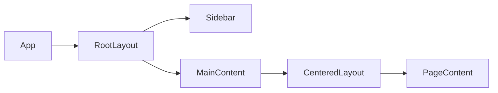

# Level 10: Layout Patterns and Portals

## Layout components — architectural building blocks

A layout component is a component that knows **where** to place content, but not **what** that content is. It manages page structure: grids, columns, spacing. Business components know **what** to display, but don't worry about their position on screen.



Separating layout and content is a specific case of the SoC principle (Separation of Concerns).

## Portals: rendering outside the tree

`createPortal` allows rendering a component into a different DOM node, while the component remains part of the React tree (events bubble, context is available).

```tsx
import { createPortal } from 'react-dom'

function Modal({ children }) {
  return createPortal(
    <div className="modal-overlay">{children}</div>,
    document.body
  )
}
```

Without a portal, a modal is constrained by `overflow: hidden` and parent `z-index`. With a portal, it renders directly into `<body>`.

## When portals are needed

- Modals and dialogs
- Popups (tooltip, popover)
- Notifications and toasts
- Context menus

## Common mistakes

- ⚠️ Mixing layout logic with business logic inside one component
- ⚠️ Forgetting to lock `<body>` scroll when modal is open
- ⚠️ Not closing modal on Escape — accessibility violation
- ⚠️ Positioning tooltip without considering viewport bounds — it goes off screen
- ⚠️ Not removing event listeners on portal unmount — memory leak
