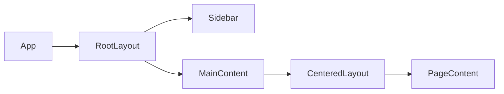

# Level 10: Layout-паттерны и порталы

## Layout-компоненты — архитектурные строительные блоки

Layout-компонент — это компонент, который знает **где** разместить контент, но не знает **что** это за контент. Он управляет структурой страницы: сетками, колонками, отступами. Бизнес-компоненты знают **что** отображать, но не беспокоятся о своём положении на экране.



Разделение layout и content — частный случай принципа SoC (Separation of Concerns).

## Порталы: рендеринг вне дерева

`createPortal` позволяет рендерить компонент в другой DOM-узел, при этом компонент остаётся частью React-дерева (события всплывают, контекст доступен).

```tsx
import { createPortal } from 'react-dom'

function Modal({ children }) {
  return createPortal(
    <div className="modal-overlay">{children}</div>,
    document.body
  )
}
```

Без портала модалка ограничена `overflow: hidden` и `z-index` родителей. С порталом она рендерится прямо в `<body>`.

## Когда нужны порталы

- Модальные окна и диалоги
- Всплывающие подсказки (tooltip, popover)
- Уведомления и тосты
- Контекстные меню

## Типичные ошибки

- ⚠️ Смешивать layout-логику с бизнес-логикой внутри одного компонента
- ⚠️ Забыть заблокировать прокрутку `<body>` при открытой модалке
- ⚠️ Не закрывать модалку по Escape — нарушение accessibility
- ⚠️ Позиционировать tooltip без учёта границ viewport — он уходит за экран
- ⚠️ Не убирать слушатели событий при размонтировании портала — утечка памяти
