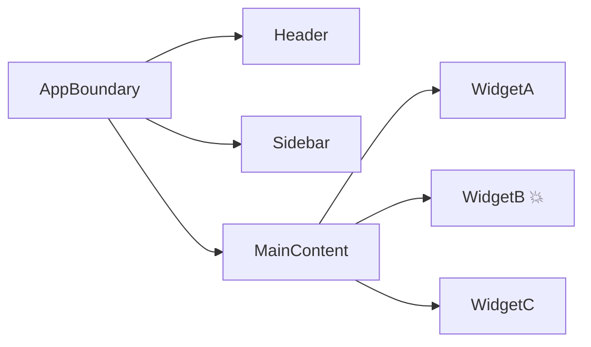
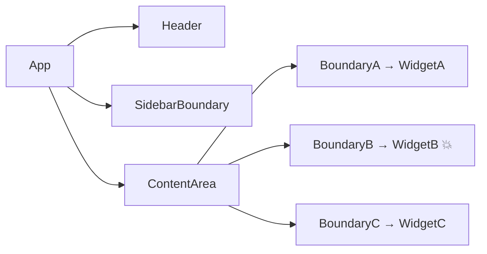

# Level 11: Error Boundaries — Detailed Theory

## The problem: why do apps "die" entirely?

Imagine you're on a plane. A lightbulb above your seat stops working. Should the plane make an emergency landing? Of course not — it's an isolated problem that doesn't affect the rest.

In React without Error Boundaries, it's different: a broken recommendations widget on a product page kills the **entire** interface. The user sees a white screen, even though the cart, navigation, and search work fine.

Error Boundaries are "bulkheads" in your application. Like bulkheads in a ship hull: one compartment flooded — the rest hold.

## Why only class components?

This often surprises people. Error Boundaries require two specific lifecycle methods:

- `static getDerivedStateFromError(error)` — static method, called synchronously during the render phase
- `componentDidCatch(error, info)` — called after committing to DOM

React intentionally hasn't added an equivalent for functional components. Hooks work differently — they have no equivalent of `getDerivedStateFromError`, because a hook can't catch an error from its own render call. This limitation is not architectural ignorance, but a conscious decision by the React team.

📌 Good news: you write **one** class component `ErrorBoundary`, then use it everywhere as a regular JSX tag.

## Full ErrorBoundary implementation

```tsx
interface FallbackProps {
  error: Error
  resetErrorBoundary: () => void
}

interface ErrorBoundaryProps {
  fallback: (props: FallbackProps) => React.ReactNode
  children: React.ReactNode
  onError?: (error: Error, info: React.ErrorInfo) => void
  onReset?: () => void
}

interface ErrorBoundaryState {
  hasError: boolean
  error: Error | null
}

class ErrorBoundary extends React.Component<ErrorBoundaryProps, ErrorBoundaryState> {
  constructor(props: ErrorBoundaryProps) {
    super(props)
    this.state = { hasError: false, error: null }
  }

  // Called during rendering when an error occurs in the subtree
  // Must return an object to update state (or null)
  static getDerivedStateFromError(error: Error): ErrorBoundaryState {
    return { hasError: true, error }
  }

  // Called after the error is "caught" — for logging
  // info.componentStack contains the component stack where the error occurred
  componentDidCatch(error: Error, info: React.ErrorInfo) {
    this.props.onError?.(error, info)
    console.error('ErrorBoundary caught:', error)
    console.error('Component stack:', info.componentStack)
  }

  reset = () => {
    this.props.onReset?.()
    this.setState({ hasError: false, error: null })
  }

  render() {
    if (this.state.hasError) {
      return this.props.fallback({
        error: this.state.error!,
        resetErrorBoundary: this.reset,
      })
    }
    return this.props.children
  }
}
```

### Why `fallback` is a render prop, not just a ReactNode?

```tsx
// ❌ Simple element — no access to error and reset
<ErrorBoundary fallback={<div>Something went wrong</div>}>

// ✅ Render prop — fallback knows about the error and can reset it
<ErrorBoundary fallback={({ error, resetErrorBoundary }) => (
  <div>
    <p>Error: {error.message}</p>
    <button onClick={resetErrorBoundary}>Try again</button>
  </div>
)}>
```

## Where to place Error Boundaries?

This is the key architectural question. The answer depends on what you want to isolate.

### Strategy 1: One global boundary



❌ When WidgetB crashes, the user sees a stub for the entire app.

### Strategy 2: Granular boundaries around independent sections



✅ WidgetB crash is isolated. Header, Sidebar, WidgetA, WidgetC continue working.

### Granularity rule

Wrap in boundary what:
1. Loads data independently from the rest
2. Can crash for independent reasons
3. The user can perceive as a separate "section"

## Fallback UI: what to show?

A good fallback is not just "An error occurred". It should:

1. **Explain** what happened (briefly, without technical details)
2. **Offer action** — "Try again" button, "Go to home" link
3. **Not confuse** — the user should understand that part of the page broke, not the whole app

```tsx
function WidgetFallback({ error, resetErrorBoundary }: FallbackProps) {
  return (
    <div style={{ padding: '1rem', border: '1px solid #ffcdd2', borderRadius: '8px', background: '#fff5f5' }}>
      <h4 style={{ color: '#c62828', margin: '0 0 0.5rem' }}>Failed to load block</h4>
      <p style={{ color: '#555', fontSize: '0.85rem', margin: '0 0 1rem' }}>
        {error.message || 'An unexpected error occurred'}
      </p>
      <button onClick={resetErrorBoundary}>Try again</button>
    </div>
  )
}
```

## Recovery patterns: how to recover after an error?

### Pattern 1: Simple reset

User clicks "Try again" → boundary resets state → component re-renders.

⚠️ If the error cause is not fixed (data is still invalid), the component will crash again. This is normal — after several attempts, show a different message.

### Pattern 2: Reset with key

```tsx
function Dashboard() {
  const [retryKey, setRetryKey] = useState(0)

  return (
    <ErrorBoundary
      key={retryKey}                    // key change = boundary recreation
      fallback={({ error, resetErrorBoundary }) => (
        <button onClick={() => {
          resetErrorBoundary()
          setRetryKey(k => k + 1)       // forcibly recreate subtree
        }}>
          Reload widget
        </button>
      )}
    >
      <Widget />
    </ErrorBoundary>
  )
}
```

### Pattern 3: Retry counter

```tsx
function SmartFallback({ error, resetErrorBoundary }: FallbackProps) {
  const [retries, setRetries] = useState(0)
  const maxRetries = 3

  const handleRetry = () => {
    setRetries(r => r + 1)
    resetErrorBoundary()
  }

  if (retries >= maxRetries) {
    return <p>Failed to restore the block. Contact support.</p>
  }

  return (
    <button onClick={handleRetry}>
      Try again ({retries}/{maxRetries})
    </button>
  )
}
```

## Async errors: the "blind spot" of Error Boundaries

💡 Error Boundaries **don't catch** errors in:
- `setTimeout` / `setInterval`
- Promise `.catch()` and async/await
- Event handlers (`onClick`, `onChange`)

```tsx
// ❌ This error will NOT be caught by boundary
function Widget() {
  useEffect(() => {
    fetch('/api/data')
      .then(r => r.json())
      .catch(err => {
        throw err // error in Promise — boundary won't catch
      })
  }, [])
}

// ✅ Re-throw in render via useState
function Widget() {
  const [error, setError] = useState<Error | null>(null)

  useEffect(() => {
    fetch('/api/data')
      .then(r => r.json())
      .catch(err => setError(err)) // save error in state
  }, [])

  if (error) throw error // throw in render — boundary will catch!
}
```

## useErrorHandler: universal hook for async errors

This pattern can be extracted into a hook to avoid repeating everywhere:

```tsx
function useErrorHandler() {
  const [, setState] = useState<null>(null)

  return useCallback((error: Error) => {
    // Trick: update state via a function that throws the error.
    // React will call this function during the next render,
    // the error will hit the render phase and be caught by the boundary.
    setState(() => {
      throw error
    })
  }, [])
}

// Usage
function DataWidget() {
  const handleError = useErrorHandler()

  useEffect(() => {
    fetchData()
      .catch(handleError) // async errors now go to boundary
  }, [handleError])
}
```

### Why does this work?

The function passed to `setState` is called by React during the reconciliation phase. If this function throws — React treats it as a render error and passes it to the nearest Error Boundary. Simple but powerful trick.

## Error Boundaries + Suspense

These two mechanisms work well together:

```tsx
// Suspense catches "waiting" (Promise), ErrorBoundary catches "errors"
<ErrorBoundary fallback={({ error, resetErrorBoundary }) => (
  <ErrorFallback error={error} onRetry={resetErrorBoundary} />
)}>
  <Suspense fallback={<Spinner />}>
    <LazyComponent />   {/* can "wait" and "crash" */}
  </Suspense>
</ErrorBoundary>
```

📌 Order matters: `ErrorBoundary` outside, `Suspense` inside. If reversed — Suspense errors won't be caught.

## Common mistakes

### ❌ Mistake 1: boundary wraps itself

```tsx
// ❌ ErrorBoundary can't catch errors in its own render
class BrokenBoundary extends React.Component {
  render() {
    if (this.state.hasError) {
      return doSomethingThatThrows() // won't be caught
    }
  }
}
```

✅ Fallback UI should be as simple as possible — no complex computations.

### ❌ Mistake 2: one global boundary

```tsx
// ❌ When any component crashes — white screen for the entire app
function App() {
  return (
    <ErrorBoundary fallback={<div>Error</div>}>
      <Header />
      <Sidebar />
      <Dashboard />  {/* crashed — everything hidden */}
    </ErrorBoundary>
  )
}
```

✅ Wrap independent sections in separate boundaries.

### ❌ Mistake 3: forgetting about async

```tsx
// ❌ Thinking boundary will catch — but it won't
function Widget() {
  const handleClick = async () => {
    const data = await fetch('/bad-url').then(r => r.json())
    // if fetch crashed — boundary doesn't know
  }
}
```

✅ Use `useErrorHandler` to propagate async errors to boundary.

### ❌ Mistake 4: not giving the user a way to recover

```tsx
// ❌ Dead end: showed error and that's it
fallback={<div>An error occurred. Refresh the page.</div>}
```

✅ Always add a "Try again" button calling `resetErrorBoundary`.

## Best practices

| Rule | Why |
|---|---|
| Wrap routes in boundaries | One page crash doesn't kill navigation |
| Wrap widgets with external data | Unstable API — common error cause |
| Log in `componentDidCatch` | Sentry, Datadog and other monitoring tools |
| Show different fallbacks for dev and prod | In dev, stack trace is useful; in prod — friendly message |
| Add `key` for forced reset | When `resetErrorBoundary` isn't enough |
