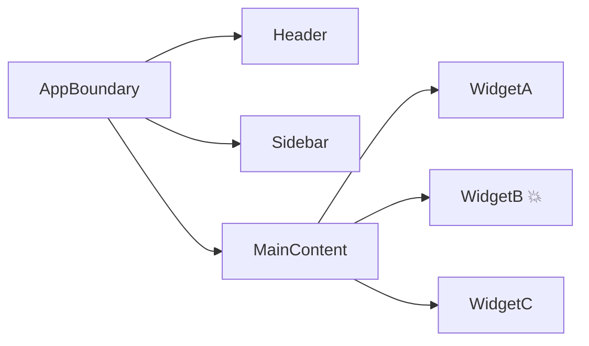
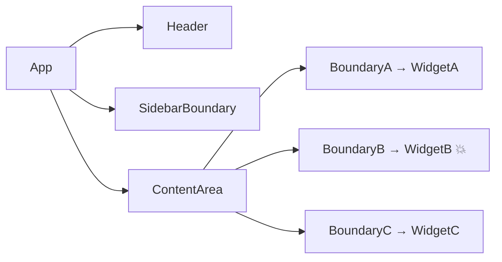

# Level 11: Error Boundaries — подробная теория

## Проблема: почему приложения «умирают» целиком?

Представьте, что вы в самолёте. Перестала работать лампочка над вашим сиденьем. Должен ли самолёт экстренно приземлиться? Конечно нет — это изолированная проблема, которая не влияет на остальное.

В React без Error Boundaries всё иначе: сломанный виджет рекомендаций на странице товара убивает **весь** интерфейс. Пользователь видит белый экран, хотя корзина, навигация и поиск работают отлично.

Error Boundaries — это «переборки» в вашем приложении. Как переборки в корпусе корабля: один отсек затопило — остальные держатся.

## Почему только class-компоненты?

Это часто вызывает удивление. Error Boundaries требуют двух специфических lifecycle-методов:

- `static getDerivedStateFromError(error)` — статический метод, вызывается синхронно во время фазы рендеринга
- `componentDidCatch(error, info)` — вызывается после коммита в DOM

React намеренно не добавляет аналог для функциональных компонентов. Hooks работают иначе — у них нет эквивалента `getDerivedStateFromError`, потому что hook не может перехватить ошибку из своего же render-вызова. Это ограничение не архитектурного невежества, а осознанного решения команды React.

📌 Хорошая новость: вы пишете **один** class-компонент `ErrorBoundary`, а дальше везде используете его как обычный JSX-тег.

## Полная реализация ErrorBoundary

```tsx
interface FallbackProps {
  error: Error
  resetErrorBoundary: () => void
}

interface ErrorBoundaryProps {
  fallback: (props: FallbackProps) => React.ReactNode
  children: React.ReactNode
  onError?: (error: Error, info: React.ErrorInfo) => void
  onReset?: () => void
}

interface ErrorBoundaryState {
  hasError: boolean
  error: Error | null
}

class ErrorBoundary extends React.Component<ErrorBoundaryProps, ErrorBoundaryState> {
  constructor(props: ErrorBoundaryProps) {
    super(props)
    this.state = { hasError: false, error: null }
  }

  // Вызывается во время рендеринга при ошибке в поддереве
  // Должен вернуть объект для обновления state (или null)
  static getDerivedStateFromError(error: Error): ErrorBoundaryState {
    return { hasError: true, error }
  }

  // Вызывается после того, как ошибка «поймана» — для логирования
  // info.componentStack содержит стек компонентов, где произошла ошибка
  componentDidCatch(error: Error, info: React.ErrorInfo) {
    this.props.onError?.(error, info)
    console.error('ErrorBoundary caught:', error)
    console.error('Component stack:', info.componentStack)
  }

  reset = () => {
    this.props.onReset?.()
    this.setState({ hasError: false, error: null })
  }

  render() {
    if (this.state.hasError) {
      return this.props.fallback({
        error: this.state.error!,
        resetErrorBoundary: this.reset,
      })
    }
    return this.props.children
  }
}
```

### Почему `fallback` — это render prop, а не просто ReactNode?

```tsx
// ❌ Просто элемент — нет доступа к ошибке и reset
<ErrorBoundary fallback={<div>Что-то пошло не так</div>}>

// ✅ Render prop — fallback знает об ошибке и может её сбросить
<ErrorBoundary fallback={({ error, resetErrorBoundary }) => (
  <div>
    <p>Ошибка: {error.message}</p>
    <button onClick={resetErrorBoundary}>Попробовать снова</button>
  </div>
)}>
```

## Где размещать Error Boundaries?

Это ключевой архитектурный вопрос. Ответ зависит от того, что вы хотите изолировать.

### Стратегия 1: Один глобальный boundary



❌ При падении WidgetB пользователь видит заглушку вместо всего приложения.

### Стратегия 2: Гранулярные boundaries вокруг независимых секций



✅ Падение WidgetB изолировано. Header, Sidebar, WidgetA, WidgetC продолжают работать.

### Правило гранулярности

Оборачивайте в boundary то, что:
1. Загружает данные независимо от остальных
2. Может упасть по независимым причинам
3. Пользователь может воспринимать как отдельную «секцию»

## Fallback UI: что показывать?

Хороший fallback — это не просто «Произошла ошибка». Он должен:

1. **Объяснить** что произошло (коротко, без технических деталей)
2. **Предложить действие** — кнопка «Попробовать снова», ссылка «На главную»
3. **Не сбивать с толку** — пользователь должен понять, что это часть страницы сломалась, а не всё приложение

```tsx
function WidgetFallback({ error, resetErrorBoundary }: FallbackProps) {
  return (
    <div style={{ padding: '1rem', border: '1px solid #ffcdd2', borderRadius: '8px', background: '#fff5f5' }}>
      <h4 style={{ color: '#c62828', margin: '0 0 0.5rem' }}>Не удалось загрузить блок</h4>
      <p style={{ color: '#555', fontSize: '0.85rem', margin: '0 0 1rem' }}>
        {error.message || 'Произошла непредвиденная ошибка'}
      </p>
      <button onClick={resetErrorBoundary}>Попробовать снова</button>
    </div>
  )
}
```

## Recovery patterns: как восстановиться после ошибки?

### Паттерн 1: Простой reset

Пользователь нажимает «Попробовать снова» → boundary сбрасывает state → компонент рендерится заново.

⚠️ Если причина ошибки не устранена (данные по-прежнему невалидны), компонент упадёт снова. Это нормально — после нескольких попыток покажите другое сообщение.

### Паттерн 2: Reset с ключом

```tsx
function Dashboard() {
  const [retryKey, setRetryKey] = useState(0)

  return (
    <ErrorBoundary
      key={retryKey}                    // смена ключа = пересоздание boundary
      fallback={({ error, resetErrorBoundary }) => (
        <button onClick={() => {
          resetErrorBoundary()
          setRetryKey(k => k + 1)       // принудительно пересоздаём поддерево
        }}>
          Перезагрузить виджет
        </button>
      )}
    >
      <Widget />
    </ErrorBoundary>
  )
}
```

### Паттерн 3: Retry counter

```tsx
function SmartFallback({ error, resetErrorBoundary }: FallbackProps) {
  const [retries, setRetries] = useState(0)
  const maxRetries = 3

  const handleRetry = () => {
    setRetries(r => r + 1)
    resetErrorBoundary()
  }

  if (retries >= maxRetries) {
    return <p>Не удалось восстановить блок. Обратитесь в поддержку.</p>
  }

  return (
    <button onClick={handleRetry}>
      Попробовать снова ({retries}/{maxRetries})
    </button>
  )
}
```

## Async-ошибки: «слепая зона» Error Boundaries

💡 Error Boundaries **не ловят** ошибки в:
- `setTimeout` / `setInterval`
- Promise `.catch()` и async/await
- Обработчиках событий (`onClick`, `onChange`)

```tsx
// ❌ Эта ошибка НЕ будет поймана boundary
function Widget() {
  useEffect(() => {
    fetch('/api/data')
      .then(r => r.json())
      .catch(err => {
        throw err // ошибка в Promise — boundary не поймает
      })
  }, [])
}

// ✅ Перебрасываем в render через useState
function Widget() {
  const [error, setError] = useState<Error | null>(null)

  useEffect(() => {
    fetch('/api/data')
      .then(r => r.json())
      .catch(err => setError(err)) // сохраняем ошибку в state
  }, [])

  if (error) throw error // бросаем в render — boundary поймает!
}
```

## useErrorHandler: универсальный хук для async-ошибок

Этот паттерн можно вынести в хук, чтобы не писать одно и то же везде:

```tsx
function useErrorHandler() {
  const [, setState] = useState<null>(null)

  return useCallback((error: Error) => {
    // Хитрость: обновляем state через функцию, которая бросает ошибку.
    // React вызовет эту функцию во время следующего рендера,
    // ошибка попадёт в фазу рендеринга и будет поймана boundary.
    setState(() => {
      throw error
    })
  }, [])
}

// Использование
function DataWidget() {
  const handleError = useErrorHandler()

  useEffect(() => {
    fetchData()
      .catch(handleError) // async-ошибки теперь попадают в boundary
  }, [handleError])
}
```

### Почему это работает?

Функция, переданная в `setState`, вызывается React во время фазы рендеринга (reconciliation). Если эта функция бросает исключение — React воспринимает это как ошибку рендеринга и передаёт её в ближайший Error Boundary. Хитрость простая, но мощная.

## Error Boundaries + Suspense

Эти два механизма прекрасно работают вместе:

```tsx
// Suspense ловит «ожидание» (Promise), ErrorBoundary ловит «ошибки»
<ErrorBoundary fallback={({ error, resetErrorBoundary }) => (
  <ErrorFallback error={error} onRetry={resetErrorBoundary} />
)}>
  <Suspense fallback={<Spinner />}>
    <LazyComponent />   {/* может и «ждать» и «падать» */}
  </Suspense>
</ErrorBoundary>
```

📌 Порядок важен: `ErrorBoundary` снаружи, `Suspense` внутри. Если перепутать — Suspense-ошибки не будут пойманы.

## Распространённые ошибки

### ❌ Ошибка 1: boundary оборачивает сам себя

```tsx
// ❌ ErrorBoundary не может поймать ошибки в своём render
class BrokenBoundary extends React.Component {
  render() {
    if (this.state.hasError) {
      return doSomethingThatThrows() // не будет поймано
    }
  }
}
```

✅ Fallback UI должен быть максимально простым — никаких сложных вычислений.

### ❌ Ошибка 2: один глобальный boundary

```tsx
// ❌ При падении любого компонента — белый экран на всё приложение
function App() {
  return (
    <ErrorBoundary fallback={<div>Ошибка</div>}>
      <Header />
      <Sidebar />
      <Dashboard />  {/* упал — скрылось всё */}
    </ErrorBoundary>
  )
}
```

✅ Оборачивайте независимые секции в отдельные boundaries.

### ❌ Ошибка 3: забыть про async

```tsx
// ❌ Думаем, что boundary поймает — но нет
function Widget() {
  const handleClick = async () => {
    const data = await fetch('/bad-url').then(r => r.json())
    // если fetch упал — boundary не знает об этом
  }
}
```

✅ Используйте `useErrorHandler` для проброса async-ошибок в boundary.

### ❌ Ошибка 4: не давать пользователю возможность восстановиться

```tsx
// ❌ Тупик: показали ошибку и всё
fallback={<div>Произошла ошибка. Обновите страницу.</div>}
```

✅ Всегда добавляйте кнопку «Попробовать снова» с вызовом `resetErrorBoundary`.

## Лучшие практики

| Правило | Почему |
|---|---|
| Оборачивайте роуты в boundaries | Падение одной страницы не убивает навигацию |
| Оборачивайте виджеты с внешними данными | Нестабильное API — частая причина ошибок |
| Логируйте в `componentDidCatch` | Sentry, Datadog и другие инструменты мониторинга |
| Показывайте разные fallback для dev и prod | В dev полезен стек трейс, в prod — дружелюбное сообщение |
| Добавляйте `key` для принудительного сброса | Когда `resetErrorBoundary` недостаточно |
