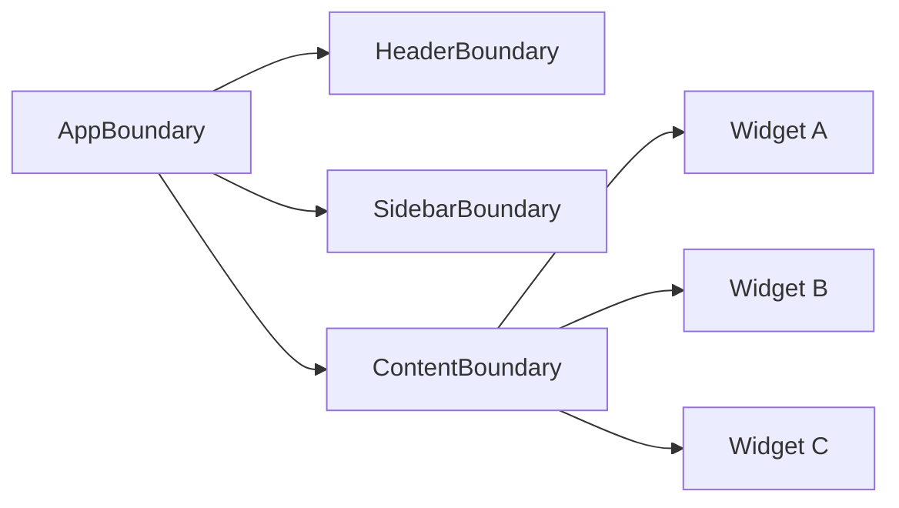

# Level 11: Error Boundaries

## Why Error Boundaries are needed?

Without protection, one broken detail crashes the entire interface. Error Boundary is a "fuse" component: catches rendering errors in its subtree and shows fallback UI instead of a white screen.

## Key points

- **Only class components** can be Error Boundaries (React 18 limitation)
- Catches errors in `render`, lifecycle methods, and constructors of child components
- **Doesn't catch**: async errors, event handlers, errors in the boundary itself
- Placement granularity determines the "blast zone" on failure

## Minimal ErrorBoundary

```tsx
class ErrorBoundary extends React.Component<Props, State> {
  static getDerivedStateFromError(error: Error): State {
    return { hasError: true, error }
  }

  componentDidCatch(error: Error, info: React.ErrorInfo) {
    console.error('Caught:', error, info.componentStack)
  }

  render() {
    if (this.state.hasError) {
      return this.props.fallback({
        error: this.state.error!,
        resetErrorBoundary: this.reset,
      })
    }
    return this.props.children
  }
}
```

## Mermaid diagram: granularity



Each boundary isolates its zone: Widget B crash doesn't affect Widget A and Widget C.

## Async errors: useErrorHandler

Async errors (fetch, setTimeout) are not caught by boundaries automatically. The propagation pattern:

```tsx
function useErrorHandler() {
  const [, setState] = useState(null)
  return (error: Error) => {
    setState(() => { throw error }) // throws error on next render
  }
}
```

## Common mistakes

❌ One global boundary for the entire app — one widget crashes, the whole screen hides.

❌ Wrapping event handlers in boundary — errors there are not caught.

✅ Place boundaries around independent sections (widgets, routes, panels).
