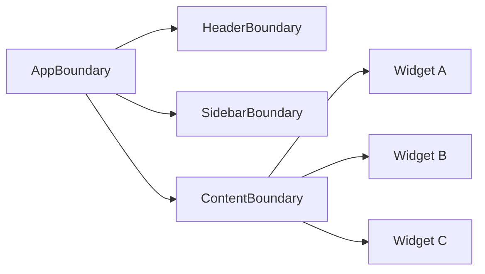

# Level 11: Error Boundaries

## Зачем нужны Error Boundaries?

Без защиты одна сломанная деталь рушит весь интерфейс. Error Boundary — это компонент-«предохранитель»: перехватывает ошибки рендеринга в своём поддереве и показывает fallback UI вместо белого экрана.

## Ключевые моменты

- **Только class-компоненты** могут быть Error Boundaries (ограничение React 18)
- Ловят ошибки в `render`, lifecycle-методах и конструкторах дочерних компонентов
- **Не ловят**: async-ошибки, обработчики событий, ошибки в самом boundary
- Гранулярность размещения определяет «зону поражения» при падении

## Минимальный ErrorBoundary

```tsx
class ErrorBoundary extends React.Component<Props, State> {
  static getDerivedStateFromError(error: Error): State {
    return { hasError: true, error }
  }

  componentDidCatch(error: Error, info: React.ErrorInfo) {
    console.error('Caught:', error, info.componentStack)
  }

  render() {
    if (this.state.hasError) {
      return this.props.fallback({
        error: this.state.error!,
        resetErrorBoundary: this.reset,
      })
    }
    return this.props.children
  }
}
```

## Mermaid-диаграмма: гранулярность



Каждый boundary изолирует свою зону: падение Widget B не затрагивает Widget A и Widget C.

## Async-ошибки: useErrorHandler

Async-ошибки (fetch, setTimeout) не перехватываются границами автоматически. Паттерн пробрасывания:

```tsx
function useErrorHandler() {
  const [, setState] = useState(null)
  return (error: Error) => {
    setState(() => { throw error }) // бросает ошибку при следующем рендере
  }
}
```

## Частые ошибки

❌ Один глобальный boundary на всё приложение — падает один виджет, скрывается весь экран.

❌ Оборачивание в boundary обработчиков событий — там ошибки не перехватываются.

✅ Размещать boundaries вокруг независимых секций (виджеты, роуты, панели).
