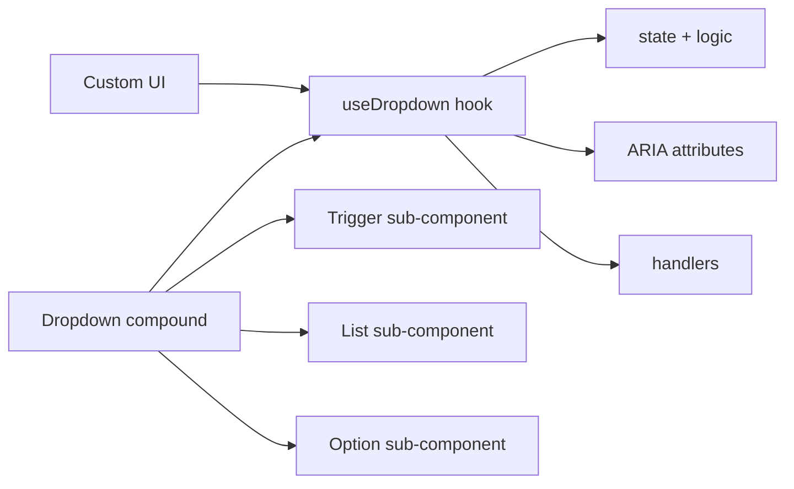

# Level 12: Advanced Patterns — Capstone

## What we study

The final level brings all course patterns together: controlled/uncontrolled modes, headless components, state machines, and provider pattern for libraries.

## Controlled vs Uncontrolled

A component can work in two modes. **Controlled** — state from outside, parent manages via `value` + `onChange`. **Uncontrolled** — state inside, parent only sets `defaultValue`.

TypeScript trick: if `value` is passed, `onChange` becomes required:

```tsx
type ControlledProps = { value: Date; onChange: (d: Date) => void; defaultValue?: never }
type UncontrolledProps = { defaultValue?: Date; value?: never; onChange?: never }
type DatePickerProps = ControlledProps | UncontrolledProps
```

## Headless components

Logic without UI. A hook returns state and handlers, UI is connected separately:

```tsx
function useDropdown(options: string[]) {
  const [isOpen, setIsOpen] = useState(false)
  const [selected, setSelected] = useState<string | null>(null)
  // ...returns everything needed to build UI
  return { isOpen, selected, triggerProps, listProps, getOptionProps }
}
```

Compound component uses the hook and provides default UI — but the user can take just the hook and build their own UI.

## State Machines in UI

Explicit states eliminate "impossible states". Instead of multiple flags — a single `status` value:

```tsx
type CheckoutState =
  | { status: 'idle' }
  | { status: 'shipping'; data: ShippingData }
  | { status: 'payment'; data: ShippingData }
  | { status: 'confirmation'; orderId: string }
  | { status: 'error'; message: string }
```

`useReducer` with typed actions guarantees correct state transitions.

## Mermaid diagram: headless component architecture



The hook is the single source of truth. The UI layer is interchangeable.

## Provider pattern for libraries

A component library passes configuration through context:

```tsx
const UIKitContext = createContext<UIKitConfig>(defaultConfig)

function UIKitProvider({ config, children }: Props) {
  return <UIKitContext.Provider value={config}>{children}</UIKitContext.Provider>
}
```

Components read config from context but accept props for local override.

## Common mistakes

❌ Mixing controlled and uncontrolled in one component without explicit separation — behavior becomes unpredictable.

❌ Storing multiple flags `isLoading`, `isSuccess`, `isError` instead of state machine — you can get `isLoading && isError`, which is semantically impossible.

✅ Use discriminated union for states — TypeScript won't allow accessing `orderId` in the `error` state.
