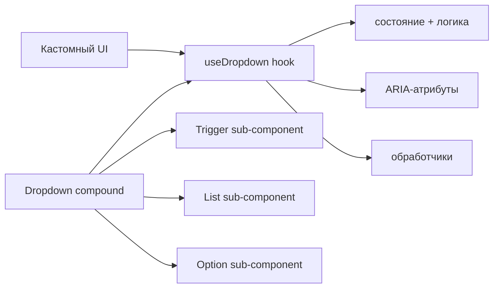

# Level 12: Продвинутые паттерны — Capstone

## Что изучаем

Финальный уровень собирает все паттерны курса воедино: controlled/uncontrolled режимы, headless компоненты, state machines и provider pattern для библиотек.

## Controlled vs Uncontrolled

Компонент может работать в двух режимах. **Controlled** — состояние снаружи, родитель управляет через `value` + `onChange`. **Uncontrolled** — состояние внутри, родитель задаёт только `defaultValue`.

TypeScript-трюк: если `value` передан, `onChange` становится обязательным:

```tsx
type ControlledProps = { value: Date; onChange: (d: Date) => void; defaultValue?: never }
type UncontrolledProps = { defaultValue?: Date; value?: never; onChange?: never }
type DatePickerProps = ControlledProps | UncontrolledProps
```

## Headless компоненты

Логика без UI. Хук отдаёт состояние и обработчики, UI подключается отдельно:

```tsx
function useDropdown(options: string[]) {
  const [isOpen, setIsOpen] = useState(false)
  const [selected, setSelected] = useState<string | null>(null)
  // ...возвращает всё нужное для построения UI
  return { isOpen, selected, triggerProps, listProps, getOptionProps }
}
```

Compound component использует хук и предоставляет дефолтный UI — но пользователь может взять только хук и построить свой UI.

## State Machines в UI

Явные состояния устраняют «невозможные состояния». Вместо нескольких флагов — одно значение `status`:

```tsx
type CheckoutState =
  | { status: 'idle' }
  | { status: 'shipping'; data: ShippingData }
  | { status: 'payment'; data: ShippingData }
  | { status: 'confirmation'; orderId: string }
  | { status: 'error'; message: string }
```

`useReducer` с typed actions гарантирует правильные переходы между состояниями.

## Mermaid-диаграмма: архитектура headless компонента



Хук — единственный источник истины. UI-слой взаимозаменяем.

## Provider pattern для библиотек

Библиотека компонентов передаёт конфигурацию через контекст:

```tsx
const UIKitContext = createContext<UIKitConfig>(defaultConfig)

function UIKitProvider({ config, children }: Props) {
  return <UIKitContext.Provider value={config}>{children}</UIKitContext.Provider>
}
```

Компоненты читают конфиг из контекста, но принимают props для локального переопределения.

## Частые ошибки

❌ Смешивать controlled и uncontrolled в одном компоненте без явного разделения — поведение становится непредсказуемым.

❌ Хранить несколько флагов `isLoading`, `isSuccess`, `isError` вместо state machine — можно получить `isLoading && isError`, что невозможно семантически.

✅ Использовать discriminated union для состояний — TypeScript не позволит обратиться к `orderId` в состоянии `error`.
