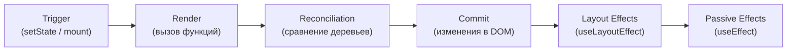

# Уровень 0: Ментальная модель React — подробно

## Как разработчики думают о React

Представь, что ты спрашиваешь опытного React-разработчика: "Что происходит, когда ты вызываешь setState?" Типичный ответ: "React перерисовывает компонент". Технически это не ложь, но это как сказать "машина едет" вместо описания работы двигателя, трансмиссии и колёс.

Пока эта упрощённая модель работает — всё хорошо. Но как только ты сталкиваешься с неожиданным поведением — лишними рендерами, "устаревшими" closures, race conditions в useEffect — упрощённая модель ломается. Тебе нужна настоящая.

## Три фазы React



---

### Фаза 1: Trigger

Trigger — это событие, которое говорит React: "Пора посмотреть, что изменилось".

Есть ровно два источника:

**Первичный рендер (Initial Render)**
```jsx
const root = ReactDOM.createRoot(document.getElementById('root'))
root.render(<App />)
// Это и есть первый Trigger
```

**Обновление состояния**
```jsx
const [count, setCount] = useState(0)

// Этот вызов — Trigger
setCount(count + 1)

// Этот тоже Trigger, но React может сделать bailout
setCount(0) // если count уже равен 0
```

Когда React получает Trigger, он не бросается сразу обновлять DOM. Он ставит обновление в очередь и планирует работу через scheduler. Это важно: между Trigger и началом Render может пройти время (особенно в Concurrent Mode).

**Batching:** если несколько setState вызываются в одном обработчике событий, React группирует их в один рендер:

```jsx
function handleClick() {
  setCount(c => c + 1)  // Trigger #1
  setName('Alice')       // Trigger #2
  setFlag(true)          // Trigger #3
  // React сделает ОДИН рендер со всеми тремя изменениями
}
```

Это Automatic Batching — он работает в React 18+ для всех асинхронных контекстов, не только обработчиков событий.

---

### Фаза 2: Render

Render — это вызов твоих компонентных функций. Не рисование на экране, не обновление DOM — именно вызов функций.

```jsx
function MyComponent({ value }) {
  console.log('render called!')  // Это выполняется в фазе Render
  
  return <div>{value}</div>  // Возвращает описание (JSX → объекты)
}
```

**Что происходит внутри React во время Render:**

```
scheduleUpdate(fiber)
    ↓
workLoop()
    ↓
performUnitOfWork(fiber) — для каждого fiber node
    ↓
beginWork(fiber) — вызывает renderWithHooks(fiber)
    ↓
renderWithHooks() — вызывает твою функцию компонента
    ↓
твоя функция возвращает JSX
    ↓
React превращает JSX в Fiber nodes (reconcileChildFibers)
    ↓
completeWork(fiber) — завершает обработку узла
```

React обходит дерево компонентов в два прохода:
- **beginWork** (сверху вниз) — вызывает функцию компонента, создаёт дочерние fibers
- **completeWork** (снизу вверх) — финализирует fiber, создаёт список эффектов

📌 Функции компонентов должны быть **чистыми**: один и тот же входной props → один и тот же JSX. React может вызывать компонент несколько раз (например, в Strict Mode) именно чтобы проверить это свойство.

**Что НЕ должно происходить во время Render:**
- Изменение DOM напрямую
- Отправка сетевых запросов (без специальных инструментов)
- Изменение внешних переменных

---

### Фаза 3: Reconciliation — сравнение деревьев

После того как Render построил новое виртуальное дерево, начинается reconciliation — сравнение нового дерева со старым (тем, что сейчас в DOM).

React использует O(n) алгоритм с двумя допущениями:
1. Элементы разных типов создают разные деревья (если `<div>` стал `<span>` — всё дерево пересоздаётся)
2. `key` prop помогает React отслеживать элементы между рендерами

Результат reconciliation — список изменений: "добавить этот узел", "обновить этот атрибут", "удалить этот элемент". Это называется "effect list".

---

### Фаза 4: Commit

Commit — единственная фаза, которая трогает реальный DOM. React берёт effect list из reconciliation и применяет изменения.

Commit состоит из трёх под-фаз:

```
commitBeforeMutationEffects  ← getSnapshotBeforeUpdate, beforeBlur
      ↓
commitMutationEffects        ← вставка/удаление/обновление DOM узлов
      ↓
commitLayoutEffects          ← useLayoutEffect, componentDidMount/Update
```

После commitMutationEffects браузер получает обновлённый DOM и может перерисовать страницу.

---

### Пассивные эффекты: useEffect

useEffect — особенный. Он не выполняется во время Commit. React откладывает его до тех пор, пока браузер не отрисует изменения:

```
Commit → Браузер рисует → useEffect cleanup (предыдущий) → useEffect setup (новый)
```

Именно поэтому useEffect не блокирует браузер. И именно поэтому commitCount в нашем упражнении будет корректным — useEffect гарантированно вызывается после каждого commit.

---

## Render без Commit: почему это важно

Когда React делает bailout? В нескольких случаях:

**1. setState с тем же значением**
```jsx
const [count, setCount] = useState(0)

// Если count уже 0:
setCount(0)  // React вызовет функцию компонента один раз,
             // увидит тот же результат и остановится
             // (на самом деле React 18 делает два вызова в Strict Mode)
```

**2. React.memo**
```jsx
const Child = React.memo(({ value }) => {
  return <div>{value}</div>
})

// Если value не изменился — Child вообще не будет вызван
```

**3. useMemo**
```jsx
const expensiveValue = useMemo(() => compute(a, b), [a, b])
// Если a и b не изменились — compute не вызывается
```

Понимание этого механизма критично для оптимизации производительности. Ты научишься видеть лишние рендеры и bailout-ы через Profiler.

---

## React Profiler API

React предоставляет встроенный компонент `<Profiler>` для измерения производительности рендеров.

### Базовое использование

```jsx
import { Profiler } from 'react'

function onRenderCallback(
  id,           // идентификатор дерева Profiler
  phase,        // 'mount' или 'update'
  actualDuration, // время рендера с мемоизацией
  baseDuration,   // время рендера без мемоизации (оценка)
  startTime,      // когда React начал рендерить
  commitTime      // когда React закоммитил обновление
) {
  console.log(`${id} [${phase}]: actual=${actualDuration}ms, base=${baseDuration}ms`)
}

function App() {
  return (
    <Profiler id="MyComponent" onRender={onRenderCallback}>
      <MyComponent />
    </Profiler>
  )
}
```

### Что означают аргументы

| Аргумент | Тип | Описание |
|---|---|---|
| `id` | string | Имя из prop `id` компонента Profiler |
| `phase` | 'mount' \| 'update' | Первый рендер или обновление |
| `actualDuration` | number | Реальное время рендера (мс), включая memo bail-out |
| `baseDuration` | number | Оценочное время без оптимизаций (мс) |
| `startTime` | number | Timestamp начала рендера |
| `commitTime` | number | Timestamp commit'а |

### Практический пример: сбор статистики рендеров

```jsx
import { Profiler, useRef, useState } from 'react'

function ProfilerDemo() {
  const renders = useRef([])
  const [, forceUpdate] = useState(0)

  const handleRender = (id, phase, actualDuration, baseDuration, startTime, commitTime) => {
    renders.current.push({ id, phase, actualDuration, baseDuration, startTime, commitTime })
  }

  return (
    <div>
      <Profiler id="demo" onRender={handleRender}>
        <ExpensiveComponent />
      </Profiler>
      
      <button onClick={() => forceUpdate(n => n + 1)}>
        Force Update
      </button>
      
      <table>
        <thead>
          <tr>
            <th>Phase</th>
            <th>Actual (ms)</th>
            <th>Base (ms)</th>
          </tr>
        </thead>
        <tbody>
          {renders.current.map((r, i) => (
            <tr key={i}>
              <td>{r.phase}</td>
              <td>{r.actualDuration.toFixed(2)}</td>
              <td>{r.baseDuration.toFixed(2)}</td>
            </tr>
          ))}
        </tbody>
      </table>
    </div>
  )
}
```

### Profiler в production

По умолчанию Profiler отключён в production-сборках (чтобы не добавлять overhead). Если нужно профилировать production — используй специальную сборку:
```
react-dom/profiling
scheduler/tracing
```

---

## ⚠️ Частые заблуждения у опытных разработчиков

**❌ "Я вижу render в console.log — значит, DOM обновился"**

Нет. console.log в теле компонента выполняется во время фазы Render, а не Commit. DOM может не измениться вообще.

✅ Правильная проверка: `useEffect` без зависимостей вызывается после каждого Commit — вот там можно считать обновления DOM.

---

**❌ "setState с тем же значением — это бесполезный вызов"**

Почти правда, но не совсем. React 18 в Strict Mode вызовет функцию компонента один раз (даже если значение то же самое) при первом bailout. Только при втором одинаковом значении подряд React полностью пропустит дочерние компоненты.

✅ Используй `useReducer` или функциональный `setState` если хочешь гарантированно избежать лишних вызовов.

---

**❌ "Profiler замедляет приложение — не стоит его использовать"**

В development-режиме overhead незначителен. В production Profiler автоматически отключается. Используй его свободно во время разработки.

✅ React DevTools Profiler делает то же самое визуально — но программный `<Profiler>` позволяет собирать данные автоматически.

---

**❌ "useEffect вызывается сразу после setState"**

useEffect вызывается после того, как браузер отрисовал изменения. Между setState и useEffect могут пройти миллисекунды и несколько кадров анимации.

✅ Если нужно выполнить что-то синхронно после DOM-обновления — используй `useLayoutEffect`. Но это редкий случай.

---

## 💡 Итог: что нужно помнить

1. React — это **описательный язык**: ты описываешь UI, reconciler решает что менять
2. **Render = вызов функции**, не рисование на экране
3. **Commit = изменение DOM**, происходит только если что-то реально изменилось
4. Между Trigger и Commit может произойти много всего (batching, bailout, concurrent interruption)
5. **Profiler** — твой главный инструмент для понимания того, что реально происходит

Этот фундамент нужен для всего, что будет дальше в курсе.
