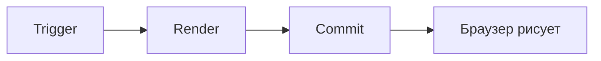

# Уровень 0: Ментальная модель React

## Что ты думаешь, что делает React

Большинство разработчиков представляют React примерно так: нажал кнопку — React "перерисовал" компонент — изменения появились в браузере. Всё происходит мгновенно и линейно.

Это не совсем неправильно. Но это как думать, что архитектор строит дом своими руками. Архитектор рисует чертёж — а дом строит прораб по этому чертежу. React — это архитектор. DOM — это дом. А reconciler — прораб, который решает, что именно переделывать.

## Три фазы: как React работает на самом деле



### 1. Trigger — что-то произошло

React начинает работу только по двум причинам:
- **Первичный рендер** — компонент монтируется первый раз (`ReactDOM.createRoot().render(...)`)
- **Обновление состояния** — вызван `setState` (или `dispatch`, или обновился контекст)

Ничего другого React не замечает. Изменение переменной вне состояния? React не знает. Мутация объекта? Тоже не знает. Только явный сигнал через setState.

### 2. Render — вызов функций компонентов

💡 Слово "render" в React означает не "рисование на экране", а **вызов функции компонента**.

Когда React рендерит компонент, он вызывает твою функцию и получает JSX — описание того, как должен выглядеть UI. Это описание React превращает в виртуальное дерево объектов (Fiber-дерево). Никакой DOM на этом этапе не трогается.

```jsx
// Во время фазы Render React вызывает эту функцию
function Counter({ count }) {
  return <div>{count}</div>  // Возвращает описание, не DOM
}
```

React обходит дерево компонентов сверху вниз, вызывая каждую функцию. Если компонент вернул другие компоненты — React рекурсивно вызывает и их.

### 3. Commit — применение изменений к DOM

Только после того как React построил новое виртуальное дерево и сравнил его с предыдущим (reconciliation), он идёт в DOM и делает минимально необходимые изменения.

📌 Ключевой момент: **Render может произойти без Commit**. Если виртуальное дерево не изменилось — React не будет трогать DOM вообще. Например, `setState(sameValue)` → React вызовет функцию компонента → увидит, что результат тот же → пропустит Commit.

## Render ≠ DOM update

Это самое распространённое заблуждение новичков. Посмотри на счётчики:

```
renderCount: 3   ← функция вызывалась 3 раза
commitCount: 2   ← DOM менялся 2 раза
```

Такое возможно. React может вызвать функцию компонента, получить тот же JSX и ничего не изменить в браузере. Это называется "bailout" — React сделал работу, но решил не коммитить.

## ⚠️ Частые заблуждения

❌ "Каждый setState вызывает обновление DOM"

Нет. setState вызывает re-render (фазу Render), но Commit произойдёт только если результат изменился.

❌ "Render — это рисование в браузере"

Render — это вызов функции компонента. Рисует браузер на своём этапе, после Commit.

❌ "React обновляет только изменившиеся компоненты"

По умолчанию React обновляет компонент и всё его поддерево, если его родитель обновился. Оптимизации (memo, useMemo) — это отдельная тема.

## React DevTools Profiler

В этом курсе мы будем много работать с Profiler. Он показывает:
- Какие компоненты рендерились и почему
- Сколько времени занял каждый рендер
- Какие рендеры привели к изменениям DOM (committed renders)

Установи расширение [React Developer Tools](https://react.dev/learn/react-developer-tools) и открой вкладку Profiler — она понадобится уже в следующих уровнях.
