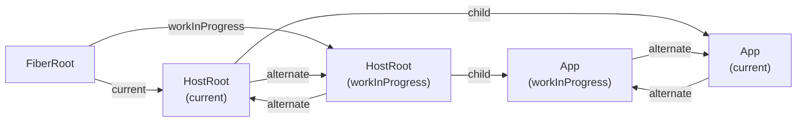

# Уровень 1: Fiber-архитектура — дерево (подробно)

## Почему React переписали на Fiber

В 2017 году команда React выпустила React 16 — полное переписывание внутренностей. Внешний API не изменился, но внутри всё стало другим. Причина — классическая проблема "janky" интерфейсов.

Старый React обходил дерево компонентов рекурсивно. Когда дерево большое — функция уходила в стек вызовов на десятки миллисекунд. Браузер не мог вклиниться и нарисовать анимацию. Результат: если у тебя 2000 компонентов в списке и пользователь быстро печатает — интерфейс "заикается".

Решение: сделать обход дерева **прерываемым**. Для этого нужно перенести "стек вызовов" из CPU в обычные объекты в памяти. Каждый такой объект — Fiber node. Вместо рекурсии — цикл `while (workInProgress !== null)`. В любой момент между итерациями можно выйти из цикла и вернуться к нему в следующем кадре.

## Полная структура FiberNode

Вот реальные поля из исходников React (пакет `react-reconciler`):

```ts
type Fiber = {
  // ─── Идентификация ──────────────────────────────────────────
  
  tag: WorkTag
  // Числовой тип узла. 0 = FunctionComponent, 1 = ClassComponent,
  // 3 = HostRoot, 5 = HostComponent ('div', 'span'), 6 = HostText,
  // 7 = Fragment, 10 = ContextProvider, 11 = ContextConsumer, ...

  key: null | string
  // Тот самый key prop. Используется при reconciliation для
  // сопоставления элементов между рендерами.

  elementType: any
  // То, что передаётся в createElement первым аргументом.
  // Для React.memo это memo-обёртка, а type — оригинальная функция.

  type: any
  // Функция компонента, строка ('div'), или специальный символ (Fragment).
  // Это то, что React вызывает при рендере.

  stateNode: any
  // Для HostComponent ('div') — реальный DOM-узел
  // Для ClassComponent — экземпляр класса
  // Для HostRoot — объект FiberRoot
  // Для FunctionComponent — null (нет экземпляра)

  // ─── Навигация по дереву ─────────────────────────────────────

  return: Fiber | null
  // Родитель. Называется "return" потому что после обработки этого
  // fiber алгоритм "возвращается" к нему.

  child: Fiber | null
  // Первый дочерний узел. Остальные — через sibling.

  sibling: Fiber | null
  // Следующий узел на том же уровне (брат).

  index: number
  // Позиция среди братьев (нужна при reconciliation с key).

  // ─── Пропсы и состояние ──────────────────────────────────────

  ref: RefObject | null
  // Ref, переданный через prop ref.

  pendingProps: any
  // Пропсы текущего рендера (ещё не сохранённые как memoized).

  memoizedProps: any
  // Пропсы, сохранённые после последнего completed рендера.
  // Если pendingProps === memoizedProps — можно сделать bailout.

  updateQueue: UpdateQueue | null
  // Очередь обновлений состояния (setState, dispatch).
  // Для HostComponent — список DOM-пропсов для обновления.

  memoizedState: any
  // Для FunctionComponent — первый хук в linked list хуков.
  // Для ClassComponent — объект state.
  // Каждый хук (useState, useEffect, useRef...) — это объект
  // в linked list, цепочка которого начинается здесь.

  dependencies: Dependencies | null
  // Контексты и другие зависимости, которые читает этот fiber.

  // ─── Режим работы ────────────────────────────────────────────

  mode: TypeOfMode
  // Флаги режима: ConcurrentMode, StrictMode, ProfileMode...

  // ─── Эффекты ─────────────────────────────────────────────────

  flags: Flags
  // Битовая маска того, что нужно сделать с этим fiber в Commit:
  // Placement (вставить), Update (обновить), Deletion (удалить),
  // Ref, Snapshot, Passive (useEffect), Layout (useLayoutEffect)...

  subtreeFlags: Flags
  // Объединение flags всего поддерева. Позволяет React быстро
  // пропустить поддерево, если в нём нечего делать.

  deletions: Fiber[] | null
  // Список дочерних fibers, помеченных на удаление.

  // ─── Concurrent Mode ─────────────────────────────────────────

  lanes: Lanes
  // Приоритет этого fiber. Число — битовая маска.
  // Sync (блокирующий) vs InputContinuous vs DefaultLane...

  childLanes: Lanes
  // Объединение lanes всего поддерева.

  // ─── Double Buffering ────────────────────────────────────────

  alternate: Fiber | null
  // Ссылка на "двойника" в другом дереве.
  // current.alternate = workInProgress
  // workInProgress.alternate = current
}
```

## WorkTag — что означает каждый тип

```ts
// Упрощённый WorkTag enum из react-reconciler/src/ReactWorkTags.js
const WorkTag = {
  FunctionComponent:      0,  // функциональный компонент
  ClassComponent:         1,  // классовый компонент
  IndeterminateComponent: 2,  // до первого вызова (ещё неизвестно FC или CC)
  HostRoot:               3,  // корень дерева (FiberRoot.current)
  HostPortal:             4,  // ReactDOM.createPortal
  HostComponent:          5,  // нативный элемент: 'div', 'span', 'input'...
  HostText:               6,  // текстовый узел "Hello"
  Fragment:               7,  // <>...</> или React.Fragment
  ContextConsumer:        9,  // Context.Consumer
  ContextProvider:        10, // Context.Provider
  ForwardRef:             11, // React.forwardRef
  Profiler:               12, // <Profiler>
  SuspenseComponent:      13, // <Suspense>
  MemoComponent:          14, // React.memo
  SimpleMemoComponent:    15, // React.memo без второго аргумента
  // ...и ещё несколько специальных типов
}
```

Почему это важно? Потому что `beginWork` делает `switch(fiber.tag)` и вызывает разную логику для каждого типа. FunctionComponent вызывает `renderWithHooks`. HostComponent создаёт DOM-узел. HostText просто создаёт текстовый узел.

## Alternate tree: double buffering

React всегда держит в памяти **два** дерева:



**current** — дерево, которое сейчас в DOM. Оно неизменно до следующего Commit.

**workInProgress** — дерево, которое React строит прямо сейчас (во время Render). Это черновик.

Когда Commit завершён: `FiberRoot.current = workInProgress`. Старое `current` становится заготовкой для следующего `workInProgress`. Поэтому React переиспользует Fiber nodes вместо того, чтобы создавать новые с нуля — он клонирует `current` в `workInProgress` и обновляет поля.

Это как double buffering в видеоиграх: пока один кадр рисуется на экране, другой подготавливается за кулисами. Когда готов — переключаем.

## Как React обходит дерево: алгоритм шаг за шагом

```
workInProgress = HostRoot

while (workInProgress !== null) {
  // 1. beginWork: вызвать компонент, получить дочерние fibers
  const next = beginWork(current, workInProgress)
  
  if (next !== null) {
    // Есть дочерний fiber — идём вниз
    workInProgress = next
  } else {
    // Нет дочерних — завершаем текущий и идём вправо/вверх
    completeUnitOfWork(workInProgress)
  }
}

function completeUnitOfWork(fiber) {
  let node = fiber
  while (node !== null) {
    completeWork(node)  // создаём DOM-узлы, собираем флаги
    
    if (node.sibling !== null) {
      // Есть брат — обрабатываем его
      workInProgress = node.sibling
      return
    }
    // Нет брата — идём к родителю и завершаем его
    node = node.return
  }
}
```

Визуально для дерева `App → [Header, Main → [Article, Aside], Footer]`:

```
beginWork(HostRoot)
beginWork(App)
beginWork(Header)
completeWork(Header)   ← нет child и sibling у Header? нет, sibling = Main
beginWork(Main)
beginWork(Article)
completeWork(Article)
beginWork(Aside)
completeWork(Aside)
completeWork(Main)
beginWork(Footer)
completeWork(Footer)
completeWork(App)
completeWork(HostRoot)
```

## JSX → Element → Fiber: три уровня

Посмотрим как конкретный JSX превращается в Fiber-дерево:

```jsx
// JSX (что пишет разработчик)
function App() {
  return (
    <div className="app">
      <Header title="Hello" />
      <main>
        <p>Content</p>
      </main>
    </div>
  )
}
```

**Шаг 1: JSX → React Elements** (при вызове функции компонента)

```js
// Что делает Babel/компилятор из JSX:
React.createElement('div', { className: 'app' },
  React.createElement(Header, { title: 'Hello' }),
  React.createElement('main', null,
    React.createElement('p', null, 'Content')
  )
)

// Результат — дерево объектов:
{
  type: 'div',
  props: { className: 'app', children: [...] },
  key: null
}
```

**Шаг 2: React Elements → Fiber Nodes** (во время Render фазы, reconcileChildFibers)

```
div (HostComponent, tag=5)
  ├── Header (FunctionComponent, tag=0)
  └── main (HostComponent, tag=5)
        └── p (HostComponent, tag=5)
              └── "Content" (HostText, tag=6)
```

В Fiber-дереве все связи — через child/sibling/return:
- `div.child = Header`
- `Header.sibling = main`
- `main.child = p`
- `p.child = "Content" (HostText)`
- `Header.return = div`, `main.return = div`, `p.return = main`

**Шаг 3: Fiber Nodes → DOM** (во время Commit)

Из Fiber-дерева выше в DOM попадут только HostComponent и HostText узлы. `Header` — FunctionComponent, в DOM его нет. Его render-результат "прозрачно" встраивается в родительский DOM-контейнер.

## Почему Fragment и ContextProvider видны в Fiber, но не в DOM

```jsx
function Page() {
  return (
    <ThemeContext.Provider value="dark">
      <>
        <Nav />
        <Content />
      </>
    </ThemeContext.Provider>
  )
}
```

Fiber-дерево этого компонента:

```
Page (FunctionComponent, tag=0)
  └── ThemeContext.Provider (ContextProvider, tag=10)
        └── Fragment (tag=7)
              ├── Nav (FunctionComponent, tag=0)
              └── Content (FunctionComponent, tag=0)
```

В DOM-дереве ни `ThemeContext.Provider`, ни Fragment не появятся. React обходит Fiber-дерево и при Commit ищет ближайшего **HostComponent-предка** для каждого нового DOM-узла.

Это означает, что `ThemeContext.Provider` — это реальный Fiber node с `tag=10`, у которого есть `memoizedProps` (в том числе `value`) и механизм propagation (обход поддерева в поиске Consumer'ов). Но в DOM его нет.

## memoizedState для хуков — linked list

У FunctionComponent `memoizedState` указывает не на объект state, а на **первый хук** в linked list:

```ts
// Структура одного Hook object
type Hook = {
  memoizedState: any    // текущее значение
  baseState: any        // базовое состояние (до pending updates)
  baseQueue: Update | null
  queue: UpdateQueue | null
  next: Hook | null     // следующий хук в цепочке
}
```

Если компонент вызывает `useState`, `useEffect`, `useRef`, `useMemo` — каждый из них добавляет Hook object в этот linked list. Именно поэтому **нельзя вызывать хуки в условиях** — порядок хуков в linked list должен быть стабильным между рендерами.

```jsx
function MyComponent() {
  const [count, setCount] = useState(0)    // hook[0]
  const [name, setName] = useState('')     // hook[1]
  useEffect(() => { /* ... */ }, [count])  // hook[2]
  const ref = useRef(null)                 // hook[3]
  
  // fiber.memoizedState → hook[0] → hook[1] → hook[2] → hook[3] → null
}
```

## ⚠️ Частые заблуждения у опытных разработчиков

**❌ "Fiber node — это виртуальный DOM"**

Это неточность. Fiber node содержит больше информации, чем просто описание DOM: хуки, очереди обновлений, приоритеты, флаги эффектов. Виртуальный DOM — устаревшая концепция из React 15. Fiber — это единица работы планировщика, а не просто отражение DOM.

✅ Правильная формулировка: Fiber node — это объект, который описывает компонент, его состояние, его место в дереве и что с ним нужно сделать в следующий Commit.

---

**❌ "alternate — это предыдущая версия компонента, она удаляется после рендера"**

Нет. alternate живёт постоянно и переиспользуется. После Commit дерево, которое было `workInProgress`, становится `current`. А старое `current` становится будущим `workInProgress`. Это бесконечная ротация между двумя деревьями.

✅ Попробуй в DevTools поставить breakpoint в коде React и посмотреть на `__reactFiber$...` property любого DOM-узла — это и есть его Fiber node. Поле `alternate` ведёт к двойнику.

---

**❌ "React обходит дерево каждый раз целиком от корня"**

Нет. С появлением `subtreeFlags` React может пропустить целые поддеревья, если в них нет ничего интересного. Если у `App.subtreeFlags` нет флага `Update` — React не будет заходить в его детей во время Commit. Аналогично с `childLanes` при Render.

✅ Именно поэтому `React.memo` эффективен: если props не изменились, fiber получает `PerformedWork = false` и React не обходит его поддерево.

---

**❌ "key должен быть уникальным на всей странице"**

Нет. Key должен быть уникальным только среди **братьев** (siblings) в одном родителе. React использует key локально при reconciliation этого конкретного родителя.

✅ Правило: `key` уникален в пределах одного `map()` или одного JSX-родителя.

---

**❌ "stateNode для функционального компонента — это его state"**

Нет. Для FunctionComponent `stateNode = null`. State хранится в `memoizedState` как linked list хуков. `stateNode` хранит DOM-узел (для HostComponent) или экземпляр класса (для ClassComponent).

✅ Чтобы найти state FC в DevTools: `fiber.memoizedState.memoizedState` — это значение первого `useState`.

## 💡 Практический способ посмотреть Fiber-дерево

Любой DOM-элемент имеет скрытое свойство с Fiber node:

```js
// В консоли браузера:
const div = document.querySelector('#root > div')
const fiberKey = Object.keys(div).find(k => k.startsWith('__reactFiber'))
const fiber = div[fiberKey]

// Теперь можно исследовать:
fiber.type          // 'div'
fiber.memoizedProps // { className: 'app', children: [...] }
fiber.child         // первый дочерний fiber
fiber.return        // родительский fiber
fiber.alternate     // двойник из другого дерева
fiber.memoizedState // хуки (если это FunctionComponent)
```

Это не API — это детали реализации, которые меняются между версиями. Но для обучения — бесценно.

## Итог: зачем всё это знать

Понимание Fiber-дерева объясняет:

- Почему порядок хуков нельзя менять (linked list в `memoizedState`)
- Почему `key` важен при списках (reconciliation по key в siblings)
- Почему React.memo работает на уровне subtreeFlags (пропуск поддерева)
- Почему Concurrent Mode возможен (прерываемый цикл вместо рекурсии)
- Почему Fragment и Context не создают DOM-узлы (их WorkTag не HostComponent)

Это фундамент для всего, что будет дальше: reconciliation, hooks internals, concurrent features.
