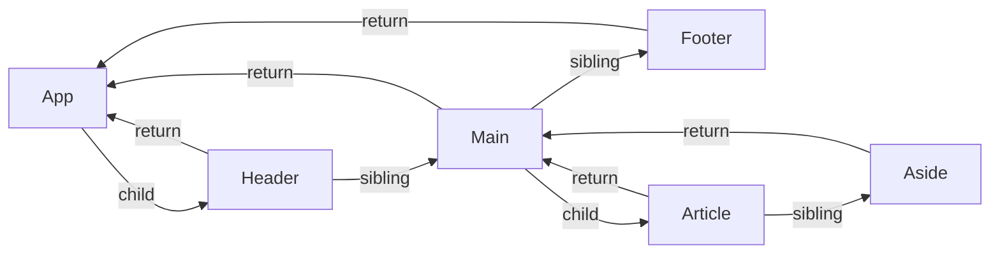

# Уровень 1: Fiber-архитектура — дерево

## Что такое Fiber

До React 16 у React не было никакого "Fiber". Был просто рекурсивный обход дерева компонентов во время фазы Render. Проблема? Рекурсию нельзя прервать на полпути. Пока React не дошёл до листьев — ни один кадр анимации не мог вклиниться. На больших деревьях это приводило к "заиканию" интерфейса.

Решение — заменить рекурсию на итерацию с явным стеком. Каждый элемент дерева стал объектом — **Fiber node**. Это те же данные, что раньше хранились в стеке вызовов, но теперь — в heap. А значит, можно сохранить "закладку" и продолжить с того же места позже.

Думай о Fiber node как о "единице работы": React обрабатывает их по одной, планировщик (Scheduler) может сказать "стоп, у браузера есть более важное дело" — и React отложит оставшееся на следующий кадр.

## Поля Fiber Node

```ts
// Упрощённая структура (не полный исходник React)
type Fiber = {
  // --- Что это за узел ---
  tag: WorkTag          // FunctionComponent = 0, HostComponent = 5, ...
  type: any             // функция компонента или 'div', 'span', ...
  key: string | null    // key prop

  // --- Данные ---
  pendingProps: any     // пропсы этого рендера (ещё не закоммиченные)
  memoizedProps: any    // пропсы прошлого рендера (закоммиченные)
  memoizedState: any    // состояние (для FC — первый хук в linked list)
  stateNode: any        // DOM-узел для HostComponent, экземпляр для ClassComponent

  // --- Навигация по дереву ---
  child: Fiber | null   // первый дочерний узел
  sibling: Fiber | null // следующий узел-брат
  return: Fiber | null  // родительский узел

  // --- Reconciliation ---
  alternate: Fiber | null  // двойник из другого дерева (current ↔ workInProgress)
  flags: Flags             // что нужно сделать (Placement, Update, Deletion...)
  lanes: Lanes             // приоритеты (для Concurrent Mode)
}
```

## Структура дерева: child, sibling, return

React хранит дерево не как массив детей, а как **linked list через sibling**. У каждого узла есть ссылка только на **первого** ребёнка. Остальные дети связаны через `sibling`. Каждый узел знает своего родителя через `return`.



Такая структура даёт O(1) вставку, удаление и перебор — без рекурсии.

## Алгоритм обхода: DFS без рекурсии

React обходит Fiber-дерево в глубину (DFS), но итеративно:

```
1. Начать с корня → перейти к child (вниз)
2. Если child есть → перейти к нему (beginWork)
3. Если child нет → завершить текущий узел (completeWork)
4. Перейти к sibling (вправо)
5. Если sibling нет → вернуться к return (вверх) и завершить его
6. Повторять до корня
```

В любой момент между шагами планировщик может сказать "стоп". Текущая позиция в обходе — это `workInProgress` fiber. Она хранится в обычной переменной — поэтому прерывание возможно.

## FiberRoot vs HostRoot

Не путай два корневых объекта:

- **FiberRoot** — создаётся при `ReactDOM.createRoot()`. Это контейнер самого высокого уровня. Хранит текущее дерево (`current`), ссылку на DOM-контейнер, очередь обновлений.
- **HostRoot** — это Fiber node типа `HostRoot` (tag = 3), самый верхний узел в Fiber-дереве. Именно он является `child` у FiberRoot.

```
FiberRoot (не Fiber) → HostRoot Fiber → App Fiber → ...
```

## React Element → Fiber Node → DOM Node

Есть три уровня абстракции, и важно не путать их:

| Уровень | Что это | Создаётся |
|---|---|---|
| React Element | `{ type, props, key }` | При вызове JSX / `createElement` |
| Fiber Node | Объект с child/sibling/return | React во время Render |
| DOM Node | Реальный `<div>` в браузере | React во время Commit |

React Element — это одноразовый snapshot (создаётся заново при каждом рендере).  
Fiber Node — это долгоживущий объект, который React переиспользует и обновляет между рендерами.  
DOM Node — создаётся при первом Commit, потом обновляется (а не пересоздаётся).

## ⚠️ Частые заблуждения

❌ **"Fiber дерево = DOM дерево"**

Нет. В Fiber-дереве есть узлы, которых нет в DOM: Fragment, ContextProvider, ContextConsumer, Memo, Suspense, StrictMode. React обходит всё дерево, но в DOM попадают только HostComponent и HostText узлы.

✅ DOM — это проекция Fiber-дерева, сжатая до "видимых" узлов.

---

❌ **"child — это массив всех детей"**

Нет. `child` — ссылка только на **первого** ребёнка. Остальные связаны через `sibling`. Это linked list, а не массив.

✅ Чтобы перебрать всех детей: `let c = fiber.child; while (c) { c = c.sibling }`

---

❌ **"alternate — это старый удалённый fiber"**

Нет. `alternate` — это двойник: у `current` дерева каждый fiber указывает на соответствующий fiber в `workInProgress` дереве и наоборот. Это double buffering — как два кадра в видеоиграх.

✅ После Commit деревья меняются ролями: workInProgress становится current, а старый current — заготовкой для следующего workInProgress.
