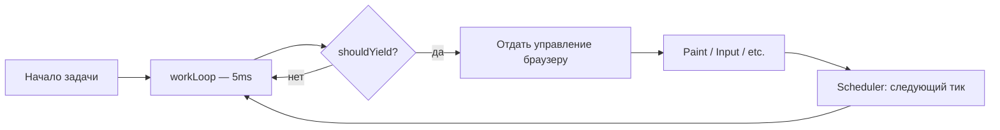

# Уровень 2: Work Loop и приоритеты

## Сердце React: бесконечный цикл

Представь поваров на кухне ресторана. Один повар (синхронный React) берёт заказ и готовит его целиком, не отвлекаясь. Пришло 100 блюд — всё, кухня занята, новые заказы не принимаются. Другой повар (Concurrent React) готовит чуть-чуть, проверяет, нет ли срочного заказа VIP-гостя, и если есть — переключается. Fiber Work Loop — это второй повар.

Внутри React есть переменная `workInProgress: Fiber | null`. Пока она не `null` — React работает:

```ts
function workLoopSync() {
  while (workInProgress !== null) {
    performUnitOfWork(workInProgress)
  }
}

function workLoopConcurrent() {
  while (workInProgress !== null && !shouldYield()) {
    performUnitOfWork(workInProgress)
  }
}
```

Разница в одном условии: `shouldYield()`. Scheduler проверяет, не истёк ли временной слот (обычно 5ms). Если истёк — цикл прерывается, управление возвращается браузеру.

## performUnitOfWork: вход и выход

Каждая итерация цикла обрабатывает один Fiber node:

```ts
function performUnitOfWork(unitOfWork: Fiber): void {
  const next = beginWork(unitOfWork.alternate, unitOfWork, renderLanes)

  unitOfWork.memoizedProps = unitOfWork.pendingProps

  if (next === null) {
    // Детей нет — закрываем узел и двигаемся дальше
    completeUnitOfWork(unitOfWork)
  } else {
    // Есть дети — идём вниз
    workInProgress = next
  }
}
```

`beginWork` — это "вход" в узел (фаза спуска). Возвращает первого ребёнка или `null`.  
`completeWork` — это "выход" из узла (фаза подъёма). Строит effect list для Commit.

## Алгоритм обхода дерева

Work Loop обходит Fiber-дерево методом DFS — сначала вглубь, потом вправо, потом вверх:


Правило простое: **вниз через `child`, вправо через `sibling`, вверх через `return`**.

После `completeWork` узла React проверяет: есть ли `sibling`? Если да — `workInProgress = sibling`. Если нет — поднимается через `return` и вызывает `completeWork` для родителя.

## beginWork: обновить или пропустить

`beginWork` решает, что делать с узлом:

1. **Bailout** — если `memoizedProps === pendingProps` и нет обновлений по текущим lanes — пропустить поддерево целиком. Это основа оптимизации `React.memo`.
2. **Обновить** — вызвать функцию компонента, запустить reconciliation детей, вернуть первого ребёнка.

```ts
// Упрощённо
function beginWork(current, workInProgress, renderLanes) {
  if (current !== null) {
    const oldProps = current.memoizedProps
    const newProps = workInProgress.pendingProps
    if (oldProps === newProps && !hasScheduledUpdateOrContext(current, renderLanes)) {
      return bailoutOnAlreadyFinishedWork(current, workInProgress, renderLanes)
    }
  }
  // ...рендеринг компонента
}
```

## Scheduler: кто командует Work Loop

Work Loop сам не решает, когда запуститься. Этим занимается **Scheduler** (пакет `scheduler`).

Scheduler использует **MessageChannel** для планирования задач. Почему не `setTimeout(0)`? Потому что браузеры ограничивают минимальный таймаут до ~4ms при вложенности, и это не гарантирует порядок исполнения относительно paint. MessageChannel + `onmessage` выполняется сразу после текущего макрозадания, перед следующим paint.

Scheduler поддерживает **приоритетные очереди**: taskQueue (срочные) и timerQueue (отложенные). При каждом тике он берёт самую приоритетную задачу и запускает её на 5ms.

## Lane-приоритеты

React 18 использует модель **Lanes** — битовые маски приоритетов:

| Lane | Биты | Когда используется |
|---|---|---|
| `SyncLane` | `0b001` | Клики, синхронные обновления |
| `InputContinuousLane` | `0b100` | Scroll, drag, непрерывный ввод |
| `DefaultLane` | `0b1000` | `setState` в обработчиках, fetch |
| `TransitionLane` | `0b10000+` | `startTransition` |
| `IdleLane` | `очень большой бит` | `requestIdleCallback`-семантика |

Lanes объединяются через `mergeLanes(a, b)` (побитовый OR), проверяются через `includesSomeLane(a, b)` (побитовый AND).

```ts
// Проверить, включён ли lane в набор
function includesSomeLane(a: Lanes, b: Lanes): boolean {
  return (a & b) !== 0
}
```

## Time Slicing: как React отдаёт управление браузеру

В Concurrent Mode React работает порциями по ~5ms. После каждой порции `shouldYield()` возвращает `true` — и цикл прерывается.



Это даёт браузеру возможность отрисовать кадр между порциями работы React. Пользователь не чувствует "заикания" даже при больших деревьях.

## ⚠️ Частые заблуждения

❌ **"Time Slicing = меньше работы"**

Нет. Общий объём работы не меняется — React всё равно обходит всё дерево. Time Slicing просто разбивает эту работу на куски, чтобы браузер мог вклиниться между ними.

✅ Time Slicing улучшает **отзывчивость**, а не **производительность**.

---

❌ **"startTransition делает рендер асинхронным"**

Не совсем. `startTransition` помечает обновление как `TransitionLane` — низкий приоритет. Если в очереди нет более приоритетных обновлений — React выполнит его синхронно. Асинхронность возникает только при вытеснении более приоритетной задачей.

✅ `startTransition` = "это можно прервать и отложить, если появится что-то важнее".

---

❌ **"IdleLane = requestIdleCallback"**

`IdleLane` вдохновлён идеей `requestIdleCallback`, но React не использует `requestIdleCallback` напрямую (он недоступен во всех окружениях и имеет нестабильное поведение). React симулирует idle через Scheduler с очень низким приоритетом.

✅ `IdleLane` — концепция, реализованная через Scheduler, а не через браузерный API.
