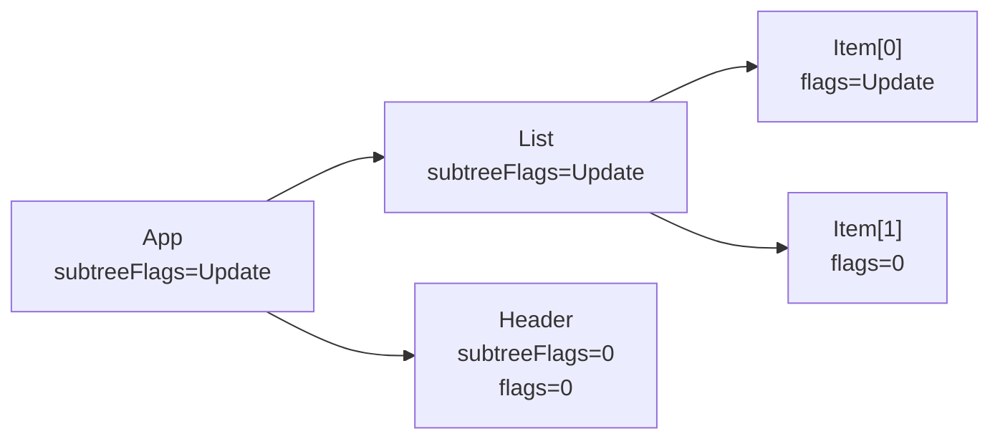

# Уровень 3 (расширенная теория): Reconciliation изнутри

## Откуда берётся reconciliation

После того как React вызвал все функции компонентов (фаза Render) и получил новое Fiber-дерево (`workInProgress`), нужно понять: что изменилось по сравнению со старым деревом (`current`)? Это и есть задача reconciliation.

Reconciliation — это **не** сравнение DOM с DOM. Это сравнение старого Fiber-дерева с новыми React Elements, которые вернули функции компонентов. Результат — помеченные флагами Fiber nodes, которые commit-фаза потом применяет к DOM.

Главная функция: `reconcileChildFibers` (для корневого узла) и `reconcileChildren` (для каждого компонента).

## reconcileChildFibers: что внутри

```ts
// Упрощённая схема (не точный код React)
function reconcileChildFibers(
  returnFiber: Fiber,
  currentFirstChild: Fiber | null,
  newChild: ReactElement | ReactElement[] | null
): Fiber | null {

  if (isArray(newChild)) {
    return reconcileChildrenArray(returnFiber, currentFirstChild, newChild)
  }

  if (typeof newChild === 'object' && newChild !== null) {
    return reconcileSingleElement(returnFiber, currentFirstChild, newChild)
  }

  if (typeof newChild === 'string' || typeof newChild === 'number') {
    return reconcileSingleTextNode(returnFiber, currentFirstChild, newChild)
  }

  // null, undefined, boolean → удаляем всё
  return deleteRemainingChildren(returnFiber, currentFirstChild)
}
```

### Single child: reconcileSingleElement

Для одного элемента алгоритм прост:

```
1. Идём по существующим children (linked list через sibling)
2. Если нашли fiber с тем же key И тем же type → переиспользуем (Update)
3. Если нашли тот же key, но другой type → удаляем этот и все остальные, создаём новый
4. Если key не совпал → удаляем текущий, продолжаем поиск
5. Если ничего не нашли → создаём новый Fiber (Placement)
```

Обрати внимание: при переиспользовании React вызывает `useFiber` — копирует старый fiber в `workInProgress.alternate`. Это позволяет сохранить `memoizedState` (хуки!) и `stateNode` (DOM-узел).

### Multiple children: reconcileChildrenArray

Это самая сложная часть. Алгоритм работает в два прохода.

#### Фаза 1: линейный поиск (пока порядок совпадает)

```
oldFiber = currentFirstChild
newIdx = 0

Пока newIdx < newChildren.length && oldFiber !== null:
  if (oldFiber.index > newIdx) → oldFiber был на другой позиции, прерываем
  
  newFiber = updateSlot(returnFiber, oldFiber, newChildren[newIdx])
  
  if (newFiber === null) → key не совпал → прерываем фазу 1
  
  if (shouldTrackSideEffects && !newFiber.alternate):
    → новый узел, отмечаем Placement
  
  oldFiber = oldFiber.sibling
  newIdx++
```

Эта фаза быстрая — O(n) — и покрывает самый частый случай: список не менял порядок, только обновились пропсы.

#### Фаза 2: Map-based поиск (когда порядок нарушен)

Если фаза 1 прервалась (несовпавший key или конец старых children):

```
// Складываем оставшиеся старые fibers в Map: key/index → fiber
existingChildren = mapRemainingChildren(returnFiber, oldFiber)

// Продолжаем с newIdx, где остановились
for (; newIdx < newChildren.length; newIdx++):
  newFiber = updateFromMap(existingChildren, returnFiber, newIdx, newChildren[newIdx])
  
  if (newFiber !== null):
    existingChildren.delete(newFiber.key ?? newIdx)  // использован — убираем из Map
    
    if (newFiber.index < lastPlacedIndex):
      → узел переехал влево → отмечаем Placement (перемещение)
    else:
      lastPlacedIndex = newFiber.index  // он остался правее/на месте

// Всё, что осталось в existingChildren — удаляем
existingChildren.forEach(child → deleteChild(returnFiber, child))
```

`lastPlacedIndex` — это "водораздел": всё, что было правее него — на месте. Всё, что оказалось левее — переместилось.

### Пример: переупорядочение [A, B, C, D] → [B, C, D, A]

```
Фаза 1:
  newIdx=0, newChild=B, oldFiber=A
  key B !== key A → прерываем

Фаза 2:
  Map: {A:fiberA, B:fiberB, C:fiberC, D:fiberD}
  lastPlacedIndex = 0

  newIdx=0, B: найден в Map, index=1 > 0 → lastPlacedIndex=1, B на месте
  newIdx=1, C: найден в Map, index=2 > 1 → lastPlacedIndex=2, C на месте
  newIdx=2, D: найден в Map, index=3 > 2 → lastPlacedIndex=3, D на месте
  newIdx=3, A: найден в Map, index=0 < 3 → Placement! (A перемещается)

Итог: только A получает флаг Placement. B, C, D остаются на месте.
```

Это важный момент: React не "перемещает" узлы — он делает insertBefore/appendChild. Если переместить нужно только один узел из пяти — это дешевле, чем пересоздавать всё.

### Пример: добавление в начало без keys

```
// До: [B, C]
// После: [A, B, C]

Фаза 1:
  newIdx=0, newChild=A, oldFiber=B → key нет, сравниваем по позиции
  Тип совпадает → Update: fiberB получает пропсы A
  
  newIdx=1, newChild=B, oldFiber=C
  Тип совпадает → Update: fiberC получает пропсы B
  
  newIdx=2, newChild=C, oldFiber=null (кончились)
  → Placement нового C

Итог: все три элемента обновляются. Это дороже, чем с keys.
```

С правильными keys (`key="a"`, `key="b"`, `key="c"`) — фаза 1 сразу прервётся, фаза 2 найдёт B и C в Map и только A создаст с Placement.

## Deletion: ChildDeletion flag

Когда React понимает, что старый fiber нужно удалить, он не удаляет его немедленно. Вместо этого:

1. Вызывается `deleteChild(returnFiber, childToDelete)`
2. `returnFiber.deletions` — массив fiber nodes, которые нужно удалить
3. `returnFiber.flags |= ChildDeletion` — флаг на родителе

В commit-фазе React идёт по `deletions` и для каждого удалённого fiber:
- Вызывает `useEffect` cleanup функции
- Вызывает `useLayoutEffect` cleanup функции
- Удаляет DOM-узел

Почему не сразу? Потому что render-фаза может прерываться (Concurrent Mode). Нельзя мутировать DOM во время render. Только commit-фаза работает синхронно и без прерываний.

## Flags и subtreeFlags

Каждый Fiber node имеет два поля для флагов:

```ts
flags: Flags       // что нужно сделать с ЭТИМ узлом
subtreeFlags: Flags // есть ли работа в поддереве
```

`subtreeFlags` — это оптимизация. В commit-фазе React идёт сверху вниз. Если у узла `subtreeFlags === 0` — можно пропустить всё поддерево, не обходя его. Это называется "ранний выход" (early bailout) в commit-фазе.

Флаги накапливаются снизу вверх во время `completeWork`:

```ts
// completeWork накапливает флаги поддерева
parentFiber.subtreeFlags |= child.subtreeFlags | child.flags
```



В commit-фазе: App → смотрим subtreeFlags → идём в List → Item[0] имеет flags=Update → обновляем. Item[1] и Header пропускаем.

## Почему index как key — это баг, а не просто warning

Рассмотрим конкретный баг. Список задач с `<input>` внутри:

```jsx
// Плохо
{tasks.map((task, index) => (
  <div key={index}>
    <span>{task.name}</span>
    <input defaultValue={task.notes} />
  </div>
))}
```

До удаления:
```
key=0: Task "Buy milk"  | input value: "from store"
key=1: Task "Call mom"  | input value: "at 6pm"
key=2: Task "Read book" | input value: "chapter 3"
```

После удаления "Buy milk" (index 0):
```
key=0: Task "Call mom"  | input value: "from store" ← БАГ! state "протёк"
key=1: Task "Read book" | input value: "at 6pm"     ← БАГ!
```

Почему? React видит `key=0` до и после — решает, что это тот же элемент. Fiber переиспользуется. `memoizedState` хука остаётся — а там значение `defaultValue` от предыдущего компонента. DOM-узел input тот же, значение не сброшено.

С правильным `key={task.id}`:
```
key=task-2: Task "Call mom"  | input value: "at 6pm"   ← правильно
key=task-3: Task "Read book" | input value: "chapter 3" ← правильно
```

React видит, что `key=task-1` исчез → `ChildDeletion`. `key=task-2` и `key=task-3` — те же элементы → Update.

## key как механизм полного пересоздания: паттерн YMNAE

"You Might Not Need an Effect" — статья из официальной документации React — описывает ситуацию:

> Когда state нужно сбросить при смене пропса — используй key, а не useEffect.

```jsx
// ❌ Антипаттерн: useEffect для сброса state
function ProfileEditor({ userId }) {
  const [name, setName] = useState('')
  const [email, setEmail] = useState('')

  useEffect(() => {
    setName('')   // промежуточный рендер со старыми данными
    setEmail('')  // ещё один рендер
  }, [userId])

  return (/* ... */)
}
```

Проблема: при смене `userId` компонент рендерится трижды:
1. Первый рендер с новым `userId`, но старыми `name`/`email`
2. После `setName('')` — второй рендер
3. После `setEmail('')` — третий рендер

Пользователь на мгновение видит старые данные под новым пользователем.

```jsx
// ✅ Паттерн: key для полного пересоздания
function ProfileEditor({ userId }) {
  const [name, setName] = useState('')
  const [email, setEmail] = useState('')
  return (/* ... */)
}

// В родителе:
<ProfileEditor key={userId} userId={userId} />
```

При смене `userId`:
- React видит новый `key` → это другой элемент → `ChildDeletion` старого + `Placement` нового
- Новый `ProfileEditor` создаётся с чистыми `useState('')`
- Никакого промежуточного состояния, никаких лишних рендеров

Это не хак — это намеренное использование механизма reconciliation.

## Практический контрольный список

Когда ты видишь список в коде — задай себе три вопроса:

1. **Может ли список изменить порядок?** Если да — нужен стабильный key.
2. **Есть ли state внутри элементов списка?** Если да — нужен стабильный key.
3. **Нужно ли сбросить state при смене пропса?** Если да — используй key, а не useEffect.

Если список только отображает данные, порядок не меняется, и внутри нет state — index как key формально безопасен (но лучше всё равно использовать id).

## ⚠️ Частые ошибки начинающих

❌ **"key нужен только чтобы убрать warning"**

```jsx
// "Решение" проблемы
items.map((item, i) => <Item key={i} ... />)
```

Warning исчезнет, но баг с "протекающим" state останется. Key — это семантика, не синтаксис.

✅ Исправление: найти реальный идентификатор в данных (`item.id`, `item.slug`).

---

❌ **Создание компонентов внутри render без мемоизации**

```jsx
function Parent() {
  // Плохо: новая функция-компонент при каждом рендере → разный type → destroy + create
  const Child = () => <div>child</div>
  return <Child />
}
```

React видит, что `type` (`Child`) — это новая функция при каждом рендере. Разные ссылки → разный тип → полное пересоздание с потерей state.

✅ Определяй компоненты вне render-функции.

---

❌ **Использование useEffect для синхронизации state с пропсом**

```jsx
// Плохо: лишние рендеры, возможно мерцание
useEffect(() => {
  setLocalValue(propValue)
}, [propValue])
```

✅ Если нужен "сброс при смене пропса" — используй `key`. Если нужна "производная от пропсов" — вычисляй во время рендера без state.
