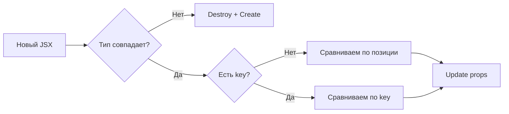

# Уровень 3: Reconciliation — как React сравнивает деревья

## Проблема: сравнение деревьев — это дорого

Представь, что ты редактор газеты. Каждый день приходит новая вёрстка, и тебе нужно понять, что изменилось по сравнению со вчерашней. Можно перечитать обе версии от первой до последней строчки и найти все различия — но это займёт много времени.

Математически полное сравнение двух деревьев — задача O(n³). Для дерева из 1000 элементов это миллиард операций. React рендерится много раз в секунду. Так не работает.

React использует **эвристический алгоритм O(n)** — быстрый, но с допущениями. Если допущения соблюдаются — алгоритм даёт правильный результат. Если нарушаются — получаем баги.

## Два ключевых допущения

**1. Элементы разного типа порождают разные деревья.**

Если тип изменился (`div` → `span`, или `ComponentA` → `ComponentB`) — React не пытается переиспользовать старый узел. Он удаляет старое поддерево целиком и создаёт новое с нуля.

**2. key идентифицирует элемент между рендерами.**

Если у элемента есть `key`, React использует его для сопоставления старых и новых элементов — независимо от их позиции в массиве.



## Три сценария diff

### Сценарий 1: одиночный элемент

```jsx
// До
<div className="old">Hello</div>

// После
<div className="new">Hello</div>
```

Тип совпадает (`div` → `div`) — React обновляет только `className`. DOM-узел тот же.

```jsx
// До
<div>Hello</div>

// После
<span>Hello</span>
```

Тип изменился — React уничтожает `div` вместе со всем поддеревом и создаёт `span` заново. Все дочерние компоненты потеряют своё состояние.

### Сценарий 2: список без keys (или с index)

```jsx
// До: ['Alice', 'Bob', 'Charlie']
<li>Alice</li>   // позиция 0
<li>Bob</li>     // позиция 1
<li>Charlie</li> // позиция 2

// После удаления Bob: ['Alice', 'Charlie']
<li>Alice</li>   // позиция 0 → Update (текст тот же)
<li>Charlie</li> // позиция 1 → Update (был Bob, стал Charlie)
               // позиция 2 → Deletion
```

React сравнивает по позиции. Если `Bob` был на позиции 1, а теперь там `Charlie` — React просто обновляет текст. Для одного `li` это нормально, но если внутри есть `<input>` с состоянием — значение "останется" у неправильного элемента.

### Сценарий 3: список с правильными keys

```jsx
// До
<li key="alice">Alice</li>
<li key="bob">Bob</li>
<li key="charlie">Charlie</li>

// После удаления Bob
<li key="alice">Alice</li>   // совпал — Update
<li key="charlie">Charlie</li> // совпал — Update (другая позиция, но тот же key)
// bob → Deletion
```

React сопоставляет по `key`, а не по позиции. `charlie` переезжает с позиции 2 на позицию 1, и React знает, что это тот же элемент — `input` внутри сохранит своё значение.

## Effect list: что происходит после diff

Во время reconciliation React собирает список операций — **effect list**:

| Флаг | Операция | Что значит |
|---|---|---|
| `Placement` | Вставка | Новый элемент, которого не было |
| `Update` | Обновление | Тот же элемент, изменились props |
| `ChildDeletion` | Удаление | Элемент исчез из нового дерева |

После обхода всего дерева React идёт в commit-фазу и применяет эти операции к реальному DOM. Только те узлы, у которых есть флаги — попадают в работу. Это и есть "минимальное количество DOM-операций".

## key как инструмент принудительного пересоздания

Из второго допущения следует мощный трюк: если ты хочешь, чтобы React **полностью пересоздал** компонент — смени его `key`.

```jsx
// Версия 1: useEffect для сброса state при смене userId
function ProfileEditor({ userId }) {
  const [name, setName] = useState('')
  useEffect(() => {
    setName('') // сброс при смене userId
  }, [userId])
  // ...
}

// Версия 2: key для полного пересоздания
function ProfileEditor({ userId }) {
  const [name, setName] = useState('')
  // ...
}

// Использование: <ProfileEditor key={userId} userId={userId} />
```

Версия с `key` чище: никакого дополнительного эффекта, никакого промежуточного рендера со старым состоянием. React просто создаёт новый компонент. Это паттерн из "You Might Not Need an Effect" — одна из самых частых ситуаций, когда `useEffect` — лишний.

## ⚠️ Частые ошибки

❌ **Index как key при изменяемом списке**

```jsx
// Плохо — при удалении/сортировке ключи меняются местами
items.map((item, index) => <Item key={index} item={item} />)
```

Это не фиксирует проблему с keys — это просто делает warning тише. Баг остаётся.

✅ Используй стабильный идентификатор: `item.id`, `item.slug`, `item.uuid`.

---

❌ **Разные типы компонентов на одном месте без причины**

```jsx
// Плохо — состояние сбрасывается при переключении
{isAdmin ? <AdminPanel /> : <UserPanel />}
```

Если `AdminPanel` и `UserPanel` должны сохранять одно состояние — лучше один компонент с пропсом `isAdmin`.

✅ Или намеренно используй это поведение для сброса состояния.

---

❌ **key из случайных значений**

```jsx
// Плохо — при каждом рендере новый key → постоянное пересоздание
items.map(item => <Item key={Math.random()} item={item} />)
```

Каждый рендер создаёт компонент заново, теряя все состояния и запуская все эффекты повторно.
