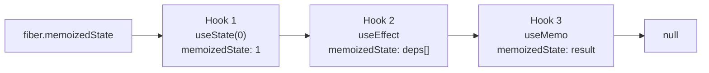

# Уровень 4: Хуки — как они работают в памяти

## Что ты думаешь, что такое хуки

Большинство разработчиков воспринимают хуки как магию: вызвал `useState` — появилось состояние. Вызвал `useEffect` — появился side effect. React как-то "знает", что вернуть при следующем рендере.

Но никакой магии нет. Хуки — это просто узлы связного списка, который React хранит на fiber-объекте компонента. Понимание этой структуры объясняет всё: почему нельзя вызывать хуки в условиях, что такое closure trap, и почему `useState + useEffect` для вычисляемых значений — это антипаттерн.

## Хуки как стопка карточек

Представь, что каждый хук — это карточка в стопке. При первом рендере React создаёт карточки и кладёт их одну за другой. При каждом следующем рендере React перебирает стопку с начала и выдаёт карточки по порядку.

```
Первый рендер (mount):          Второй рендер (update):
useState(0)  → карточка 1      карточка 1 → { memoizedState: 1 }
useEffect()  → карточка 2      карточка 2 → { memoizedState: [dep] }
useMemo()    → карточка 3      карточка 3 → { memoizedState: result }
```

React не знает имён хуков. Он знает только их порядок. Именно поэтому порядок хуков должен быть одинаковым при каждом рендере.

## Структура хука в памяти

Каждый хук — это объект (Hook) со следующими полями:

```typescript
type Hook = {
  memoizedState: any   // текущее значение (state, deps array, memo result...)
  baseState: any       // базовое состояние для обработки очереди обновлений
  baseQueue: Update | null  // очередь отложенных обновлений
  queue: UpdateQueue | null // очередь обновлений для этого хука
  next: Hook | null    // указатель на следующий хук
}
```

Поле `next` — это и есть связный список. Fiber хранит указатель на первый хук в `fiber.memoizedState`, остальные цепочкой через `next`.



## Dispatcher pattern: mount vs update

React использует разные реализации хуков в зависимости от фазы. Это называется Dispatcher Pattern.

```typescript
// При первом рендере:
ReactCurrentDispatcher.current = HooksDispatcherOnMount

// При повторных рендерах:
ReactCurrentDispatcher.current = HooksDispatcherOnUpdate
```

При mount `useState` создаёт новый Hook-узел, инициализирует `memoizedState` начальным значением и добавляет узел в список. При update `useState` просто читает следующий узел из существующего списка.

Это объясняет, почему вызов хука в условии ломает всё: React при update пытается прочитать узлы в том же порядке, в котором создал их при mount. Если один хук пропущен — все последующие сдвигаются.

## Почему порядок хуков критичен

```tsx
// ❌ Сломает список при условии
function BadComponent({ isLoggedIn }) {
  if (isLoggedIn) {
    const [name, setName] = useState('') // хук 1 только если isLoggedIn
  }
  const [count, setCount] = useState(0) // React ждёт хук 2, но получит хук 1
}
```

```tsx
// ✅ Хуки всегда в одном порядке
function GoodComponent({ isLoggedIn }) {
  const [name, setName] = useState('')   // всегда хук 1
  const [count, setCount] = useState(0) // всегда хук 2
  // условие — внутри, не снаружи хука
}
```

## Closure trap: почему setInterval видит старое значение

Это один из самых частых багов в React. Посмотри:

```tsx
function Timer() {
  const [count, setCount] = useState(0)

  useEffect(() => {
    const id = setInterval(() => {
      setCount(count + 1) // ❌ count всегда 0!
    }, 1000)
    return () => clearInterval(id)
  }, []) // пустой массив зависимостей
}, [])
```

Почему `count` всегда 0? Потому что функция в `setInterval` захватывает переменную `count` из замыкания — ту, которая была на момент первого рендера. Каждый рендер создаёт новое замыкание с новым `count`, но `setInterval` держит ссылку на старое замыкание.

Это называется **stale closure** — устаревшее замыкание.

### Решение: functional updater

```tsx
setCount(prev => prev + 1) // ✅ prev — всегда актуальное значение из очереди
```

Функциональный апдейтер получает текущее значение из очереди обновлений React, а не из замыкания. React передаёт его сам.

## ⚠️ Частые ошибки новичков

❌ **Хук в условии**

```tsx
if (condition) {
  const [x, setX] = useState(0) // сдвигает весь список при следующем рендере
}
```

Почему это проблема: React не может сопоставить хуки при update — список смещается.

✅ Хук объявляется всегда, условие применяется к использованию значения.

---

❌ **setState в setInterval без functional updater**

```tsx
setInterval(() => setCount(count + 1), 1000) // count устарел
```

✅ `setInterval(() => setCount(c => c + 1), 1000)` — передавай функцию.

---

❌ **useState + useEffect для вычисляемых значений**

```tsx
const [fullName, setFullName] = useState('')
useEffect(() => {
  setFullName(firstName + ' ' + lastName) // лишний рендер!
}, [firstName, lastName])
```

Почему это плохо: лишний рендер, лишнее состояние, лишняя сложность.

✅ `const fullName = firstName + ' ' + lastName` — вычисляй во время рендера.

💡 Если значение полностью определяется другими state/props — это не state, это derived value. Держи его как обычную переменную или (при дорогом вычислении) через `useMemo`.
