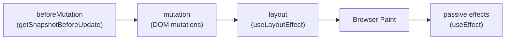
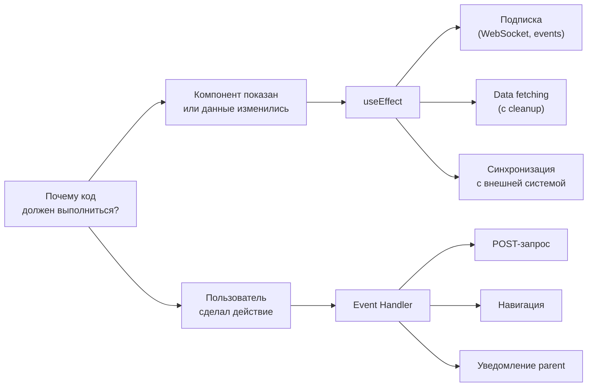

# Уровень 5 (расширенная версия): useEffect под микроскопом

## Фазы commit и где живут Effects

После завершения фазы render (построение Fiber tree) React переходит к фазе commit. Она делится на три подфазы:



**beforeMutation** — React читает DOM до мутаций (классовый `getSnapshotBeforeUpdate`).

**mutation** — React применяет изменения к DOM: вставляет, удаляет, обновляет узлы.

**layout** — React запускает `useLayoutEffect` callbacks синхронно. Именно здесь, **до** browser paint. Вот почему `useLayoutEffect` может блокировать отрисовку: он выполняется в той же задаче, что и DOM-мутации.

**passive effects** — React планирует `useEffect` через `MessageChannel` (асинхронно, как макротаск). Браузер успевает нарисовать кадр до того, как callbacks выполнятся.

### Почему это важно на практике

```tsx
// useLayoutEffect — синхронно, блокирует paint
// Используй для измерения DOM и немедленного исправления
useLayoutEffect(() => {
  const rect = ref.current.getBoundingClientRect()
  setTooltipPosition({ top: rect.bottom, left: rect.left })
}, [])

// useEffect — асинхронно, после paint
// Используй для всего остального: subscriptions, fetch, analytics
useEffect(() => {
  analytics.track('tooltip_shown')
}, [])
```

Если использовать `useEffect` для позиционирования тултипа — пользователь на долю секунды увидит тултип в неправильной позиции (flash). `useLayoutEffect` исправляет позицию до того, как браузер рисует.

## Механизм cleanup: как React хранит destroy-функцию

Когда `useEffect` возвращает функцию, React сохраняет её в поле `destroy` на hook-узле в linked list. Схема hook-узла для useEffect:

```typescript
type EffectHook = {
  memoizedState: Effect  // объект с tag, create, destroy, deps
  next: Hook | null
}

type Effect = {
  tag: HookFlags          // Passive | Layout | HasEffect
  create: () => (() => void) | void  // твой callback
  destroy: (() => void) | void       // возвращённая cleanup-функция
  deps: DependencyList | null
  next: Effect                       // circular list эффектов
}
```

Перед запуском нового effect React вызывает `destroy` если она существует. Именно поэтому порядок всегда такой:

```
render N+1 → commitHookEffectListUnmount (все destroy) → commitHookEffectListMount (все create)
```

React обходит circular list эффектов дважды — сначала все cleanup, потом все callbacks. Это гарантирует консистентность: ни один новый effect не запустится, пока не отработают все старые cleanups.

## Object.is: детальный разбор

Зависимости в `useEffect` сравниваются через `Object.is`, который почти идентичен `===`, но с двумя исключениями:

```typescript
// Стандартный ===
NaN === NaN  // false (IEEE 754 quirk)
+0 === -0    // true

// Object.is
Object.is(NaN, NaN)  // true  — React считает NaN стабильным значением
Object.is(+0, -0)    // false — React считает их разными
```

На практике `NaN` в deps — это edge case. Гораздо чаще проблемы с объектами:

```tsx
// ❌ Каждый рендер создаёт новый объект — Object.is вернёт false
useEffect(() => {
  fetchUser(options)
}, [{ userId: 1 }]) // новый литерал при каждом рендере → бесконечный loop!

// ✅ Выноси объект за пределы компонента или стабилизируй через useMemo/useCallback
const options = useMemo(() => ({ userId }), [userId])
useEffect(() => {
  fetchUser(options)
}, [options])
```

## You Might Not Need an Effect — подробный разбор

Это руководящий принцип современного React. Разберём каждый сценарий.

### Сценарий 1: Effect Chains (каскадные рендеры)

Это один из самых дорогих антипаттернов. Каждый `setState` внутри Effect вызывает новый рендер.

```tsx
// ❌ 4 рендера вместо 1
function Game({ card }) {
  const [goldCardCount, setGoldCardCount] = useState(0)
  const [round, setRound] = useState(1)
  const [isGameOver, setIsGameOver] = useState(false)

  useEffect(() => {
    if (card !== null && card.gold) {
      setGoldCardCount(c => c + 1)  // рендер #2
    }
  }, [card])

  useEffect(() => {
    if (goldCardCount > 3) {
      setRound(r => r + 1)          // рендер #3
      setGoldCardCount(0)
    }
  }, [goldCardCount])

  useEffect(() => {
    if (round > 5) {
      setIsGameOver(true)           // рендер #4
    }
  }, [round])
}
```

Что происходит при изменении `card`:
1. Рендер #1: `card` изменился
2. Effect 1 запускается → `setGoldCardCount` → рендер #2
3. Effect 2 запускается → `setRound` → рендер #3
4. Effect 3 запускается → `setIsGameOver` → рендер #4

Всё это ради одного логического события — "карта сыграна".

```tsx
// ✅ 1 рендер, вся логика в одном месте
function Game({ card }) {
  const [goldCardCount, setGoldCardCount] = useState(0)
  const [round, setRound] = useState(1)
  const [isGameOver, setIsGameOver] = useState(false)

  function handleCardPlay(card) {
    let newGoldCount = goldCardCount
    if (card !== null && card.gold) {
      newGoldCount = goldCardCount + 1
    }

    let newRound = round
    if (newGoldCount > 3) {
      newRound = round + 1
      newGoldCount = 0
    }

    setGoldCardCount(newGoldCount)
    setRound(newRound)
    setIsGameOver(newRound > 5)
  }
}
```

Три `setState` в одном обработчике батчируются React 18 — это один рендер.

### Сценарий 2: POST-запросы — аналитика vs регистрация

Здесь важно различать семантику:

```tsx
// ✅ Аналитика при показе страницы — Effect правильный
// "Потому что компонент показан" → Effect
useEffect(() => {
  analytics.logPageView('/checkout')
}, [])

// ❌ Регистрация по кнопке — Effect неправильный
// "Потому что пользователь нажал кнопку" → Event Handler
useEffect(() => {
  if (formSubmitted) {
    fetch('/api/register', { method: 'POST', body: JSON.stringify(userData) })
  }
}, [formSubmitted])

// ✅ Правильно: в обработчике события
function handleSubmit() {
  fetch('/api/register', { method: 'POST', body: JSON.stringify(userData) })
}
```

Тест: "Если бы пользователь открыл страницу в двух вкладках, должен ли запрос выполниться дважды?" Для аналитики — да. Для регистрации — нет. Если ответ "нет" — это Event Handler.

### Сценарий 3: Notify parent (уведомление родителя)

```tsx
// ❌ Уведомление через Effect — лишний рендер
function Toggle({ onChange }) {
  const [isOn, setIsOn] = useState(false)

  useEffect(() => {
    onChange(isOn)
  }, [isOn, onChange])

  return <button onClick={() => setIsOn(v => !v)}>{isOn ? 'ON' : 'OFF'}</button>
}
```

Что происходит:
1. Пользователь кликает → `setIsOn` → рендер дочернего
2. `useEffect` видит изменение `isOn` → вызывает `onChange(isOn)`
3. Родитель обновляет своё состояние → рендер родителя

Два рендера вместо одного. Плюс `onChange` в deps — если родитель не мемоизировал функцию, это бесконечный loop.

```tsx
// ✅ Уведомление в обработчике — один рендер
function Toggle({ onChange }) {
  const [isOn, setIsOn] = useState(false)

  function handleClick() {
    const nextIsOn = !isOn
    setIsOn(nextIsOn)
    onChange(nextIsOn) // синхронно, в том же event
  }

  return <button onClick={handleClick}>{isOn ? 'ON' : 'OFF'}</button>
}
```

### Сценарий 4: Data Fetching и Race Condition

Это единственный сценарий, где `useEffect` для fetching оправдан — но требует careful implementation.

**Проблема race condition:**

```
Пользователь быстро набирает: "a" → "ab" → "abc"

Запросы отправлены в порядке: 1, 2, 3
Ответы пришли в порядке:     3, 1, 2  (сеть ненадёжна)

Финальное состояние: результаты для "ab" (запрос 2, последний пришедший)
Но в поле поиска: "abc"
```

Пользователь видит нерелевантные результаты.

**Решение 1: ignore flag**

```tsx
useEffect(() => {
  let ignore = false

  async function fetchResults() {
    const data = await fetch(`/api/search?q=${query}`).then(r => r.json())
    if (!ignore) {
      setResults(data)
    }
  }

  fetchResults()

  return () => {
    ignore = true // cleanup: игнорируем ответ устаревшего запроса
  }
}, [query])
```

Как работает: каждый новый query создаёт новое замыкание с `ignore = false`. Cleanup предыдущего effect устанавливает `ignore = true`. Когда старый fetch завершится — он проверит `ignore` и не обновит state.

**Решение 2: AbortController (предпочтительно)**

```tsx
useEffect(() => {
  const controller = new AbortController()

  fetch(`/api/search?q=${query}`, { signal: controller.signal })
    .then(r => r.json())
    .then(data => setResults(data))
    .catch(err => {
      if (err.name === 'AbortError') return // нормальная отмена
      setError(err.message)
    })

  return () => controller.abort() // отменяем запрос в flight
}, [query])
```

AbortController реально отменяет HTTP-запрос (экономит трафик), а не просто игнорирует ответ. Это предпочтительный подход в современных браузерах.

**Сравнение подходов:**

| Подход | Отменяет запрос | Простота | Поддержка |
|--------|----------------|----------|-----------|
| ignore flag | Нет (запрос завершится) | Проще | Везде |
| AbortController | Да | Чуть сложнее | Современные браузеры |

## StrictMode: зачем двойной запуск

В React 18 StrictMode в development-режиме делает следующее:

```
mount → useEffect (create) → cleanup (destroy) → useEffect (create снова)
```

Это симуляция "быстрого unmount/remount" — сценарий, который React планирует использовать для Offscreen API. Если твой component сломается при повторном mount — cleanup написан неправильно.

```tsx
// ❌ Накапливает листнеры при двойном запуске
useEffect(() => {
  window.addEventListener('resize', handleResize) // добавляется дважды!
  // нет cleanup
}, [])

// ✅ Идемпотентный cleanup
useEffect(() => {
  window.addEventListener('resize', handleResize)
  return () => window.removeEventListener('resize', handleResize)
}, [])
```

После двойного запуска: add → remove → add. Один листнер. Всё корректно.

## Полная картина: когда что использовать



## Антипаттерны и их цена

| Антипаттерн | Цена | Решение |
|------------|------|---------|
| Effect chain (3 звена) | +3 рендера | Один event handler |
| Notify parent через Effect | +1 рендер, риск loop | В event handler |
| POST через Effect | Двойной запрос в StrictMode | Event handler |
| Fetch без cleanup | Race condition | ignore flag / AbortController |
| Объект в deps | Бесконечный loop | useMemo / вынос за пределы |
